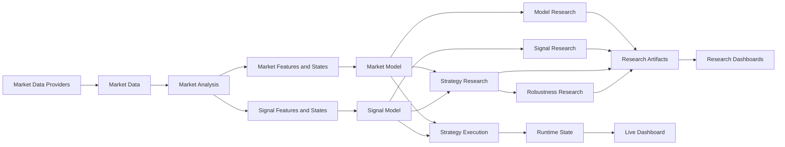

# Trading Research Framework

A modular Python framework for market-data processing, declarative model research, strategy simulation, robustness analysis and live dry-run execution.

It provides a shared architecture for historical datasets, analytical components, market and signal models, research workflows, strategy evaluation and execution runtimes.

---

## Repository Guide

| Reader | Recommended sections |
|---|---|
| Recruiter | [What It Is](#what-it-is) · [Problems It Solves](#problems-it-solves) · [Technology Stack](#technology-stack) · [Reference Scale](#reference-scale) · [Live Dry-Run Demo](#live-dry-run-demo) |
| Software Engineer | [Problems It Solves](#problems-it-solves) · [Engineering Methods](#engineering-methods) · [Architecture Overview](#architecture-overview) · [Documentation](#documentation) |

---

## What It Is

Trading Research Framework supports the complete lifecycle of systematic market research:

- importing and normalizing historical market data,
- publishing reusable datasets,
- calculating market features and states,
- composing declarative Market Models and Signal Models,
- evaluating signals and market behaviour,
- simulating complete strategies,
- testing robustness,
- running selected logic against live market data in dry-run mode.

The framework separates data preparation, research, execution and visualization instead of combining them into one pipeline.

---

## Problems It Solves

| Problem | Framework approach |
|---|---|
| Research logic scattered across scripts and notebooks | Declarative definitions and reusable application workflows |
| Vendor-specific market-data formats | Provider adapters and normalized internal datasets |
| Repeated preprocessing for each experiment | Published derived datasets referenced by stable identifiers |
| Research results difficult to reproduce | Persisted run metadata, manifests and immutable artifacts |
| Market analysis duplicated across models and strategies | Shared analytical components producing reusable features and states |
| Research coupled to execution | Independent Signal Research, Strategy Research and Strategy Execution workflows |
| Backtest code difficult to reuse online | Shared domain contracts with a separate execution runtime |
| Visualization mixed with computation | Dashboards read persisted research artifacts or runtime state |
| Live systems difficult to inspect safely | Persisted execution state exposed through a read-only API |
| Framework code mixed with local research | Explicit boundary between reusable `src/` code and user-owned `user_data/` |

---

## Technology Stack

| Area | Technologies |
|---|---|
| Language and environment | Python, uv |
| Data processing | Polars, NumPy, Numba |
| Data storage | Parquet, partitioned datasets, manifests |
| Visualization | Plotly, standalone HTML dashboards |
| Testing and quality | pytest, Ruff, mypy |
| Packaging and delivery | Docker, GitHub Actions |
| Historical market data | Databento |
| Live market data | Binance |
| Runtime infrastructure | AWS, VPS deployment |
| API and dashboard delivery | Read-only HTTP API, browser-based live dashboard |

---

## Engineering Methods

| Area | Methods |
|---|---|
| Architecture | Modular boundaries, dependency inversion, stable public contracts |
| Extensibility | Declarative definitions and component composition |
| Domain modelling | Shared domain models for data, research and execution |
| Data lifecycle | Normalize, validate, partition, publish and reference |
| Reproducibility | Immutable datasets, manifests, lineage and persisted run outputs |
| Research | Forward-outcome analysis, grouped analytics and complete strategy simulation |
| Robustness | Parameter sweeps, walk-forward analysis, stress testing and anti-overfitting checks |
| Performance | Vectorized calculations, batched processing and reusable materialized datasets |
| Execution | Provider abstraction, isolated runtime, paper broker and persisted state |
| Visualization | Separation of compute from presentation |
| Repository design | Framework Core separated from User Workspace |

---

## Architecture Overview



Core rules:

- Market Model and Signal Model are declarative compositions of lower-level features and states.
- Signal Research, Strategy Research and Strategy Execution are independent workflows.
- Research does not form one mandatory pipeline ending in execution.
- Execution does not depend on research reports or historical run state.
- Dashboards consume persisted artifacts or runtime state; they do not perform research or execution.
- Framework Core never imports user-owned `user_data/`.

---

## Reference Scale

A reference NQ research run demonstrates the system on non-trivial data volumes:

- 45M+ normalized Databento trades,
- 44M+ continuous futures trades,
- 177k+ derived one-minute OHLCV bars,
- 1,400+ simulated strategy trades.

Expensive preprocessing is materialized once. Downstream research consumes published datasets through stable references.

---

## Research Demonstrations

| Demonstration | Output |
|---|---|
| Market Model Research | Market-state occurrence and outcome analysis |
| Signal Model Research | Signal occurrence, context and forward-outcome analysis |
| Strategy Research | Trades, equity curve, KPIs and interactive dashboard |
| Robustness Research | Parameter, walk-forward and stress-test reports |

Generate the local demo bundle:

```bash
uv pip install plotly
uv run python scripts/demo/run_portfolio_demo.py --full --open
```

Demo documentation:

[`scripts/demo/README.md`](scripts/demo/README.md)

---

## Quick Start

```bash
git clone <repo-url>
cd research-trading-framework

uv sync --locked --dev
uv run pytest
```

Quality checks:

```bash
uv run ruff check .
uv run ruff format --check .
uv run mypy
uv run pytest
```

---

## Documentation

| Document | Purpose |
|---|---|
| [`docs/reference/MODULE_MAP.md`](docs/reference/MODULE_MAP.md) | Module ownership, dependencies and public entry points |
| [`docs/reference/DATA_WORKFLOWS.md`](docs/reference/ARCHITECTURE_AND_WORKFLOWS.md) | Data lifecycle, storage, research and execution flows |
| [`docs/reference/RESEARCH_METHODOLOGIES.md`](docs/reference/RESEARCH_METHODOLOGIES.md) | Research workflows and methodology |


---

## License

Private research project.
