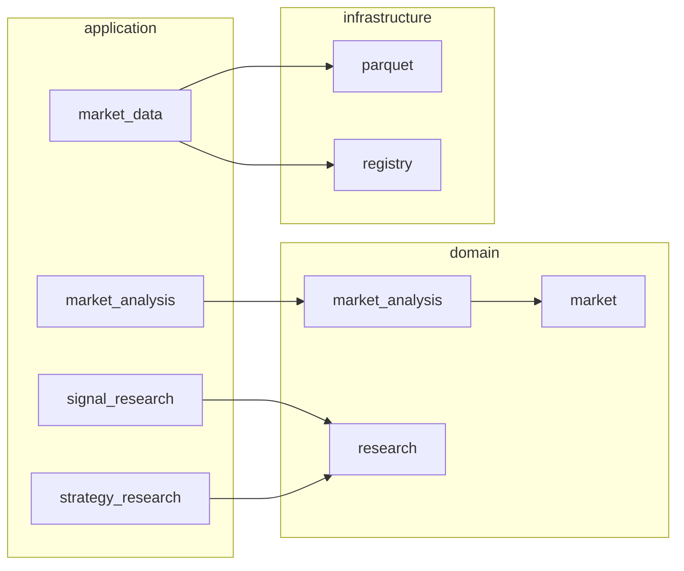

# Trading Research Framework

A **modular Python platform for quantitative trading research**: ingest market data, run reproducible analysis, evaluate signals and strategies, and inspect results in **offline HTML dashboards** — without coupling research to live trading.

**Status (2026-07-14):** Production-ready vertical slice on `main` — from Databento archives and continuous NQ futures through analysis, model evaluation, signal/strategy research and dashboards (~600 tests, CI on every change).

---

## Start here — pick your path

| If you are… | Read this first | What you get |
|-------------|-----------------|--------------|
| **Recruiter / hiring manager** | [In 60 seconds](#in-60-seconds) → [Portfolio demo](#portfolio-demo-try-it-in-the-browser) | Plain-language scope, deliverables you can open in a browser |
| **Data engineer** | [Data pipeline](#for-data-engineers) → [Storage layout](#storage-layout) → [DATA_WORKFLOWS](docs/reference/DATA_WORKFLOWS.md) | Parquet partitions, dataset lifecycle, continuous futures materialization |
| **Software engineer** | [Architecture](#for-software-engineers) → [Project structure](#project-structure) → [MODULE_MAP](docs/reference/MODULE_MAP.md) | Layering, boundaries, packages, quality gates |
| **Quant / researcher** | [Research workflows](#for-quant-developers) → [Capabilities](#capabilities) → demo dashboards | Signal vs strategy research, models, simulation, KPIs |
| **Developer (new to repo)** | [Quick start](#quick-start) → [DEVELOPER_GUIDE](docs/onboarding/DEVELOPER_GUIDE.md) | Install, tests, where code lives |

**Fastest showcase** (no prior setup beyond `uv sync`):

```bash
uv pip install plotly
uv run python scripts/demo/run_portfolio_demo.py --full --open
```

Opens `demo/output/index.html` with strategy dashboards and inspection reports.

---

## In 60 seconds

**Problem:** Research code often mixes data loading, indicators, backtests and reporting in one script — hard to reproduce, review or extend.

**Approach:** Separate **pipelines** with explicit contracts:

1. **Market Data** — import and publish versioned datasets (CSV, Databento DBN, continuous futures).
2. **Market Analysis** — reusable components (volatility, swing structure, MTF alignment) on a shared execution engine.
3. **Declarative models** — Market Model and Signal Model as expressions, not ad-hoc scripts.
4. **Signal Research** — measure whether signals predict forward price behaviour (MFE, MAE, hit rate).
5. **Strategy Research** — simulate entries/exits/risk on historical bars; persist trades, equity and a **12-KPI dashboard**.

**Evidence of depth:** partitioned Parquet storage, dataset immutability after publish, Numba simulation kernel, columnar batch reads for half-year NQ runs (~6–15 s), architecture docs and ADRs.

**Not in scope yet:** live broker execution, orderflow features, options data, walk-forward robustness suite.

---

## Portfolio demo (try it in the browser)

One command builds offline HTML artifacts — useful for **portfolio reviews** and **technical demos**:

```bash
uv pip install plotly   # optional — extra inspection charts
uv run python scripts/demo/run_portfolio_demo.py --full --open
```

| Output | Audience | Shows |
|--------|----------|-------|
| `00_strategy_dashboard_nq_half_year.html` | Everyone | Real NQ half-year backtest: KPIs, equity, OHLCV + trade markers |
| `01_strategy_dashboard_fixture.html` | Engineers | Same pipeline on small committed fixture |
| `02`–`06` inspection reports | Quants / engineers | Signal analytics, model overlays, MTF swing charts |

Details: [scripts/demo/README.md](scripts/demo/README.md) (includes a **recruiter** section — no Python required if you already have the HTML).

---

## Capabilities

| Area | What works today |
|------|------------------|
| **Ingestion** | CSV OHLCV; Databento DBN trades; 1m bars derived from trades; **continuous NQ** (`NQ.c.0`) with volume-based roll schedule |
| **Analysis** | Component DAG, MTF resample/align, CME ES RTH sessions, swing structure, volatility state |
| **Models** | Declarative Market Model × Signal Model; single shared evaluation pass per research run |
| **Signal Research** | Three scopes (market-only, signal-only, combined); forward outcomes; analytics HTML |
| **Strategy Research** | Full strategy (market × signal × exit × risk); bar simulation; persisted run + dashboard |
| **Quality** | Ruff, mypy, pytest, pre-commit, GitHub Actions |

Roadmap: [docs/planning/ROADMAP.md](docs/planning/ROADMAP.md).

---

## For data engineers

**Mental model:** external files → **normalize** → **Parquet** → **register** → **publish** → consumers query by `DatasetRef` (not by file path). Published versions are **immutable**.

**Main pipelines:**

```text
CSV / Databento DBN
  → validate → partitioned Parquet → metadata JSON
  → WORKING → FINALIZED → PUBLISHED

Multi-contract trades (NQ.NQM5, NQ.NQU5, …)
  → roll schedule (volume-RTH-close)
  → continuous trades + 1m OHLCV (NQ.c.0)
```

**Storage under `storage_root/`** (typically `user_data/storage/`):

```text
metadata/…/vN.json
normalized/…/partitions/session_date=…/*.parquet
continuous/schedules/…/
signal_research/<run_id>/
strategy_research/<run_id>/{manifest.json, trades.parquet, equity.parquet}
```

**Tech:** PyArrow Parquet, Polars aggregation, day/session partitions, import manifests, lineage on derived datasets.

Deep reference: [DATA_WORKFLOWS.md](docs/reference/DATA_WORKFLOWS.md) · [DATA_MODULE](docs/reference/modules/DATA_MODULE_UPDATED.md)

---

## For software engineers

**Style:** modular monolith — domain packages stay pure; **infrastructure** holds CSV/Databento/Parquet adapters; **`user_data/` is never imported** from `src/`.



**Dependency rule:** `application` → domain + infrastructure. Domain does not import infrastructure.

**Stack:** Python 3.12 · uv · Polars · NumPy · Numba · PyArrow · Pydantic · pytest · Ruff · mypy

**Quality (run locally):**

```bash
uv sync --locked --dev
uv run ruff check . && uv run ruff format --check .
uv run mypy && uv run pytest
```

Package map and entry points: [MODULE_MAP.md](docs/reference/MODULE_MAP.md) · Architecture ADRs: [docs/adr/](docs/adr/)

---

## For quant developers

Three **independent** research workflows share published OHLCV and analysis — they do not share mutable run state.

### Signal Research — does the signal predict future moves?

```text
OHLCV → analysis + models → occurrences / observations
      → forward outcomes (MFE, MAE, return at horizon)
      → persisted run → analytics & HTML report
```

Use when exploring **edge** before committing to a full strategy (no position sizing required).

### Strategy Research — what is the PnL of a complete rule set?

```text
OHLCV → analysis + models → gated entry signals
      → bar-sequential simulator (slippage, commission)
      → trades + equity → 12-KPI dashboard (Sharpe, drawdown, win rate, …)
```

Canonical example: high-volatility market filter × higher-low signal × fixed-bar exit.

### Continuous futures — research-grade NQ series

```text
Contract DBN → roll schedule → NQ.c.0 trades & 1m OHLCV → strategy backtest
```

Example scale: **~177k** 1m bars (half-year), **~1.5k** trades on canonical strategy (demo dataset).

Expression layer: `market_model/`, `signal_model/`, `model_expression/` — compose conditions without rewriting indicator code.

---

## Project structure

```text
src/trading_framework/
  application/      orchestration (run_analysis, evaluate_models, run_strategy_research, …)
  market/           bars, trades, datasets, continuous futures
  market_analysis/  components, planner, executor, frames
  model_expression/ market_model/ signal_model/ strategy/
  research/         simulation, envelopes, analytics, dashboards
  infrastructure/   Parquet, Databento, CSV, file registry

scripts/            CLIs (import, build_continuous, backtest, demo, dashboard)
tests/              unit + integration + fixtures
docs/               vision, reference, planning, ADR
user_data/          local storage & config (gitignored)
```

---

## Storage layout

See [For data engineers](#for-data-engineers). OHLCV decimals are stored as strings in Parquet; batch research uses a **columnar float path** (`OhlcvColumnBatch`) for performance. Small queries still use `query_historical()` → `MarketBar` objects.

---

## Quick start

**Prerequisites:** Python 3.12+, [uv](https://docs.astral.sh/uv/)

```bash
git clone <repo-url>
cd research-trading-framework
uv sync --locked --dev
uv run pytest
```

**With local NQ storage** (optional):

```bash
uv run python scripts/market_data/run_half_year_backtest.py \
  --storage-root user_data/storage_nq_half_year --skip-build
```

---

## Documentation

| Document | Best for |
|----------|----------|
| [docs/README.md](docs/README.md) | Documentation index |
| [DEVELOPER_GUIDE.md](docs/onboarding/DEVELOPER_GUIDE.md) | Day-one setup |
| [DATA_WORKFLOWS.md](docs/reference/DATA_WORKFLOWS.md) | Data engineers — diagrams & sequences |
| [MODULE_MAP.md](docs/reference/MODULE_MAP.md) | Software engineers — packages & APIs |
| [CURRENT_STATUS.md](docs/planning/CURRENT_STATUS.md) | Sprint status |
| [ROADMAP.md](docs/planning/ROADMAP.md) | What is planned next |

AI contributors: start with [AGENTS.md](AGENTS.md).

---

## License

Private research project.
