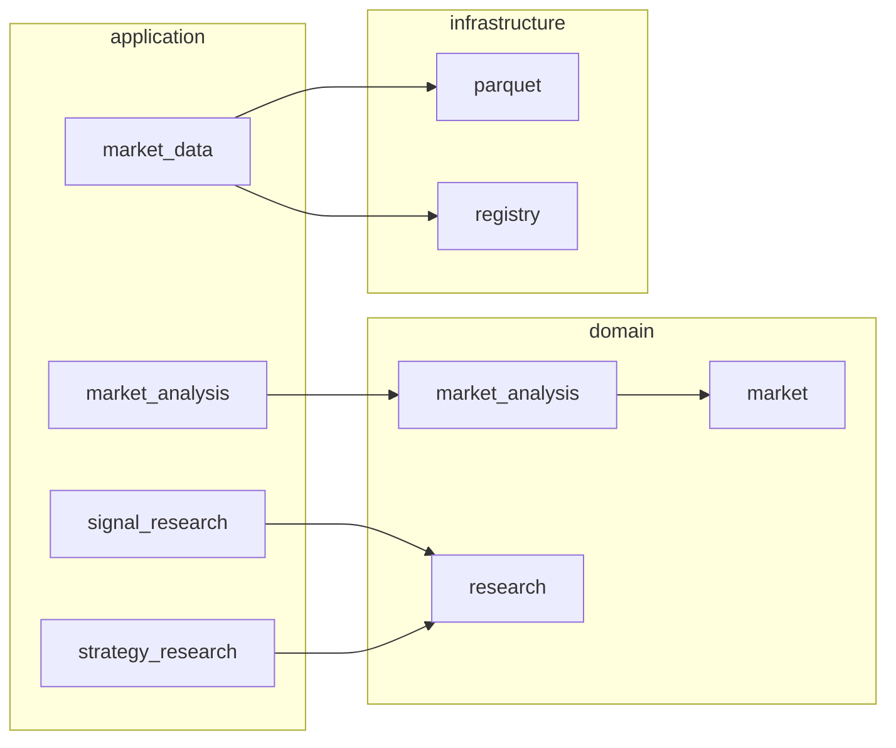

# Trading Research Framework

A **modular Python platform for quantitative trading research**: ingest market data, run reproducible analysis, evaluate signals and strategies, and inspect results in **offline HTML dashboards** — without coupling research to live trading.

**Status (2026-07-14):** Production-ready vertical slice on `main` — from Databento archives and continuous NQ futures through analysis, model evaluation, signal/strategy research and dashboards (~600 tests, CI on every change).

---

## Start here — pick your path

| If you are… | Read this first | What you get |
|-------------|-----------------|--------------|
| **Recruiter / hiring manager** | [In 60 seconds](#in-60-seconds) → [Scale & performance](#scale--performance-reference-run) → [Portfolio demo](#portfolio-demo-try-it-in-the-browser) | Plain-language scope, concrete scale, browser deliverables |
| **Data engineer** | [Data pipeline](#for-data-engineers) → [Storage layout](#storage-layout) → [DATA_WORKFLOWS](docs/reference/DATA_WORKFLOWS.md) | Parquet partitions, dataset lifecycle, continuous futures materialization |
| **Software engineer** | [Architecture](#for-software-engineers) → [Project structure](#project-structure) → [MODULE_MAP](docs/reference/MODULE_MAP.md) | Layering, boundaries, packages, quality gates |
| **Developer (new to repo)** | [Quick start](#quick-start) → [DEVELOPER_GUIDE](docs/onboarding/DEVELOPER_GUIDE.md) | Install, tests, where code lives |

**Fastest showcase** (no prior setup beyond `uv sync`):

```bash
uv pip install plotly
uv run python scripts/demo/run_portfolio_demo.py --full --open
```

Opens `demo/output/index.html` with strategy dashboards and inspection reports.

---

## In 60 seconds

**Problem:** Research code often mixes data loading, indicators, backtests and reporting in one script — hard to reproduce, review or extend.

**Approach:** Separate **pipelines** with explicit contracts:

1. **Market Data** — import and publish versioned datasets (CSV, Databento DBN, continuous futures).
2. **Market Analysis** — reusable components (volatility, swing structure, MTF alignment) on a shared execution engine.
3. **Declarative models** — Market Model and Signal Model as expressions, not ad-hoc scripts.
4. **Signal Research** — measure whether signals predict forward price behaviour (MFE, MAE, hit rate).
5. **Model Research Methodology** — declarative study specs, quality diagnostics, Plotly dashboards (Phase 5B).
6. **Strategy Research** — simulate entries/exits/risk on historical bars; persist trades, equity and a **12-KPI dashboard**.
7. **Robustness Research** — parameter sweep, walk-forward, stress and Monte Carlo verdicts on strategy edge.

**Evidence of depth:** **45M+** tick trades ingested, **178k** 1m OHLCV bars materialized, full strategy backtest in **~6 s** on a laptop — see [Scale & performance](#scale--performance-reference-run).

**Not in scope yet:** live broker execution, orderflow features, options data.

Research methodology reference: [docs/reference/RESEARCH_METHODOLOGIES.md](docs/reference/RESEARCH_METHODOLOGIES.md).

---

## Scale & performance (reference run)

Measured on the **NQ half-year demo dataset** (`user_data/storage_nq_half_year`, Jul 2025 – Jan 2026). Reproduce with `--profile` on `run_half_year_backtest.py` (requires built storage).

### Data volume

| Stage | Scale |
|-------|-------|
| **Databento contract ticks** (7 NQ contracts) | **45.2M** trades normalized to day-partitioned Parquet |
| **Continuous tick series** (`NQ.c.0`, volume-RTH-close roll) | **44.3M** trades materialized once, reused by all research |
| **Derived 1m OHLCV** (`NQ.c.0`) | **177,507** bars (~**250:1** tick→bar compression) |
| **Analysis workspace** (canonical strategy: ATR, volatility state, 5m swing + MTF align) | **26** aligned output series · **~2.4M** numeric cells per pass |
| **Strategy simulation output** | **1,464** trades · **177,507** equity points |

Preprocessing is **one-time**: published continuous OHLCV is a versioned cache — backtests do not re-decode DBN or re-roll contracts.

### Wall-clock (strategy research only, `--skip-build`)

| Milestone | Half-year NQ backtest | Notes |
|-----------|----------------------|-------|
| Before align + columnar optimizations | ~40 s | `EVENT_AT_AVAILABLE` nested loop dominated |
| After vectorized align + batch Parquet read | ~10 s | PR #131 |
| **Current** (columnar OHLCV + shared eval table + Numba kernel) | **~6 s** | PR #132; profiled 2026-07-14 |

```bash
uv run python scripts/market_data/run_half_year_backtest.py \
  --storage-root user_data/storage_nq_half_year \
  --skip-build --no-persist --profile
```

**Hot phases (~6 s total):** columnar OHLCV load (~1.4 s) · 5m resample + components (~1.2 s) · shared model evaluation table (~0.6 s) · Numba simulation kernel (~1.4 s).

### Data-pipeline throughput (import)

Vectorized CME session mapping on contract import: **~807 s → ~89 s** for the same three DBN archives (~**9×** faster; dominated by per-tick session resolve before fix).

Deep dive: [DATA_WORKFLOWS.md §1.1](docs/reference/DATA_WORKFLOWS.md#11-reference-scale-nq-half-year-demo).

---

## Portfolio demo (try it in the browser)

One command builds offline HTML artifacts — useful for **portfolio reviews** and **technical demos**:

```bash
uv pip install plotly   # optional — extra inspection charts
uv run python scripts/demo/run_portfolio_demo.py --full --open
```

| Output | Audience | Shows |
|--------|----------|-------|
| `00_strategy_dashboard_nq_half_year.html` | Everyone | **177,507** bars · **1,464** trades · KPIs, equity, OHLCV + markers |
| `01_strategy_dashboard_fixture.html` | Engineers | Same pipeline on small committed fixture |
| `02`–`06` inspection reports | Engineers | Signal analytics, model overlays, MTF swing charts |
| `07_robustness_dashboard.html` | Engineers | Robustness Research verdict dashboard |
| `08_model_research_nq_half_year.html` | Everyone | Model Research — 3 scopes on NQ half-year |

Details: [scripts/demo/README.md](scripts/demo/README.md) (includes a **recruiter** section — no Python required if you already have the HTML).

All research workflows: [RESEARCH_METHODOLOGIES.md](docs/reference/RESEARCH_METHODOLOGIES.md).

---

## Capabilities

| Area | What works today |
|------|------------------|
| **Ingestion** | CSV OHLCV; Databento DBN trades; 1m bars derived from trades; **continuous NQ** (`NQ.c.0`) with volume-based roll schedule |
| **Analysis** | Component DAG, MTF resample/align, CME ES RTH sessions, swing structure, volatility state |
| **Models** | Declarative Market Model × Signal Model; single shared evaluation pass per research run |
| **Signal Research** | Three scopes (market-only, signal-only, combined); forward outcomes; analytics HTML |
| **Model Research** | YAML/JSON study definitions, quality flags, baseline comparison, Plotly report v2, NQ demo |
| **Strategy Research** | Full strategy (market × signal × exit × risk); bar simulation; persisted run + dashboard |
| **Robustness Research** | Parameter sweep, walk-forward, stress, Monte Carlo; PASS/CONDITIONAL/FAIL verdict |
| **Quality** | Ruff, mypy, pytest, pre-commit, GitHub Actions |

Roadmap: [docs/planning/ROADMAP.md](docs/planning/ROADMAP.md).

---

## For data engineers

**Mental model:** external files → **normalize** → **Parquet** → **register** → **publish** → consumers query by `DatasetRef` (not by file path). Published versions are **immutable**.

**Main pipelines:**

```text
CSV / Databento DBN
  → validate → partitioned Parquet → metadata JSON
  → WORKING → FINALIZED → PUBLISHED

Multi-contract trades (NQ.NQM5, NQ.NQU5, …)
  → roll schedule (volume-RTH-close)
  → continuous trades + 1m OHLCV (NQ.c.0)
```

**Storage under `storage_root/`** (typically `user_data/storage/`):

```text
metadata/…/vN.json
normalized/…/partitions/session_date=…/*.parquet
continuous/schedules/…/
signal_research/<run_id>/
strategy_research/<run_id>/{manifest.json, trades.parquet, equity.parquet}
```

**Tech:** PyArrow Parquet, Polars aggregation, day/session partitions, import manifests, lineage on derived datasets.

**Reference scale:** 45M contract ticks → 44M continuous ticks → 178k 1m OHLCV bars on the NQ half-year demo ([§1.1](docs/reference/DATA_WORKFLOWS.md#11-reference-scale-nq-half-year-demo)).

Deep reference: [DATA_WORKFLOWS.md](docs/reference/DATA_WORKFLOWS.md) · [DATA_MODULE](docs/reference/modules/DATA_MODULE_UPDATED.md)

---

## For software engineers

**Style:** modular monolith — domain packages stay pure; **infrastructure** holds CSV/Databento/Parquet adapters; **`user_data/` is never imported** from `src/`.



**Dependency rule:** `application` → domain + infrastructure. Domain does not import infrastructure.

**Stack:** Python 3.12 · uv · Polars · NumPy · Numba · PyArrow · Pydantic · pytest · Ruff · mypy

**Quality (run locally):**

```bash
uv sync --locked --dev
uv run ruff check . && uv run ruff format --check .
uv run mypy && uv run pytest
```

Package map and entry points: [MODULE_MAP.md](docs/reference/MODULE_MAP.md) · Architecture ADRs: [docs/adr/](docs/adr/)

Research workflows (signal vs strategy): [DATA_WORKFLOWS.md](docs/reference/DATA_WORKFLOWS.md) §3.

---

## Project structure

```text
src/trading_framework/
  application/      orchestration (run_analysis, evaluate_models, run_strategy_research, …)
  market/           bars, trades, datasets, continuous futures
  market_analysis/  components, planner, executor, frames
  model_expression/ market_model/ signal_model/ strategy/
  research/         simulation, envelopes, analytics, dashboards
  infrastructure/   Parquet, Databento, CSV, file registry

scripts/            CLIs (import, build_continuous, backtest, demo, dashboard)
tests/              unit + integration + fixtures
docs/               vision, reference, planning, ADR
user_data/          local storage & config (gitignored)
```

---

## Storage layout

See [For data engineers](#for-data-engineers). OHLCV decimals are stored as strings in Parquet; batch research uses a **columnar float path** (`OhlcvColumnBatch`) for performance. Small queries still use `query_historical()` → `MarketBar` objects.

---

## Quick start

**Prerequisites:** Python 3.12+, [uv](https://docs.astral.sh/uv/)

```bash
git clone <repo-url>
cd research-trading-framework
uv sync --locked --dev
uv run pytest
```

**With local NQ storage** (optional):

```bash
uv run python scripts/market_data/run_half_year_backtest.py \
  --storage-root user_data/storage_nq_half_year --skip-build
```

---

## Documentation

| Document | Best for |
|----------|----------|
| [docs/README.md](docs/README.md) | Documentation index |
| [DEVELOPER_GUIDE.md](docs/onboarding/DEVELOPER_GUIDE.md) | Day-one setup |
| [DATA_WORKFLOWS.md](docs/reference/DATA_WORKFLOWS.md) | Data engineers — diagrams & sequences |
| [MODULE_MAP.md](docs/reference/MODULE_MAP.md) | Software engineers — packages & APIs |
| [CURRENT_STATUS.md](docs/planning/CURRENT_STATUS.md) | Sprint status |
| [ROADMAP.md](docs/planning/ROADMAP.md) | What is planned next |

AI contributors: start with [AGENTS.md](AGENTS.md).

---

## License

Private research project.
