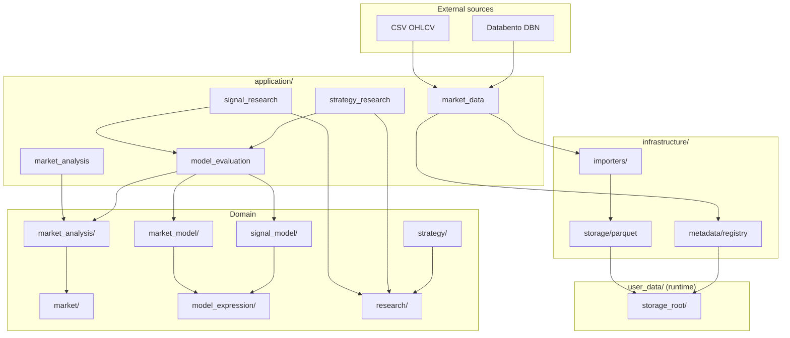

# Trading Research Framework

Modular quantitative trading research platform in Python. Separates **market data**, **market analysis**, **declarative models**, **signal research**, **strategy research** and (future) **execution** into independent domains with explicit contracts, reproducible runs and offline HTML inspection.

**Status (2026-07-14):** Sprints 001–006 and 008–015 are integrated on `main`. End-to-end workflows run from Databento archives through continuous futures, analysis, model evaluation, signal/strategy research and standalone dashboards.

---

## Capabilities (as implemented)

| Track | What works today |
|-------|------------------|
| **Market Data** | CSV OHLCV import; Databento DBN trades; derived 1m bars from trades; multi-contract continuous futures (`NQ.c.0`) with volume-RTH-close roll schedule |
| **Market Analysis** | Component registry, DAG planner, sequential executor, MTF resample/align, CME ES RTH sessions, swing structure, volatility state |
| **Declarative Models** | Market Model and Signal Model expressions; `evaluate_models` on one shared `AnalysisFrame` |
| **Signal Research** | Three scopes (`MARKET_MODEL_ONLY`, `SIGNAL_MODEL_ONLY`, `MARKET_AND_SIGNAL`); forward outcomes; read-only analytics and HTML reports |
| **Strategy Research** | Market × Signal × Exit × Risk composition; bar-sequential simulation (Numba kernel); persisted run envelope; 12-KPI dashboard (Lightweight Charts) |
| **Portfolio demo** | One command generates all offline HTML artifacts — see [Demo](#portfolio-demo) |

Not yet built: live execution, orderflow components (Phase 4B), options data (Phase 2D), robustness research (Phase 7). See [ROADMAP](docs/planning/ROADMAP.md).

---

## Tech stack

| Layer | Choices |
|-------|---------|
| Language | Python 3.12+ |
| Packaging | [uv](https://docs.astral.sh/uv/), `uv_build` |
| Data / compute | **Polars** (resample, align, analytics), **NumPy** (indicator adapters), **Numba** (simulation hot path), **PyArrow** (Parquet I/O) |
| Storage | Local Parquet partitions + JSON metadata registry (`user_data/`, not in git) |
| Validation / config | Pydantic v2 |
| Market data import | Databento SDK (DBN decode at adapter boundary only) |
| Quality | Ruff, mypy (strict on `src/`), pytest (~600+ tests), pre-commit, GitHub Actions |
| Dashboards | Standalone HTML — Lightweight Charts (strategy), Plotly (inspection spikes; optional `uv pip install plotly`) |

Domain logic does **not** call vendor APIs at runtime. Importers normalize to canonical `MarketBar` / `MarketTrade` models; consumers use `DatasetRef` and repository protocols.

---

## Architecture

Modular monolith: **application** orchestrates **domain** packages; **infrastructure** implements adapters. `src/trading_framework/` never imports `user_data/`.



### Layer responsibilities

```text
application/     Use cases — import, publish, run_analysis, evaluate_models,
                   run_signal_research, run_strategy_research, dashboards
market/            Dataset identity, lifecycle, MarketBar/MarketTrade, repository protocols
market_analysis/   Components, planning, execution, frames, temporal alignment
model_expression/  Declarative IR, validation, Polars evaluation
market_model/      Market Model definitions and evaluator
signal_model/      Signal Model definitions, firing policies, emissions
strategy/          Exit, Risk, Strategy model contracts
research/          Signal/Strategy run envelopes, simulation, analytics, dashboards
infrastructure/    CSV, Databento, Parquet, file registry, observability
core/, time/, config/   Identifiers, UTC time, Clock, framework config
execution/, events/     Reserved for future execution track
```

**Dependency rule:** `application` → domain + infrastructure. Domain packages do not import infrastructure or `user_data/`.

---

## Research workflows

Three independent research paths share **published datasets** and **market analysis**, but not each other's workflow state (ADR-0011–0013).

### 1. Signal Research — edge discovery

```text
Published OHLCV
  → run_analysis + evaluate_models
  → SignalOccurrence / MarketModelObservation (+ optional ContextFact)
  → forward outcomes (MFE, MAE, terminal return)
  → persisted Signal Research envelope
  → analyze_signal_research_run → HTML analytics report
```

**Scopes:** market-only, signal-only, or combined (context at `available_at`).

### 2. Strategy Research — PnL simulation

```text
Published OHLCV (columnar batch path in hot research)
  → run_analysis + evaluate_models (shared evaluation table)
  → gated entry signals (market state × signal emissions)
  → BarSequentialSimulator (Numba fixed-bars kernel)
  → trades.parquet + equity.parquet + manifest
  → build_strategy_dashboard_view_model → offline HTML dashboard
```

### 3. Continuous futures preprocessing (data track)

```text
Databento DBN (NQ.NQM5, NQ.NQU5, …)
  → contract trades partitions
  → volume-RTH-close roll schedule
  → materialized continuous trades + derived 1m OHLCV (NQ.c.0)
  → publish → query_historical / run_strategy_research (read-only)
```

Detailed sequence diagrams: [docs/reference/DATA_WORKFLOWS.md](docs/reference/DATA_WORKFLOWS.md).

---

## Project structure

```text
research-trading-framework/
├── src/trading_framework/          # Framework code (installable package)
│   ├── application/                # Use cases (market_data, market_analysis, …)
│   ├── market/                     # Domain: bars, trades, datasets, contracts, continuous
│   ├── market_analysis/            # Analysis engine, components, assembly
│   ├── model_expression/           # Expression IR and evaluation
│   ├── model_authoring/            # Optional DSL → IR
│   ├── market_model/ · signal_model/
│   ├── strategy/ · research/
│   ├── infrastructure/             # Parquet, Databento, CSV, registry
│   └── core/ · time/ · config/
├── scripts/                        # Thin CLIs (not imported by domain)
│   ├── databento/                  # DBN inspect, trades import
│   ├── market_data/                # derive bars, build_continuous, half-year backtest
│   ├── strategy_research/          # run research, render dashboard
│   └── demo/                       # Portfolio demo generator
├── tests/
│   ├── unit/ · integration/        # CI test suites
│   ├── fixtures/                   # Small deterministic CSV/DBN samples
│   └── spike/                      # Manual inspection HTML scripts (Plotly)
├── docs/
│   ├── vision/                     # Target design and binding decisions
│   ├── reference/                  # As-implemented: MODULE_MAP, DATA_WORKFLOWS
│   ├── planning/                   # ROADMAP, CURRENT_STATUS, sprints
│   └── adr/                        # Architecture decision records
├── user_data/                      # Gitignored: storage, config, proprietary models
├── demo/output/                    # Generated portfolio HTML (from demo script)
├── AGENTS.md                       # AI agent instructions
└── pyproject.toml
```

Package index and entry points: [docs/reference/MODULE_MAP.md](docs/reference/MODULE_MAP.md).

---

## Storage layout (under `storage_root`)

Published datasets are immutable. Identity is `DatasetRef`, not file path.

```text
storage_root/
├── metadata/…/vN.json              # DatasetMetadata (lifecycle, checksum, lineage)
├── normalized/                     # Per-dataset Parquet
│   ├── ES.c.0/ohlcv/1m/…/bars.parquet
│   ├── NQ.NQU5/trades/tick/…/partitions/session_date=…/trades.parquet
│   └── NQ.c.0/ohlcv/1m/derived/…/partitions/session_date=…/bars.parquet
├── continuous/schedules/…/         # Roll schedule artifacts (Sprint 015)
├── signal_research/<run_id>/       # Signal Research envelope tables
└── strategy_research/<run_id>/     # manifest.json, trades.parquet, equity.parquet
```

OHLCV Parquet stores decimals as strings; batch research uses a **columnar float path** (`OhlcvColumnBatch`) to avoid per-bar `MarketBar` materialization. Boundary API `query_historical()` still returns `list[MarketBar]` for small queries.

---

## Quick start

### Prerequisites

- Python 3.12+
- [uv](https://docs.astral.sh/uv/)

### Install and verify

```bash
uv sync --locked --dev
uv run ruff check .
uv run ruff format --check .
uv run mypy
uv run pytest
```

### Portfolio demo

Generates offline HTML dashboards for all major workflows (~30 s on fixtures; includes NQ half-year dashboard when `user_data/storage_nq_half_year` exists):

```bash
uv pip install plotly   # optional — inspection reports
uv run python scripts/demo/run_portfolio_demo.py --full --open
```

Output: `demo/output/index.html`. Details: [scripts/demo/README.md](scripts/demo/README.md).

### Example CLIs

```bash
# Half-year NQ continuous backtest (requires built storage)
uv run python scripts/market_data/run_half_year_backtest.py \
  --storage-root user_data/storage_nq_half_year --skip-build

# Strategy dashboard from persisted run
uv run python scripts/strategy_research/render_strategy_dashboard.py \
  --storage-root user_data/storage_nq_half_year \
  --run-id <run_id> \
  --output strategy_dashboard.html
```

---

## Documentation

| Document | Purpose |
|----------|---------|
| **[docs/README.md](docs/README.md)** | Documentation index and reading paths |
| [DATA_WORKFLOWS.md](docs/reference/DATA_WORKFLOWS.md) | Technical data-flow reference (diagrams) |
| [MODULE_MAP.md](docs/reference/MODULE_MAP.md) | Packages, status, entry points |
| [CURRENT_STATUS.md](docs/planning/CURRENT_STATUS.md) | Sprint progress and next steps |
| [ROADMAP.md](docs/planning/ROADMAP.md) | Capability tracks and phased plan |
| [DEVELOPER_GUIDE.md](docs/onboarding/DEVELOPER_GUIDE.md) | Day-one setup |

AI agents: read `AGENTS.md` first.

---

## License

Private research project.
