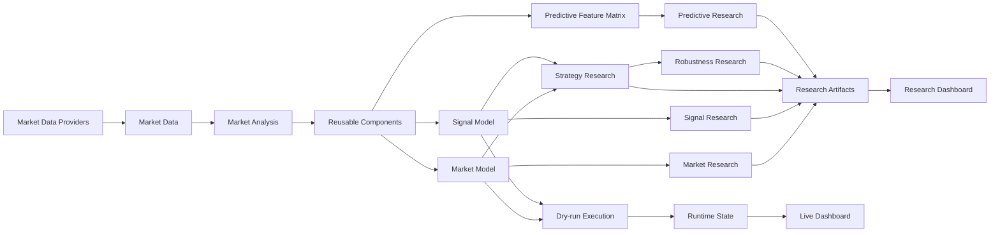

# Trading Research Framework

End-to-end Python framework for systematic market research: market-data
pipelines, reusable analytical components, declarative models, strategy
simulation, robustness analysis, predictive ML research and read-only research
dashboards.

This repository is a portfolio-grade product demo. It demonstrates how a trading
research platform can be designed, tested and inspected responsibly. It does not
sell strategies, publish proprietary strategy logic or make live-performance
claims.

To understand the implementation from architecture to modules, follow the
[documentation reading path](docs/README.md#learn-the-system).

Public dashboard:

**https://dashboard.filipf.online**

---

## What This Project Demonstrates

| Area | Demonstrated capability |
|---|---|
| Data engineering | Provider adapters, normalized datasets, partitioned Parquet storage, manifests and stable dataset references |
| Quant research | Market states, signal research, strategy simulation, forward-outcome analysis and robustness validation |
| ML / AI research | Predictive-study contracts, feature matrices, baselines, tree models, neural models, walk-forward evaluation and model diagnostics |
| Software architecture | Modular boundaries, dependency inversion, typed contracts, reproducible artifacts and isolated application consumers |
| Product surface | Public read-only dashboard over persisted research artifacts and live paper-runtime state |
| Responsible framing | PnL and ROI are treated as simulation diagnostics under explicit assumptions, not as investment promises |

The core capabilities share upstream contracts but remain independent:

```text
market data -> reusable market components -> market and signal models
                                              |-> Signal Research
                                              |-> Strategy Research -> robustness
                                              |-> Strategy Execution
                                              |-> Predictive Research
persisted research evidence / runtime read models -> dashboard and reports
```

---

## Public Dashboard

The public dashboard is the main interactive demo surface. It is a read-only
consumer of persisted artifacts and runtime state.

| Page | What it shows |
|---|---|
| Project Overview | High-level system narrative and research / execution flow |
| Research Catalog | Persisted market, signal, strategy, robustness and predictive runs |
| Market and Signal Research | Occurrence analytics, grouped outcomes, distributions and diagnostics |
| Strategy Research | Strategy KPIs, equity, drawdown, trades and selected-trade inspection |
| Robustness Analysis | Walk-forward, parameter sweep, stress and Monte Carlo evidence |
| Predictive Research | Being rebuilt, with a public refresh target of 2026-09-11; persisted diagnostics remain available where published |
| Live Paper Trading | VPS migration status; live telemetry is temporarily unavailable |

Dashboard source:

- [`apps/dashboard/`](apps/dashboard/)
- [`apps/dashboard/README.md`](apps/dashboard/README.md)
- [`apps/dashboard/docs/ARCHITECTURE.md`](apps/dashboard/docs/ARCHITECTURE.md)
- [`apps/dashboard/docs/RUNBOOK.md`](apps/dashboard/docs/RUNBOOK.md)

Planned dashboard direction:

- Strategy Ranking view for comparing example strategies on the same dataset,
  symbol and time range.
- Strategy Detail view with Simple / Advanced inspection modes.
- Stronger portfolio overview explaining the product, research workflow and
  evidence trail.
- Contextual links from dashboard pages to frozen research reports.

See the [product direction](docs/vision/PRODUCT_DIRECTION.md) and [roadmap](docs/planning/ROADMAP.md).

---

## Research Workflows

The framework is intentionally not one mandatory pipeline. It contains separate
research workflows that can be used independently or combined.

| Workflow | Question it answers |
|---|---|
| Market Research | How does a market state behave under specific conditions? |
| Signal Research | What happens after a signal appears, before adding full strategy mechanics? |
| Strategy Research | How does a complete entry / exit / risk model behave in simulation? |
| Robustness Research | Is the result stable across parameters, windows, stress tests and resampling? |
| Predictive Research | Is there predictable structure in declared features under honest validation? |
| Strategy Execution | Can selected logic run in an isolated dry-run runtime with observable state? |

Research outputs are persisted as artifacts. Dashboards and reports inspect those
artifacts; they do not rerun research engines.

Methodology reference:

- [`docs/reference/workflows/RESEARCH_METHODOLOGIES.md`](docs/reference/workflows/RESEARCH_METHODOLOGIES.md)

---

## Market Components and Models

Market analysis components are designed as neutral facts, not as strategy-only
indicators or ML-only features.

Examples:

```text
momentum.rsi
momentum.macd
trend.ema_distance
volatility.relative_volatility
structure.level_distance
candle.wick
statistics.return_autocorrelation
```

Those components can be reused by:

- classical rule-based strategies,
- discretionary-style setup definitions,
- Market Models and Signal Models,
- predictive feature matrices,
- signal-quality scoring,
- dashboard diagnostics,
- future promoted model-derived states.

Strategy definitions are composed from independent parts:

```text
StrategyModelDefinition
  = MarketModel
  + SignalModel
  + ExitModel
  + RiskModel
```

The reusable framework code lives under `src/`. User-owned strategy definitions,
private experiments, datasets and credentials live outside the published core
boundary, especially under gitignored `user_data/`.

Authoring references:

- [`docs/reference/modules/MODEL_AUTHORING.md`](docs/reference/modules/MODEL_AUTHORING.md)
- [`docs/reference/modules/STRATEGY_AUTHORING.md`](docs/reference/modules/STRATEGY_AUTHORING.md)

---

## Predictive ML / AI Research

Predictive Research is a research methodology, not a shortcut to live trading.
It defines explicit learning problems:

```text
PredictiveStudySpec
  = dataset reference
  + time range
  + declared features
  + label definition
  + purged walk-forward split
  + evaluation timeframe
```

Supported research directions include:

- forward-return prediction,
- classification of favourable / unfavourable market contexts,
- signal-quality scoring,
- trade-outcome modelling,
- regime classification,
- volatility forecasting,
- no-trade filters,
- discretionary setup classification.

Estimator families include classical baselines, tree-based models and neural /
sequence models. The important part is not the model family itself, but the
research contract around it: leakage controls, out-of-sample evaluation,
baselines, diagnostics, provenance and reproducible artifacts.

Promotion of learned outputs into runtime-usable state is deliberately guarded
and separate from research reporting.

References:

- [`docs/reference/modules/PREDICTIVE_PROMOTION.md`](docs/reference/modules/PREDICTIVE_PROMOTION.md)
- [Research roadmap](docs/planning/ROADMAP.md)

---

## Responsible Interpretation of Results

The project includes simulated strategy metrics such as PnL, drawdown, win rate,
profit factor and Sharpe-like ratios because these are necessary diagnostics for
research and comparison.

They should be read as:

```text
simulation diagnostics under explicit assumptions
```

They should not be read as:

```text
guaranteed profitability, investment advice or live trading performance
```

The public repository does not publish proprietary strategies from `user_data/`.
Example strategies are used to demonstrate methodology, workflow, artifact
generation, comparison and inspection.

---

## Architecture Overview


```mermaid
flowchart LR
    P[Market Data Providers] --> D[Market Data]
    D --> A[Market Analysis]
    A --> C[Reusable Components]

    C --> MM[Market Model]
    C --> SM[Signal Model]
    C --> FM[Predictive Feature Matrix]

    MM --> MR[Market Research]
    SM --> SR[Signal Research]
    MM --> STR[Strategy Research]
    SM --> STR

    STR --> ROB[Robustness Research]
    FM --> PR[Predictive Research]

    MM --> EX[Dry-run Execution]
    SM --> EX

    MR --> RA[Research Artifacts]
    SR --> RA
    STR --> RA
    ROB --> RA
    PR --> RA

    EX --> RS[Runtime State]

    RA --> RD[Research Dashboard]
    RS --> LD[Live Dashboard]
```

Core rules:

- Market and Signal Models are declarative compositions of lower-level
  components.
- Signal Research, Strategy Research, Predictive Research and Strategy Execution
  are independent capabilities.
- Research does not have to end in execution.
- Execution does not depend on historical research reports.
- Dashboards consume persisted artifacts or runtime state.
- Deployable apps under `apps/` do not import research engines or provider
  adapters directly.
- Framework Core never imports user-owned `user_data/`.

Architecture references:

- [`docs/reference/system/SYSTEM_OVERVIEW.md`](docs/reference/system/SYSTEM_OVERVIEW.md)
- [`docs/reference/system/MODULE_MAP.md`](docs/reference/system/MODULE_MAP.md)
- [`docs/reference/modules/DASHBOARD_APPLICATION.md`](docs/reference/modules/DASHBOARD_APPLICATION.md)

---

## Repository Map

| Tier | Paths | Purpose |
|---|---|---|
| Framework core | `src/` | Domain, application, research, execution and infrastructure packages |
| Applications | `apps/` | Separate deployable consumers, including dashboard and CLI |
| Tests | `tests/`, `apps/dashboard/tests/` | Unit, integration and app-boundary coverage |
| Documentation | `docs/` | Vision, ADRs, planning, reference docs and runbooks |
| Demo scripts | `scripts/demo/` | Portfolio/demo artifact generation |
| Generated artifacts | `artifacts/` | Generated demo outputs and reports |
| Local-only workspace | `user_data/`, `scratch/`, caches | Private strategies, experiments, logs and local data |

Binding rule:

- [`docs/adr/ADR-0022-repository-top-level-layout.md`](docs/adr/ADR-0022-repository-top-level-layout.md)

---

## Reference Scale

A reference NQ research run demonstrates the system on non-trivial data volumes:

- 45M+ normalized Databento trades,
- 44M+ continuous futures trades,
- 177k+ derived one-minute OHLCV bars,
- 1,400+ simulated strategy trades.

Expensive preprocessing is materialized once. Downstream research consumes
published datasets through stable references.

Example compute baselines on a laptop-class machine:

| Workflow | Hot path | Scale note |
|---|---|---|
| Strategy Research | Columnar OHLCV, shared Polars evaluation and Numba fixed-bars kernel | About 6 seconds for a half-year run |
| Signal / Market Research | Amortized reference-price lookup, Polars joins and NumPy forward outcomes | Avoids occurrence-by-bar scans on the reference-price path |
| Robustness Research | Shared strategy evaluation cache | Child cells reuse loaded OHLCV and model evaluation where possible |

---

## Technology Stack

| Area | Technologies |
|---|---|
| Language and environment | Python, uv |
| Data processing | Polars, NumPy, Numba |
| Data storage | Parquet, partitioned datasets, manifests |
| ML / AI research | scikit-learn-style adapters, XGBoost / tree families, neural / sequence estimators |
| Visualization | Streamlit, Plotly, TradingView Lightweight Charts |
| Testing and quality | pytest, Ruff, mypy |
| Packaging and delivery | Docker, GitHub Actions |
| Historical market data | Databento import pipeline |
| Live market data | Binance |
| Runtime infrastructure | VPS-oriented dry-run deployment |
| Public delivery | Read-only HTTP status API and Streamlit dashboard |

---

## Quick Start

Install the workspace and inspect the operator CLI:

```bash
git clone https://github.com/folg-code/research-trading-framework.git
cd research-trading-framework

uv sync --all-packages
uv run trading-cli --help
```

Validate example workflow plans without writing artifacts or calling external
services:

```bash
uv run trading-cli data fetch --config apps/cli/examples/data_fetch_binance.yaml --dry-run
uv run trading-cli research run --config apps/cli/examples/research_run_strategy.yaml --dry-run
uv run trading-cli research run --config apps/cli/examples/research_run_predictive.yaml --dry-run
uv run trading-cli report render --config apps/cli/examples/report_render.yaml --dry-run
```

Run a real workflow after replacing placeholder dataset/config values with your
own published research inputs:

```bash
uv run trading-cli research run --config apps/cli/examples/research_run_strategy.yaml
uv run trading-cli research run --config apps/cli/examples/research_run_predictive.yaml
```

Operator CLI references:

- [`apps/cli/README.md`](apps/cli/README.md)
- [`docs/reference/modules/OPERATOR_CLI.md`](docs/reference/modules/OPERATOR_CLI.md)
- [`apps/cli/examples/`](apps/cli/examples/)

Development checks:

```bash
uv run ruff check .
uv run ruff format --check .
uv run mypy
uv run pytest
```

Generate the local portfolio demo bundle:

```bash
uv run python scripts/demo/run_portfolio_demo.py --full --open
```

Demo documentation:

- [`scripts/demo/README.md`](scripts/demo/README.md)

---

## Documentation

Start here:

- [`docs/README.md`](docs/README.md)
- [`docs/reference/system/SYSTEM_OVERVIEW.md`](docs/reference/system/SYSTEM_OVERVIEW.md)
- [`docs/reference/system/MODULE_MAP.md`](docs/reference/system/MODULE_MAP.md)
- [`docs/reference/workflows/RESEARCH_METHODOLOGIES.md`](docs/reference/workflows/RESEARCH_METHODOLOGIES.md)

Planning notes:

- [Roadmap](docs/planning/ROADMAP.md)
- [Product direction](docs/vision/PRODUCT_DIRECTION.md)

---

## Status

This is an active private research project and product demo. The reusable
framework, dashboard and documentation are intended for public inspection; local
strategies, credentials, proprietary datasets and private research outputs are
kept outside the published core.

---

## License

Private research project.
