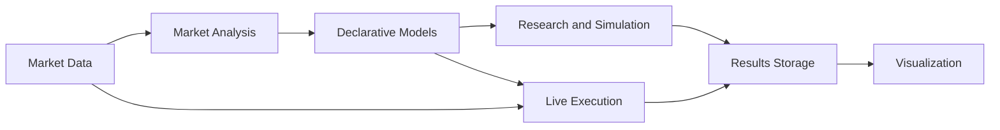
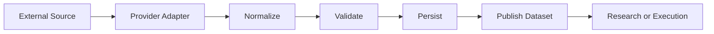
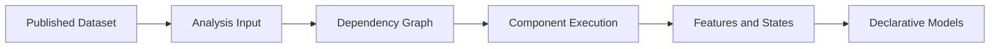
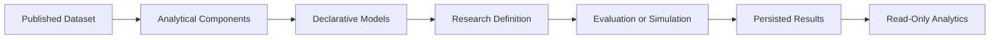
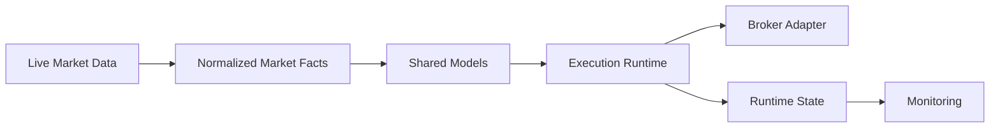

# Architecture and Workflows

This document explains the main architectural modules of the Trading Research Framework, the problems they solve, how they interact, and how data moves through the system.

It focuses on stable architectural concepts, module responsibilities, workflow boundaries and future development directions. Implementation history, sprint status and low-level API details are documented separately.

---

## 1. High-Level Architecture



The framework separates data acquisition, analytical computation, model composition, research, visualization and execution into independent modules connected through shared domain contracts.

Core principles:

- external data is normalized before it is consumed,
- analytical components are reusable and independently testable,
- Market Models and Signal Models are declarative compositions,
- research and execution are independent workflows,
- research produces persisted artifacts,
- execution produces persisted runtime state,
- visualization reads persisted outputs rather than recomputing results.

---

## 2. Framework Core and User Workspace

The framework deliberately separates reusable framework code from user-owned research assets.

```text
src/
    reusable framework code
    domain contracts
    application workflows
    infrastructure adapters
    research and execution engines

user_data/
    local data storage
    provider configuration
    user components
    model definitions
    strategy definitions
    research specifications
    generated runs
    runtime state
```

The dependency rule is simple:

```text
src/ never imports user_data/
```

This separation allows the framework to remain reusable while each user can maintain an independent workspace.

Each user can have:

- a separate market-data storage root,
- independent dataset versions,
- a private component library,
- custom Market Models and Signal Models,
- custom strategies and research definitions,
- separate research artifacts,
- separate execution state.

The framework exposes stable public contracts and declarative definitions, so users can apply components and models without understanding internal dependency planning, storage implementation, alignment logic or execution internals.

A user should be able to express:

```text
Dataset
  + Market Model
  + Signal Model
  + Research Definition
```

and let the framework handle:

```text
data loading
  → dependency resolution
  → shared computations
  → model evaluation
  → persistence
  → analytics
```

This creates a clear distinction between:

- **framework development**, where infrastructure and reusable capabilities are implemented,
- **framework usage**, where users define data, components, models and experiments through the DSL.

---

## 3. Market Data

### Problem

Market data differs across:

- providers,
- asset classes,
- schemas,
- timestamp conventions,
- frequencies,
- instrument identifiers,
- delivery mechanisms,
- data-quality guarantees.

Without a dedicated abstraction layer, every new provider forces changes across the whole system.

### Architectural Approach

The Market Data module provides a modular adapter layer that converts provider-specific inputs into normalized, provider-independent datasets.

```text
External Provider
  → Provider Adapter
  → Normalization
  → Validation
  → Storage
  → Published Dataset
```

Downstream modules depend on shared domain types and stable dataset references rather than vendor-specific files or SDKs.

### Workflow



### Data Volume and Processing Strategy

The Market Data architecture was redesigned with increasing data volume and processing cost in mind.

Lower-frequency OHLCV datasets may remain relatively small even across several years. Higher-resolution data changes the scale significantly:

| Data type | Approximate scale |
|---|---:|
| Multi-year OHLCV | less than 100 MB |
| One year of tick data | around 5 GB |
| Options snapshots | tens of gigabytes |
| L2 and order-book data | tens of gigabytes or more |

At this scale, decoding, normalization, validation and transformation become some of the most expensive operations in the research lifecycle.

The framework therefore separates the data lifecycle into reusable storage layers:

| Layer | Purpose |
|---|---|
| Raw | Preserves the original provider data unchanged |
| Normalized | Stores validated provider-independent market facts |
| Derived | Stores reusable transformations prepared for analysis and research |

The processing model is:

```text
Raw Data
  → expensive one-time decoding and normalization
  → published normalized datasets
  → optional derived datasets
  → repeated research consumption
```

Raw data is retained as the original source of truth. Expensive processing is performed once and materialized as versioned datasets. Research workflows consume the processed datasets instead of repeating provider-specific decoding and transformation for every experiment.

Large inputs are processed incrementally rather than loaded fully into memory.

```text
Large Source Dataset
  → read chunk
  → normalize and validate chunk
  → persist partition
  → release memory
  → continue with next chunk
```

Chunked processing allows the framework to work with tens of millions of records without requiring the complete dataset to be materialized in memory at once.

This is especially important for:

- tick datasets,
- quote streams,
- order-book data,
- options snapshots,
- long historical ranges,
- multi-provider ingestion.

The approach provides:

- bounded memory usage,
- lower repeated research cost,
- faster experiment iteration,
- explicit data lineage,
- reproducible inputs,
- independently testable preprocessing,
- the ability to rebuild processed datasets from retained raw data.

The main principle is:

> Expensive data preparation should be performed once. Research should operate repeatedly on published data products.

### Technologies

- Python,
- Polars,
- Parquet,
- partitioned datasets,
- chunked and batched processing,
- manifests and metadata,
- provider-specific SDKs behind adapters.

### Current Scope

The module supports normalized historical datasets, reusable dataset references, derived datasets and provider-independent access from research workflows.

### Future Direction

Planned directions include:

- additional providers,
- additional asset classes,
- options data,
- quotes and order-book data,
- unified historical and live feed contracts,
- cross-provider validation and quality comparison.

---

## 4. Market Analysis

### Problem

Many trading frameworks treat a strategy as one monolithic object combining:

- indicators,
- market context,
- signal logic,
- entry rules,
- risk,
- exits.

This makes individual parts difficult to test, reuse and research independently.

It also causes repeated computations when multiple models depend on the same analytical inputs.

### Architectural Approach

The framework isolates analytical logic into reusable components that produce:

- Market Features,
- Market States,
- Signal Features,
- Signal States.

Higher-level models are declarative compositions of these outputs.

```text
Market Model
    = composition of Market Features and Market States

Signal Model
    = composition of Signal Features and Signal States
```

A strategy is built above these models rather than embedding all analytical logic in one implementation.

### Shared Computations and DAG

Multiple components may depend on the same intermediate results.

```text
Base Calculation
  → Feature A
  → State A
  → Market Model A
  → Market Model B
```

The dependency graph is used to:

- resolve dependencies,
- order computations,
- deduplicate shared calculations,
- reuse intermediate results,
- support future persistent caching.

### Workflow



### Technologies

- Polars,
- NumPy,
- vectorized calculations,
- typed component contracts,
- dependency planning through a DAG.

### Current Scope

The framework provides reusable analysis components, dependency-aware execution and declarative composition of Market Models and Signal Models.

### Future Direction

Planned directions include:

- a larger reusable component library,
- orderflow-derived features,
- options-derived market states,
- advanced multi-timeframe analysis,
- persistent computation caching,
- dependency-graph inspection tools.

---

## 5. Declarative Models and DSL

### Problem

A framework becomes difficult to use when adding a new model requires changes to orchestration, storage, execution or internal framework code.

### Architectural Approach

Users define models and research workflows declaratively.

The DSL describes:

- which components are required,
- how features and states are combined,
- which Market Model is used,
- which Signal Model is used,
- how a strategy is composed,
- which research workflow should run.

The framework interprets these definitions and handles implementation details.

```text
User Definition
  → Validation
  → Dependency Resolution
  → Execution Plan
  → Model Evaluation
  → Persisted Output
```

### User Experience

A user can maintain a private component library in `user_data/` and apply those components through the DSL without modifying `src/`.

This allows users to:

- add domain-specific analytical components,
- compose reusable models,
- create multiple strategy variants,
- reuse the same components across research workflows,
- run experiments without understanding internal executors or repositories.

The intended abstraction is:

```text
Users describe what should be evaluated.
The framework decides how it should be executed.
```

### Future Direction

The DSL can be extended toward:

- portfolio definitions,
- experiment families,
- automated model comparison,
- machine-learning-assisted model selection,
- parameter and composition search.

---

## 6. Research and Simulation

### Problem

A single backtest does not answer whether:

- an analytical component contains useful information,
- a model is stable across market conditions,
- a strategy result is robust,
- parameters are overfitted,
- multiple strategies work well together.

### Architectural Approach

The framework separates research into independent workflows.

#### Component and Model Research

Used to study:

- features,
- states,
- Market Models,
- Signal Models,
- forward outcomes,
- conditional behaviour.

#### Strategy Research

Used to study complete compositions:

```text
Market Model
  × Signal Model
  × Entry
  × Risk
  × Exit
```

#### Robustness Research

Used to evaluate:

- parameter stability,
- walk-forward behaviour,
- stress assumptions,
- statistical credibility,
- sensitivity to execution assumptions.

#### Future Portfolio Research

Planned portfolio workflows will evaluate combinations of strategies and capital-allocation rules.

### Simulation Engine

The backtesting engine uses NumPy and Numba to support fast sequential simulation while preserving explicit execution assumptions.

This allows the framework to combine:

- high-performance numerical execution,
- reproducible fill assumptions,
- deterministic strategy evaluation,
- reusable research definitions.

### Results Storage

Research results are serialized and persisted as structured artifacts.

The storage layer is designed not only for a single simulation, but also for:

- analysis without rerunning the simulation,
- comparison of multiple runs,
- aggregation across experiments,
- filtering and grouping,
- model ranking,
- future portfolio analysis.

### Workflow



### Technologies

- NumPy,
- Numba,
- Polars,
- Parquet,
- structured manifests,
- persisted run artifacts.

### Future Direction

Planned directions include:

- multi-run comparison,
- experiment ranking,
- model-selection workflows,
- machine-learning-assisted research,
- portfolio research,
- portfolio-level robustness analysis.

---

## 7. Results and Visualization

### Problem

When visualization is coupled directly to simulation:

- reports cannot evolve independently,
- old runs are difficult to inspect,
- visual changes may require rerunning computation,
- comparing multiple runs becomes difficult,
- presentation can become a hidden source of business logic.

### Architectural Approach

Computation and presentation are separated.

```text
Research Run
  → Persisted Results
  → Analytics
  → Visualization
```

Persisted results are the source of truth.

Dashboards and reports are read-only consumers.

### Current Scope

The current implementation includes:

- standalone HTML reports,
- persisted research runs,
- read-only analytics,
- basic research dashboards,
- a lightweight live-state dashboard.

### Technologies

- Plotly,
- standalone HTML,
- structured result artifacts.

### Future Direction

The presentation layer is expected to support:

- interactive run exploration,
- cross-run comparison,
- filtering and grouping,
- dataset and model lineage,
- experiment dashboards,
- portfolio analytics,
- read-only API access.

The final implementation may combine:

- FastAPI for reusable query APIs,
- Streamlit for research-oriented exploration,
- standalone HTML for portable reports.

---

## 8. Live Execution

### Problem

A common research-system failure is that the object tested historically is not the object used during live execution.

This creates differences between:

- research logic,
- model logic,
- execution logic.

### Architectural Approach

The framework places strong emphasis on shared domain contracts.

The same declarative Market Models, Signal Models and strategy definitions are intended to be consumed by both:

- research workflows,
- execution workflows.

Research and execution remain independent processes, but they share the same domain representations.

```text
Shared Models
   ├── Research Workflow
   └── Execution Runtime
```

### Workflow



### Current Scope

The current implementation includes a lightweight dry-run pipeline used to validate:

- live-data boundaries,
- shared model usage,
- simulated execution,
- runtime-state persistence,
- dashboard integration.

It is an architectural validation layer rather than a production trading system.

### Future Direction

Planned directions include:

- additional live-data adapters,
- broker integrations,
- multi-asset execution,
- independent data and execution venues,
- runtime recovery,
- risk controls,
- monitoring and alerting,
- portfolio-level execution.

---

## 9. Shared Domain Contracts

Shared domain contracts connect the modules without coupling them to concrete infrastructure.

```text
Infrastructure Adapters
        ↓
Shared Domain Contracts
        ↓
Research / Execution / Visualization
```

They ensure that:

- Market Data exposes stable facts,
- Market Analysis does not depend on provider-specific schemas,
- Research and Execution use compatible model definitions,
- Visualization reads persisted results rather than business logic,
- infrastructure can change without redesigning the domain.

The core rule is:

```text
Infrastructure adapters may change.
Domain contracts should remain stable.
```

---

## 10. Technology Overview

| Area | Technologies |
|---|---|
| Core language | Python |
| Data processing | Polars, NumPy |
| Simulation | NumPy, Numba |
| Storage | Parquet, manifests, structured artifacts |
| Visualization | Plotly, standalone HTML |
| Runtime and deployment | Docker, cloud worker, VPS dashboard |
| Quality | pytest, Ruff, mypy |

---

## 11. Development Directions

### Market Data

- new providers,
- new asset classes,
- options data,
- order-book and quote data,
- provider-independent historical and live feeds.

### Market Analysis

- larger component library,
- orderflow features,
- derivatives-derived states,
- advanced multi-timeframe components,
- persistent computation cache.

### Research

- experiment comparison,
- model ranking,
- automated composition search,
- machine-learning-assisted model selection,
- portfolio research.

### Visualization

- interactive analytics,
- cross-run comparison,
- read-only research API,
- experiment and portfolio dashboards.

### Execution

- broker integrations,
- multi-asset execution,
- risk controls,
- recovery and restart semantics,
- monitoring,
- portfolio runtime.

---

## 12. Detailed References

Detailed implementation documentation remains in:

- `MODULE_MAP.md`
- `RESEARCH_METHODOLOGIES.md`
- module-specific references,
- Architecture Decision Records,
- execution runbooks.

This document should remain focused on stable architectural concepts, module responsibilities and workflows.
