# Data Workflows (Technical)

> **Reference doc** — [as-implemented layer](README.md).  
> Package index: [MODULE_MAP.md](MODULE_MAP.md). Index: [docs/README.md](../README.md).

Technical reference for how data moves through the framework: ingestion, persistence, lifecycle, query and analysis execution.

**Research methodologies (all workflows):** [RESEARCH_METHODOLOGIES.md](RESEARCH_METHODOLOGIES.md) — Signal, Model Research, Strategy, Robustness; scope comparison and CLI index.

**As-is scope:** Market Data Phase 2A (Sprint 002), Phase 2B + 2C.1 trades import (Sprint 011), Phase 2B.3 derived OHLCV (Sprint 012), Phase 2C.4 continuous futures (Sprint 015 on `main`). Multitimeframe and declarative models: Sprints 004–006. Signal Research: Sprints 008–010. Model Research Methodology: Sprint 017 (Phase 5B, ADR-0020). Strategy Research MVP + dashboard Phase A: Sprints 013–014. Simulation refactor + columnar OHLCV batch path: PRs #124–#132 on `main`. Robustness Research MVP: Sprint 016 on `main` (ADR-0019).  
**Planned next:** Phase 4B orderflow, Phase 6B multi-data deferred.  
**Portfolio demo:** `scripts/demo/run_portfolio_demo.py` → `demo/output/index.html`.  
**Deep market data reference:** [modules/DATA_MODULE_UPDATED.md](modules/DATA_MODULE_UPDATED.md)

---

## 1.1 Reference scale (NQ half-year demo)

Concrete numbers from `user_data/storage_nq_half_year` (not in git). Use for portfolio narrative and regression checks.

### Dataset inventory

| Artifact | Instrument / provider | Row count | Notes |
|----------|----------------------|-----------|-------|
| Contract ticks | `NQ.NQU5`, `NQ.NQZ5`, … (7 contracts) | **45,237,885** | Databento DBN → day-partitioned Parquet |
| Continuous ticks | `NQ.c.0` / `continuous` | **44,322,865** | Volume-RTH-close roll; materialized once |
| Continuous 1m OHLCV | `NQ.c.0` / `derived` | **177,507** | Jul 2025 – Jan 2026 UTC; ~250:1 tick→bar |
| Strategy run (canonical) | `high_vol_higher_low_fixed_exit` | **1,464** trades | `run_id` example: `14e36fe5fbb5d9f2` |

### Research pass (canonical strategy components)

One `run_strategy_research` on the full OHLCV range:

| Metric | Value |
|--------|-------|
| OHLCV bars loaded (columnar) | 177,507 |
| Market OHLCV cells | 887,535 (5 × bars) |
| Component output series (ATR, TR, volatility state, 5m swing, MTF align, …) | 26 |
| Total aligned analytical cells | **~2.38M** |
| Wall clock (`--skip-build --no-persist`) | **~6 s** (2026-07-14, Windows laptop) |

Consumer `AnalysisFrame` exposes only model-facing columns (2 for the canonical strategy); the executor still computes the full component DAG above.

### Throughput improvements (same dataset family)

| Pipeline step | Before | After | Change |
|---------------|--------|-------|--------|
| DBN contract import (3 archives) | ~807 s | ~89 s | Vectorized CME session date mapping |
| Strategy research (half-year) | ~40 s | **~6 s** | `searchsorted` align + columnar OHLCV + shared eval table + Numba kernel |

### Reproduce timings

```bash
uv run python scripts/market_data/run_half_year_backtest.py \
  --storage-root user_data/storage_nq_half_year \
  --skip-build --no-persist --profile
```

Row counts from published metadata:

```bash
uv run python -c "
import json
from pathlib import Path
for p in sorted(Path('user_data/storage_nq_half_year/metadata').rglob('v1.json')):
    d = json.loads(p.read_text())
    print(d['instrument_id'], d['data_type'], f\"{d['row_count']:,}\")
"
```

---

## 1. System Overview

The framework separates **user-owned storage** (`user_data/`, passed at runtime) from **framework code** (`src/trading_framework/`). All workflows below use a `storage_root: Path` argument — typically `user_data/storage`.

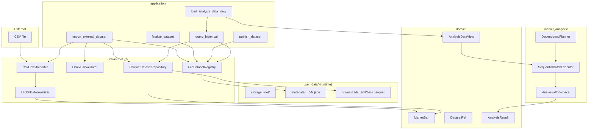

**Dependency direction:** `application` → `domain` + `infrastructure`. Domain packages do not import infrastructure. `market_analysis` consumes market data through application bridges and `DatasetRef`, not by reading Parquet directly.

---

## 2. Architectural Layers

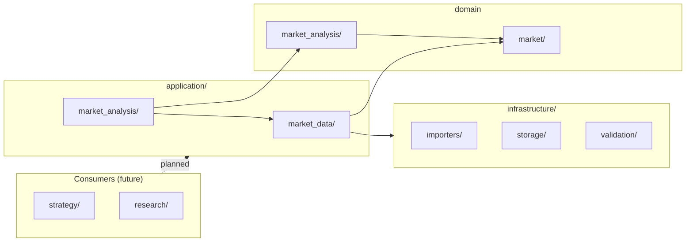

| Layer | Role in data flow |
|-------|-------------------|
| **infrastructure** | Read/write files (CSV, Parquet, JSON metadata). Converts between files and domain types. |
| **market/** | Canonical types: `MarketBar`, `DatasetRef`, lifecycle rules, repository protocols. |
| **application/market_data/** | Orchestrates ingest, lifecycle transitions and historical query. |
| **market_analysis/** | Read-only `AnalysisDataView`, planning, execution, `AnalysisResult` outputs. |
| **application/market_analysis/** | Bridge: `DatasetRef` → `query_historical` → `AnalysisDataView`. |

---

## 3. Market Data — Ingest Workflow

### 3.1 Sequence

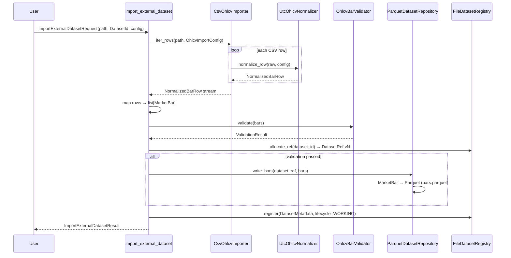

**Entry point:** `trading_framework.application.market_data.import_external_dataset`

**Steps inside one call:**

1. **Inspect & stream** — `CsvOhlcvImporter` reads CSV row-by-row (no full-file load).
2. **Normalize** — `UtcOhlcvNormalizer` maps columns to UTC `observed_at` / `available_at`, decimal OHLC, integer volume → `NormalizedBarRow`.
3. **Domain mapping** — each row becomes `MarketBar` (`Price`, `Volume`, UTC datetimes).
4. **Validate** — `OhlcvBarValidator` checks OHLC consistency and bar invariants.
5. **Allocate version** — `FileDatasetRegistry.allocate_ref` creates `DatasetRef` with next version number.
6. **Persist** (only if valid) — `ParquetDatasetRepository.write_bars` writes `bars.parquet`.
7. **Register metadata** — JSON sidecar with lifecycle `WORKING`, validation status, row count, lineage.

### 3.2 Type Transformations (Ingest)

| Stage | Type | Price representation | Time |
|-------|------|---------------------|------|
| CSV row | `dict[str, str]` | strings from file | source TZ → normalized |
| After normalizer | `NormalizedBarRow` | `Decimal` | UTC-aware `datetime` |
| Domain bar | `MarketBar` | `Price(Decimal)` | UTC `observed_at`, `available_at` |
| Parquet on disk | Arrow columns | `string` (decimal text) | `timestamp(us)` UTC |
| Volume | — | — | `int64` in Parquet |

Prices are stored as **strings in Parquet** to preserve exact `Decimal` round-trip. See ADR-0008.

### 3.3 Dataset Lifecycle

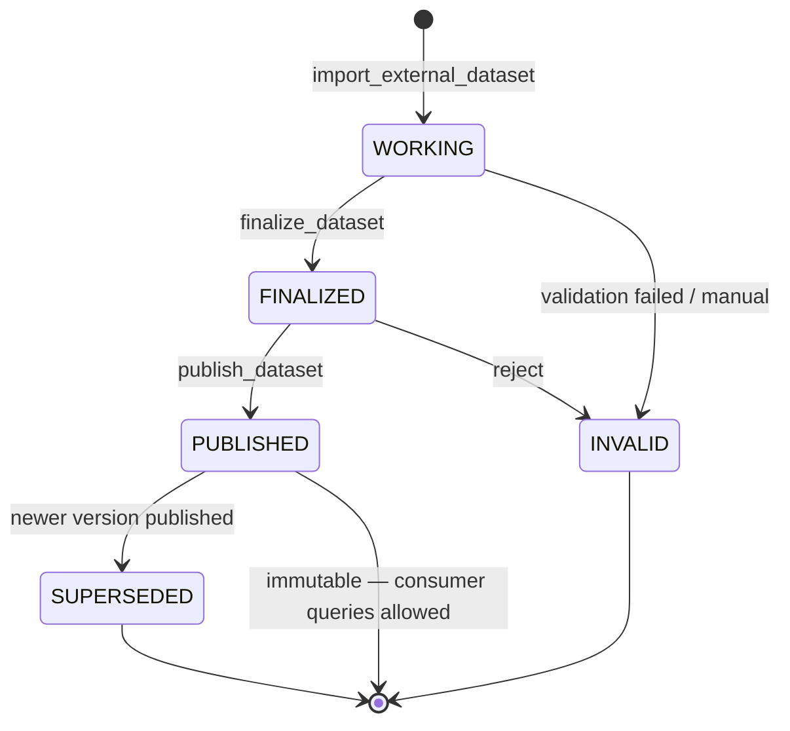

| Transition | Function | Preconditions |
|------------|----------|---------------|
| → `WORKING` | `import_external_dataset` | File readable; metadata registered |
| `WORKING` → `FINALIZED` | `finalize_dataset` | `validation_status == PASSED`; bars exist |
| `FINALIZED` → `PUBLISHED` | `publish_dataset` | Checksum computed at finalize |
| Consumer query | `query_historical` | **Only `PUBLISHED`** |

Published datasets are **immutable** — `ParquetDatasetRepository.write_bars` rejects writes when metadata says `PUBLISHED`.

### 3.4 Physical Storage Layout

Given `storage_root` and a `DatasetRef`:

```text
storage_root/
├── metadata/
│   └── {instrument_id}/
│       └── {data_type}/
│           └── {timeframe}/
│               └── {provider}/
│                   └── {source_id}/
│                       └── v{version}.json      ← DatasetMetadata
└── normalized/
    └── {instrument_id}/…/v{version}/
        └── bars.parquet                         ← OHLCV bars
```

`DatasetRef` canonical string form:

```text
{instrument}|{data_type}|{timeframe}|{provider}|{source_id}@{version}
```

Path helpers: `infrastructure/storage/paths.py` — `dataset_metadata_path`, `dataset_bars_path`, `dataset_trades_partition_path`, `dataset_import_manifest_path`.

Trade datasets use **day partitions** under `partitions/day=YYYY-MM-DD/trades.parquet` (ADR-0014). OHLCV remains single `bars.parquet` (ADR-0008).

### 3.6 Databento Trades Archive Import (Sprint 011)

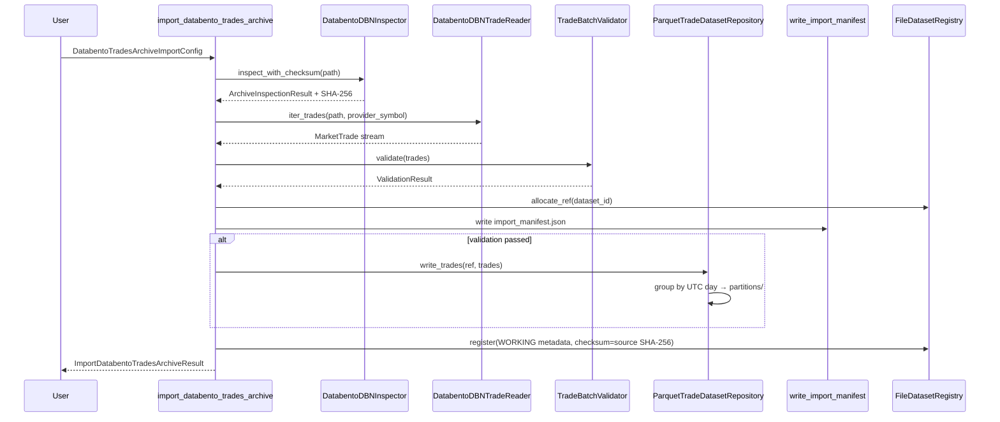

**Entry point:** `trading_framework.application.market_data.import_databento_trades_archive`

**Consumer query:** `query_trades` (PUBLISHED only) via `ParquetTradeDatasetRepository.query_trades`.

**Lifecycle:** same ADR-0007 transitions; `finalize_dataset` supports `data_type=trades`.

**CLI:** `scripts/databento/inspect_dbn.py`, `scripts/databento/import_trades.py`

Integration tests: `tests/integration/market_data/test_databento_trades_import_flow.py` (injected reader),
`test_databento_trades_import_mocked.py` (mocked `DBNStore`).

### 3.7 Derived OHLCV from Trades (Sprint 012)

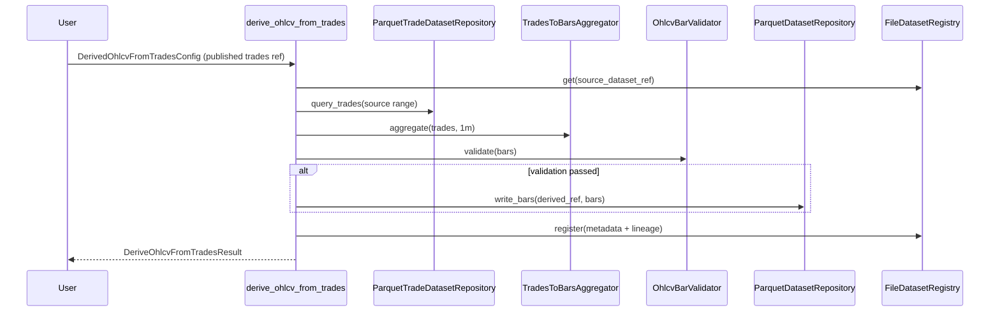

**Prerequisite:** source trades dataset must be **PUBLISHED** (`data_type=trades`, `timeframe=tick`).

**Entry point:** `trading_framework.application.market_data.derive_ohlcv_from_trades`

**Consumer query:** `query_historical` (PUBLISHED only) on derived `DatasetRef` (`provider=derived`, `timeframe=1m`).

**Lifecycle:** same ADR-0007 transitions; `finalize_dataset` uses bar content checksum (ADR-0008).

**Lineage:** `DatasetMetadata.lineage` records `source_dataset_ref`, `derivation_method`, `derivation_version` (ADR-0015).

**CLI:** `scripts/market_data/derive_bars_from_trades.py`

Integration tests: `tests/integration/market_data/test_derive_ohlcv_from_trades_flow.py`,
`test_derive_ohlcv_from_trades_mocked.py`.

### 3.8 Strategy Research Run Envelope (Sprint 013+)

```text
Published OHLCV DatasetRef
  → run_strategy_research
  → query_historical_columnar → OhlcvColumnBatch → AnalysisDataView (batch hot path)
  → evaluate_models (shared evaluation table; Market × Signal)
  → build_gated_entry_signals
  → simulate_from_columnar (Numba fixed-bars kernel)
  → strategy_research/<run_id>/{manifest.json, trades.parquet, equity.parquet}
  → analyze_strategy_research_run (read-only summary)
```

**Columnar path:** `query_ohlcv_table` → `OhlcvColumnBatch` avoids per-bar `MarketBar` materialization in batch research. Boundary `query_historical()` still returns `list[MarketBar]` for small consumer queries.

**Entry points:** `trading_framework.application.strategy_research.run_strategy_research`,
`analyze_strategy_research_run`, `BarSequentialSimulator.simulate_from_columnar`

**CLI:** `scripts/strategy_research/run_strategy_research.py`, `scripts/market_data/run_half_year_backtest.py`

**Simulation assumptions:** `NEXT_BAR_OPEN` entry/exit fills; fingerprint in manifest (ADR-0016, TD-009).

Integration test: `tests/integration/test_s013_run_strategy_research.py`

### 3.9 Strategy Research Dashboard (Sprint 014 — Phase A)

```text
StrategyResearchRunRef + storage_root
  → StrategyResearchDatasetRepository.read
  → build_strategy_dashboard_view_model (metrics + source OHLCV bars via query_historical)
  → render_strategy_research_dashboard → standalone HTML (Lightweight Charts, offline)
```

**Entry points:** `build_strategy_dashboard_view_model`,
`render_strategy_research_dashboard`

**CLI:** `scripts/strategy_research/render_strategy_dashboard.py`

**Boundary:** read-only — no `run_strategy_research`, no `evaluate_models`, no envelope writes
(ADR-0017). Renderer consumes view model only (ADR-0013 presentation split).

Integration tests: `tests/integration/test_s014_strategy_dashboard_view_model.py`,
`tests/integration/test_s014_strategy_dashboard_report.py`

Phase B (FastAPI lazy bars) deferred — see `SPRINT_014.md` T014–T019.

### 3.10 Trade Parquet Schema

Defined in `infrastructure/storage/parquet/trade_writer.py`:

| Column | Arrow type | Domain field |
|--------|------------|--------------|
| `price` | `string` | `Price.value` as decimal text |
| `size` | `int64` | `Volume.value` |
| `event_at` | `timestamp(us)` | trade event time (UTC) |
| `side` | `string` | `TradeSide` value |
| `received_at` | `timestamp(us)`, nullable | optional receive time |
| `trade_id` | `string`, nullable | provider id |
| `sequence` | `int64`, nullable | venue sequence |

### 3.11 Continuous Futures Materialization (Sprint 015)

```text
Databento DBN archives (multi-contract, user_data)
  → import_databento_contract_trades_archive
  → split by actual_contract → NQ.NQM5, NQ.NQU5, …
  → session_date partitions (market-trade-contract-v2 Parquet)
  → finalize/publish per contract dataset
  → build_roll_schedule (Arrow/Polars RTH volumes per session)
  → roll schedule artifact: continuous/schedules/NQ/volume-rth-close/vN/
  → materialize_continuous_trades (fingerprint reuse, incremental window)
  → derive_continuous_ohlcv (per-session Polars, partitioned OHLCV)
  → finalize/publish continuous trades + OHLCV
  → query_trades / query_historical (PUBLISHED only)
  → run_strategy_research (read-only; no roll builders)
```

**Entry points:**

- `trading_framework.application.market_data.import_databento_contract_trades_archive`
- `trading_framework.application.market_data.build_roll_schedule`
- `trading_framework.application.market_data.materialize_continuous_trades`
- `trading_framework.application.market_data.derive_continuous_ohlcv`
- `trading_framework.application.market_data.build_continuous` (orchestration)

**Continuous `DatasetRef` examples:**

```text
NQ.c.0|trades|tick|continuous|volume-rth-close@1
NQ.c.0|ohlcv|1m|derived|volume-rth-close@1
```

**Physical layout (additions under `storage_root/`):**

```text
normalized/NQ.NQU5/trades/tick/databento/<source>/vN/partitions/session_date=…/trades.parquet
continuous/schedules/NQ/volume-rth-close/vN/{schedule.parquet, manifest.json}
normalized/NQ.c.0/trades/tick/continuous/volume-rth-close/vN/
  partitions/session_date=…/trades.parquet
  continuous_manifest.json
normalized/NQ.c.0/ohlcv/1m/derived/volume-rth-close/vN/
  partitions/session_date=…/bars.parquet
  continuous_ohlcv_manifest.json
```

**Lifecycle:** ADR-0007 unchanged. Published continuous datasets are immutable; fingerprint match
enables reuse without rewrite.

**CLI:** `scripts/market_data/build_continuous.py`

**ADR:** ADR-0018

Integration tests: `tests/integration/test_s015_continuous_strategy_research.py`,
`tests/unit/test_continuous_futures_consumer_boundary.py`

### 3.12 Portfolio Demo (offline HTML bundle)

```text
scripts/demo/run_portfolio_demo.py
  → fixture and/or NQ half-year strategy dashboards (Lightweight Charts)
  → Signal Research analytics + combined/occurrence/model/swing inspection HTML (Plotly)
  → demo/output/index.html (landing page with workflow descriptions)
```

**CLI:** `uv run python scripts/demo/run_portfolio_demo.py --full --open`

Requires `uv pip install plotly` for Plotly-based reports. Strategy dashboards work without Plotly.

### 3.13 Model Research Methodology (Sprint 017 — Phase 5B)

```text
SignalResearchDefinitionSpec (YAML/JSON under tests/fixtures/signal_research/ or inline)
  → scripts/signal_research/run_signal_research.py
  → {storage_root}/{run_id}/manifest.json + scope-specific parquet facts
  → scripts/signal_research/analyze_signal_research.py --persist-analytics
  → {storage_root}/{run_id}/analytics/summary.json (optional sidecar)
  → scripts/signal_research/render_signal_research_report.py
  → {storage_root}/{run_id}/report/report.html or demo/output/model_research/*.html

Optional bounded family comparison:
  → scripts/signal_research/run_model_family.py
  → {storage_root}/signal_research_experiments/{experiment_id}/
```

**NQ half-year vertical slice (3 scopes):**

```text
scripts/demo/run_model_research_nq_demo.py
  → storage: user_data/storage_nq_half_year
  → dataset: NQ.c.0|ohlcv|1m|derived|volume-rth-close@1
  → scopes: MARKET_MODEL_ONLY (high_volatility), SIGNAL_MODEL_ONLY (higher_low_long),
             MARKET_AND_SIGNAL (combined + SIGNAL_ONLY baseline)
  → horizons: 5m, 15m, 30m, 60m
  → demo/output/08_model_research_nq_half_year.html (index)
  → demo/output/model_research/{market_model_only,signal_model_only,market_and_signal}.html
```

**CLI:** `uv run python scripts/demo/run_model_research_nq_demo.py --open`  
**Fixture fallback:** `--fixture` (committed ES OHLCV CSV, single 5m horizon, signal + combined scopes only)

**ADR:** ADR-0020

Unit tests: `tests/unit/scripts/test_signal_research_cli.py`,
`tests/unit/scripts/test_run_model_research_nq_demo.py`

### 3.14 Robustness Research (Sprint 016 — Phase 7)

```text
RobustnessExperimentSpec
  → run_robustness_experiment / run_walk_forward_experiment / run_stress_experiment / …
  → robustness_experiments/{experiment_id}/ + Strategy Research child runs
  → analyze_robustness_experiment → verdict (PASS / CONDITIONAL / FAIL)
  → render_robustness_report → report/robustness_report.html
```

**Kinds (MVP):** parameter sweep, walk-forward, stress test, Monte Carlo, statistical diagnostics.

**CLIs:** `scripts/robustness_research/`  
**Demo:** `scripts/demo/run_robustness_demo.py` → `demo/output/07_robustness_dashboard.html`

**ADR:** ADR-0019

Overview: [RESEARCH_METHODOLOGIES.md §6](RESEARCH_METHODOLOGIES.md#6-robustness-research-phase-7)

### 3.15 Signal Research kernel (Sprint 008–010 — Phase 5)

```text
Published DatasetRef + ResearchScope + horizons
  → run_signal_research
  → {storage_root}/{run_id}/manifest.json + scope-specific parquet facts
  → analyze_signal_research_run (read-only; no model re-evaluation)
```

**Scopes:** `MARKET_MODEL_ONLY`, `SIGNAL_MODEL_ONLY`, `MARKET_AND_SIGNAL` (ADR-0012).

**CLIs (production):** `scripts/signal_research/` — see §3.13 for Model Research Methodology layer.

**ADR:** ADR-0011, ADR-0012, ADR-0013

Overview: [RESEARCH_METHODOLOGIES.md §3](RESEARCH_METHODOLOGIES.md#3-signal-research-phase-5)

---

### 3.5 OHLCV Parquet Schema (canonical)

Defined in `infrastructure/storage/parquet/writer.py`:

| Column | Arrow type | Domain field |
|--------|------------|--------------|
| `open`, `high`, `low`, `close` | `string` | `Price.value` as decimal text |
| `volume` | `int64` | `Volume.value` |
| `observed_at` | `timestamp(us)` | bar interval boundary (UTC) |
| `available_at` | `timestamp(us)` | when bar became knowable (UTC) |

---

## 4. Market Data — Consumer Query Workflow

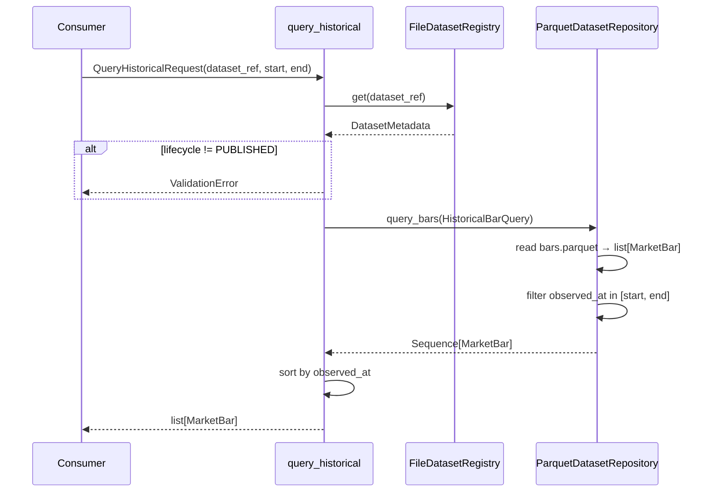

**Entry point:** `trading_framework.application.market_data.query_historical`

**Read path:** Parquet `string` → `Decimal` → `Price` / `Volume` → `MarketBar`.

**Contract:** returns `list[MarketBar]` sorted by `observed_at`. This is the **repository/application boundary** used by analysis and future consumers.

Integration test reference: `tests/integration/test_csv_import_flow.py`.

---

## 5. Market Analysis — Data Input Bridge

Analysis does not read Parquet directly. It goes through the market data application layer.

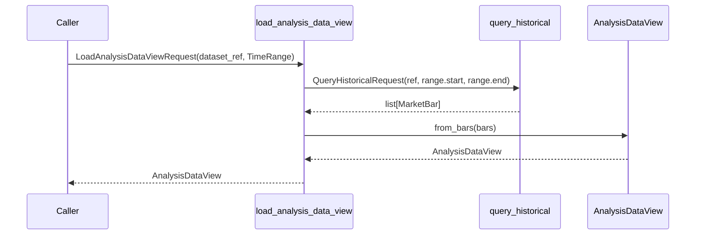

**Entry point:** `trading_framework.application.market_analysis.load_analysis_data_view`

### 5.1 AnalysisDataView Shape

Immutable columnar view aligned to bar timestamps:

| Field | Type | Notes |
|-------|------|-------|
| `timestamps` | `tuple[datetime, …]` | UTC `observed_at` per bar |
| `open`, `high`, `low`, `close`, `volume` | `DataColumn` | `tuple[float, …]`, dtype `float64` |

Conversion: `MarketBar` (`Price`/`Decimal`) → `float64` at the analysis boundary (decision D-027). The view is **read-only** and validated for equal column lengths.

---

## 6. Market Analysis — Planning and Execution

### 6.1 Planning (DAG)

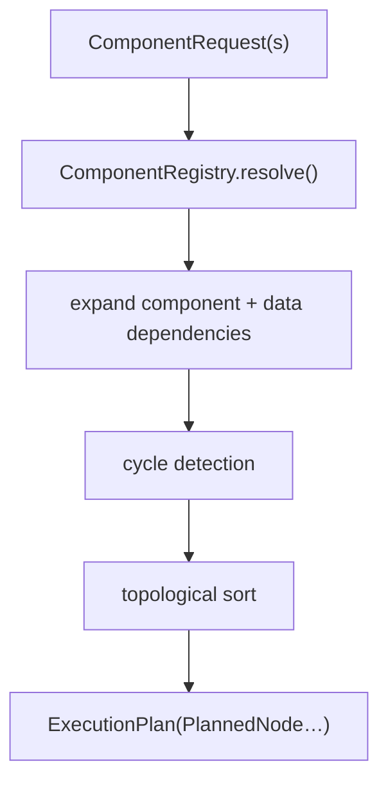

**Entry point:** `DependencyPlanner.build_plan(context, requests)` → `ExecutionPlan`

Each `PlannedNode` carries:

- resolved `ComponentImplementation`,
- `ComputationIdentity` (component + parameters fingerprint),
- dependency keys for upstream results,
- canonical execution order.

### 6.2 Execution Loop

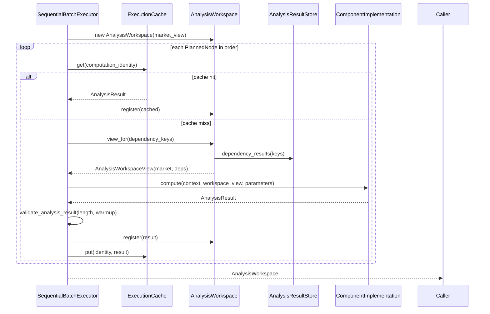

**Entry point:** `SequentialBatchExecutor.execute(plan, market_view=…, context=…)`

### 6.3 In-Memory Analysis Data Model

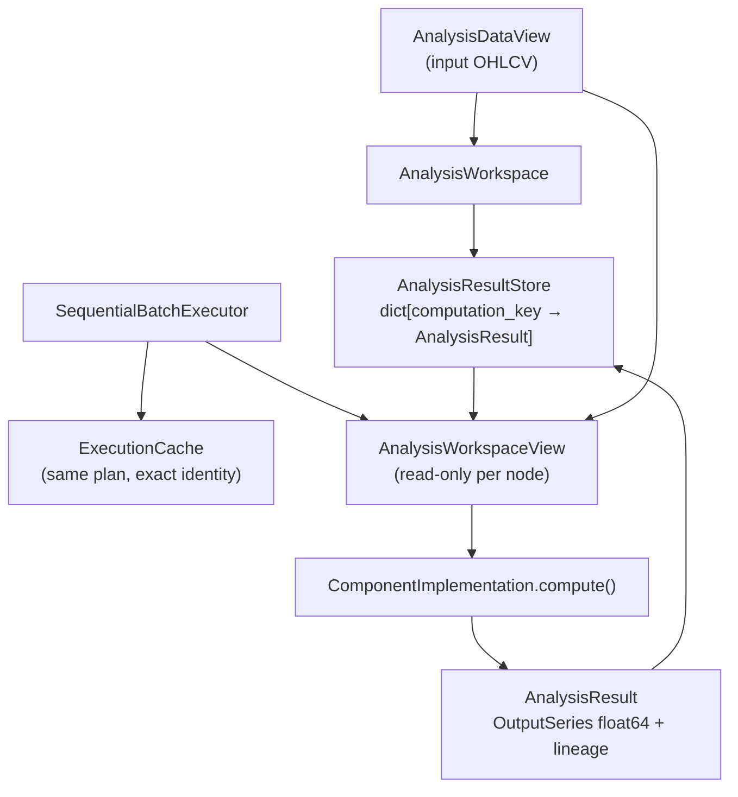

**AnalysisResult** (per computation):

- `computation_identity` — dedup key,
- `outputs` — `Mapping[OutputId, OutputSeries]` (`tuple[float, …]`),
- `lineage`, `validity`, `warmup`, `availability` metadata.

No shared mutable DataFrame. Components receive `AnalysisWorkspaceView` with market columns plus dependency results only.

---

## 7. End-to-End Flow (Implemented Today)

```mermaid
flowchart LR
    subgraph ingest["1. Ingest"]
        A1["CSV"] --> A2["import_external_dataset"]
        A2 --> A3["finalize_dataset"]
        A3 --> A4["publish_dataset"]
    end

    subgraph persist["2. Persist"]
        A4 --> P1["vN.json + bars.parquet"]
    end

    subgraph read["3. Read"]
        P1 --> B1["query_historical"]
        B1 --> B2["list[MarketBar]"]
    end

    subgraph analysis["4. Analysis (Waves 0–3)"]
        B2 --> C1["load_analysis_data_view"]
        C1 --> C2["AnalysisDataView"]
        C2 --> C3["DependencyPlanner"]
        C3 --> C4["SequentialBatchExecutor"]
        C4 --> C5["AnalysisWorkspace / AnalysisResult"]
    end

    ingest --> persist --> read --> analysis
```

### Minimal code path (conceptual)

```python
# 1–3: Market Data (see tests/integration/test_csv_import_flow.py)
result = import_external_dataset(request, storage_root=root)
finalize_dataset(result.dataset_ref, storage_root=root)
publish_dataset(result.dataset_ref, storage_root=root)
bars = query_historical(QueryHistoricalRequest(ref, start, end), storage_root=root)

# 4: Analysis input
view = load_analysis_data_view(
    LoadAnalysisDataViewRequest(dataset_ref=ref, computation_range=range_),
    storage_root=root,
)

# 4: Plan + execute (requires registered ComponentImplementation types)
plan = DependencyPlanner(registry).build_plan(context, requests)
workspace = SequentialBatchExecutor().execute(plan, market_view=view, context=context)
```

---

## 8. Representation Boundaries

Understanding **where the type changes** prevents confusion about floats vs decimals vs strings.

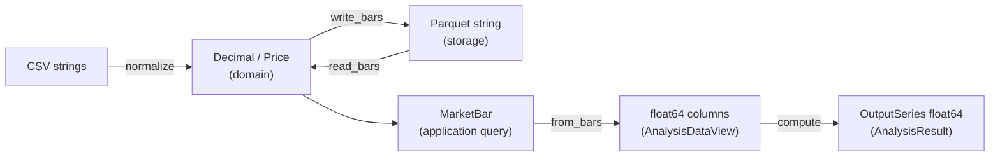

| Boundary | Left | Right | Why |
|----------|------|-------|-----|
| Import | CSV text | `Decimal` / `MarketBar` | Parse and validate in domain |
| Storage | `MarketBar` | Parquet `string` prices | Lossless decimal persistence |
| Query | Parquet | `list[MarketBar]` | Canonical consumer contract |
| Analysis input | `MarketBar` | `AnalysisDataView` float64 | Numeric backend for components (D-027) |
| Analysis output | component logic | `OutputSeries` float64 | Backend-neutral result contract |

---

## 9. Not Yet Implemented (Sprint 003 Remainder)

These appear in architecture diagrams and sprint plans but **have no production code path yet**:

| Capability | Planned role in data flow |
|------------|---------------------------|
| Built-in components (TR, ATR, EMA, Volatility State) | Produce `AnalysisResult` from `AnalysisWorkspaceView` |
| `AnalysisFrameAssembler` | Wide tabular consumer view over workspace outputs |
| `run_analysis` facade | Single entry point orchestrating load → plan → execute → frame |
| Persistent analysis cache | Cross-run deduplication (MVP uses in-memory `ExecutionCache` only) |
| Multitimeframe alignment | Separate bars per timeframe; not in MVP flow |

---

## 10. Quick Reference — Entry Points

| Workflow step | Module | Function / type |
|---------------|--------|-----------------|
| CSV import | `application.market_data` | `import_external_dataset` |
| Contract / continuous build | `application.market_data` | `build_continuous`, `build_roll_schedule`, `materialize_continuous_trades`, `derive_continuous_ohlcv` |
| Finalize / publish | `application.market_data` | `finalize_dataset`, `publish_dataset` |
| Historical bars | `application.market_data` | `query_historical` → `list[MarketBar]` |
| Strategy Research run | `application.strategy_research` | `run_strategy_research`, `analyze_strategy_research_run` |
| Strategy Research dashboard | `application.strategy_research`, `research/analytics` | `build_strategy_dashboard_view_model`, `render_strategy_research_dashboard` |
| Signal Research run | `application.signal_research` | `run_signal_research`, `analyze_signal_research_run` |
| Model Research report | `application.signal_research`, `research/reporting/signal_research` | `render_signal_research_report`, `build_signal_research_report` |
| Robustness experiment | `application.robustness_research` | `run_robustness_experiment`, `run_*_experiment`, `analyze_robustness_experiment` |
| Robustness report | `research/robustness` | `render_robustness_report` → `report/robustness_report.html` |
| Analysis input | `application.market_analysis` | `load_analysis_data_view` → `AnalysisDataView` |
| Register components | `market_analysis.registry` | `ComponentRegistry` |
| Build DAG | `market_analysis.planning` | `DependencyPlanner.build_plan` |
| Execute plan | `market_analysis.execution` | `SequentialBatchExecutor.execute` |
| Result lookup | `market_analysis.storage` | `AnalysisResultStore`, `AnalysisWorkspace` |

---

## Maintenance

Update this document when:

- a new application workflow changes how data moves between layers,
- storage schema or lifecycle rules change,
- analysis input/output contracts change.

After small wave merges: update §9 and diagrams if status changed.  
Navigation status symbols stay in [MODULE_MAP.md](MODULE_MAP.md).
