# Data Workflows (Technical)

> **Reference doc** — [as-implemented layer](README.md).  
> Package index: [MODULE_MAP.md](MODULE_MAP.md). Index: [docs/README.md](../README.md).

Technical reference for how data moves through the framework: ingestion, persistence, lifecycle, query and analysis execution.

**As-is scope:** Market Data Phase 2A (Sprint 002 CSV OHLCV) through Signal Research (Sprints 008–010 on `main`). Multitimeframe and declarative models: Sprints 004–006.  
**Planned next (not implemented):** Phase 2B archive import — `ROADMAP.md` §6, `SPRINT_011.md`.  
**Deep market data reference:** [modules/DATA_MODULE_UPDATED.md](modules/DATA_MODULE_UPDATED.md)

---

## 1. System Overview

The framework separates **user-owned storage** (`user_data/`, passed at runtime) from **framework code** (`src/trading_framework/`). All workflows below use a `storage_root: Path` argument — typically `user_data/storage`.

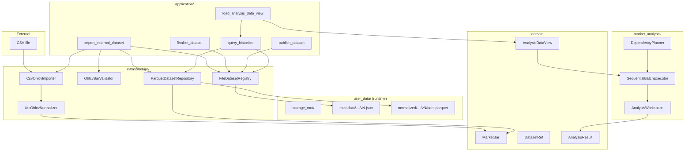

**Dependency direction:** `application` → `domain` + `infrastructure`. Domain packages do not import infrastructure. `market_analysis` consumes market data through application bridges and `DatasetRef`, not by reading Parquet directly.

---

## 2. Architectural Layers

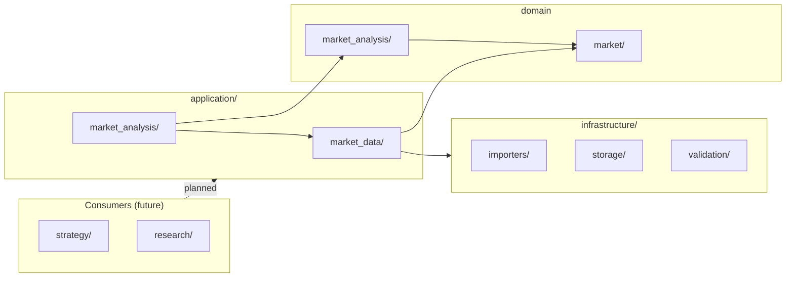

| Layer | Role in data flow |
|-------|-------------------|
| **infrastructure** | Read/write files (CSV, Parquet, JSON metadata). Converts between files and domain types. |
| **market/** | Canonical types: `MarketBar`, `DatasetRef`, lifecycle rules, repository protocols. |
| **application/market_data/** | Orchestrates ingest, lifecycle transitions and historical query. |
| **market_analysis/** | Read-only `AnalysisDataView`, planning, execution, `AnalysisResult` outputs. |
| **application/market_analysis/** | Bridge: `DatasetRef` → `query_historical` → `AnalysisDataView`. |

---

## 3. Market Data — Ingest Workflow

### 3.1 Sequence

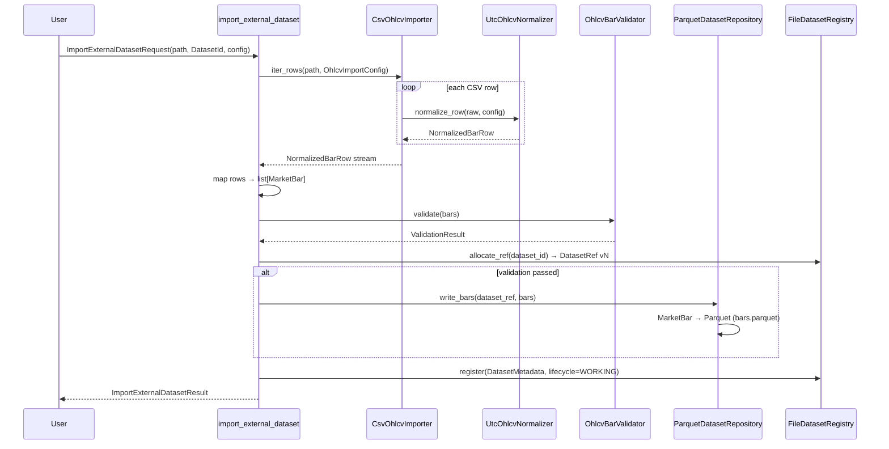

**Entry point:** `trading_framework.application.market_data.import_external_dataset`

**Steps inside one call:**

1. **Inspect & stream** — `CsvOhlcvImporter` reads CSV row-by-row (no full-file load).
2. **Normalize** — `UtcOhlcvNormalizer` maps columns to UTC `observed_at` / `available_at`, decimal OHLC, integer volume → `NormalizedBarRow`.
3. **Domain mapping** — each row becomes `MarketBar` (`Price`, `Volume`, UTC datetimes).
4. **Validate** — `OhlcvBarValidator` checks OHLC consistency and bar invariants.
5. **Allocate version** — `FileDatasetRegistry.allocate_ref` creates `DatasetRef` with next version number.
6. **Persist** (only if valid) — `ParquetDatasetRepository.write_bars` writes `bars.parquet`.
7. **Register metadata** — JSON sidecar with lifecycle `WORKING`, validation status, row count, lineage.

### 3.2 Type Transformations (Ingest)

| Stage | Type | Price representation | Time |
|-------|------|---------------------|------|
| CSV row | `dict[str, str]` | strings from file | source TZ → normalized |
| After normalizer | `NormalizedBarRow` | `Decimal` | UTC-aware `datetime` |
| Domain bar | `MarketBar` | `Price(Decimal)` | UTC `observed_at`, `available_at` |
| Parquet on disk | Arrow columns | `string` (decimal text) | `timestamp(us)` UTC |
| Volume | — | — | `int64` in Parquet |

Prices are stored as **strings in Parquet** to preserve exact `Decimal` round-trip. See ADR-0008.

### 3.3 Dataset Lifecycle

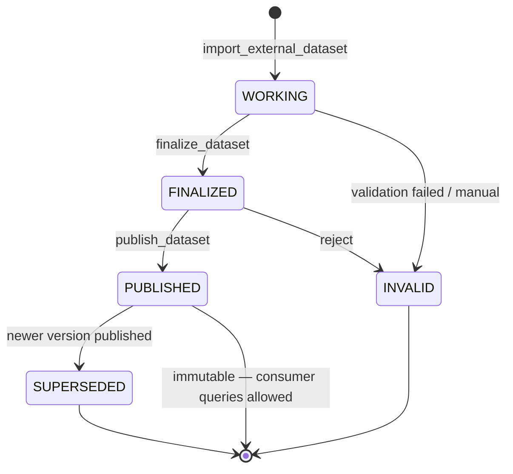

| Transition | Function | Preconditions |
|------------|----------|---------------|
| → `WORKING` | `import_external_dataset` | File readable; metadata registered |
| `WORKING` → `FINALIZED` | `finalize_dataset` | `validation_status == PASSED`; bars exist |
| `FINALIZED` → `PUBLISHED` | `publish_dataset` | Checksum computed at finalize |
| Consumer query | `query_historical` | **Only `PUBLISHED`** |

Published datasets are **immutable** — `ParquetDatasetRepository.write_bars` rejects writes when metadata says `PUBLISHED`.

### 3.4 Physical Storage Layout

Given `storage_root` and a `DatasetRef`:

```text
storage_root/
├── metadata/
│   └── {instrument_id}/
│       └── {data_type}/
│           └── {timeframe}/
│               └── {provider}/
│                   └── {source_id}/
│                       └── v{version}.json      ← DatasetMetadata
└── normalized/
    └── {instrument_id}/…/v{version}/
        └── bars.parquet                         ← OHLCV bars
```

`DatasetRef` canonical string form:

```text
{instrument}|{data_type}|{timeframe}|{provider}|{source_id}@{version}
```

Path helpers: `infrastructure/storage/paths.py` — `dataset_metadata_path`, `dataset_bars_path`.

### 3.5 Parquet Schema (canonical)

Defined in `infrastructure/storage/parquet/writer.py`:

| Column | Arrow type | Domain field |
|--------|------------|--------------|
| `open`, `high`, `low`, `close` | `string` | `Price.value` as decimal text |
| `volume` | `int64` | `Volume.value` |
| `observed_at` | `timestamp(us)` | bar interval boundary (UTC) |
| `available_at` | `timestamp(us)` | when bar became knowable (UTC) |

---

## 4. Market Data — Consumer Query Workflow

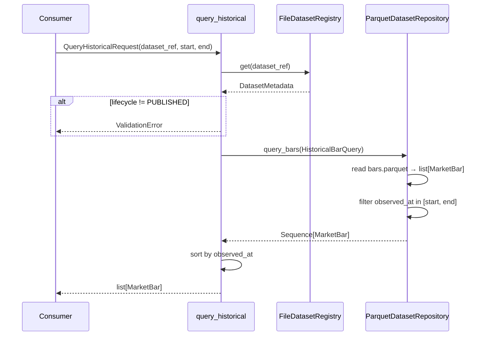

**Entry point:** `trading_framework.application.market_data.query_historical`

**Read path:** Parquet `string` → `Decimal` → `Price` / `Volume` → `MarketBar`.

**Contract:** returns `list[MarketBar]` sorted by `observed_at`. This is the **repository/application boundary** used by analysis and future consumers.

Integration test reference: `tests/integration/test_csv_import_flow.py`.

---

## 5. Market Analysis — Data Input Bridge

Analysis does not read Parquet directly. It goes through the market data application layer.

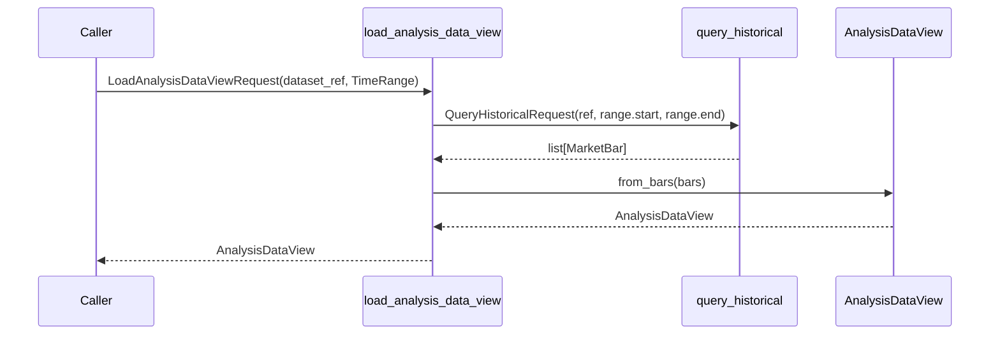

**Entry point:** `trading_framework.application.market_analysis.load_analysis_data_view`

### 5.1 AnalysisDataView Shape

Immutable columnar view aligned to bar timestamps:

| Field | Type | Notes |
|-------|------|-------|
| `timestamps` | `tuple[datetime, …]` | UTC `observed_at` per bar |
| `open`, `high`, `low`, `close`, `volume` | `DataColumn` | `tuple[float, …]`, dtype `float64` |

Conversion: `MarketBar` (`Price`/`Decimal`) → `float64` at the analysis boundary (decision D-027). The view is **read-only** and validated for equal column lengths.

---

## 6. Market Analysis — Planning and Execution

### 6.1 Planning (DAG)

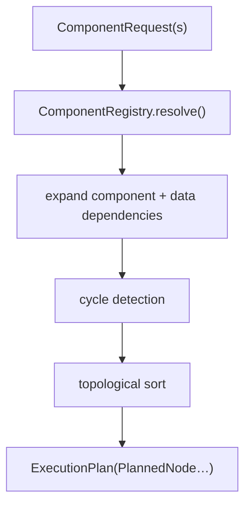

**Entry point:** `DependencyPlanner.build_plan(context, requests)` → `ExecutionPlan`

Each `PlannedNode` carries:

- resolved `ComponentImplementation`,
- `ComputationIdentity` (component + parameters fingerprint),
- dependency keys for upstream results,
- canonical execution order.

### 6.2 Execution Loop

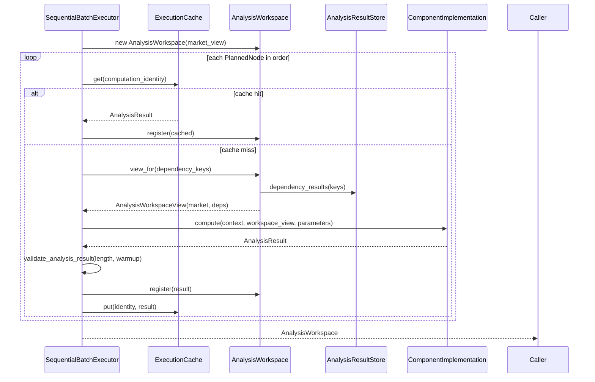

**Entry point:** `SequentialBatchExecutor.execute(plan, market_view=…, context=…)`

### 6.3 In-Memory Analysis Data Model

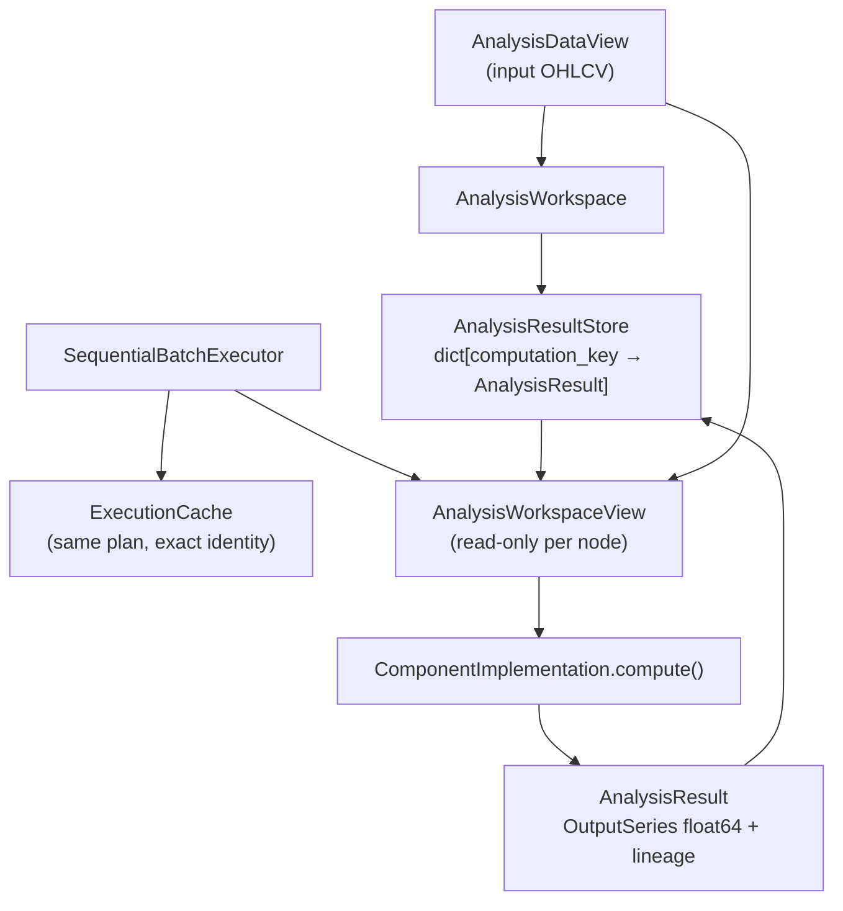

**AnalysisResult** (per computation):

- `computation_identity` — dedup key,
- `outputs` — `Mapping[OutputId, OutputSeries]` (`tuple[float, …]`),
- `lineage`, `validity`, `warmup`, `availability` metadata.

No shared mutable DataFrame. Components receive `AnalysisWorkspaceView` with market columns plus dependency results only.

---

## 7. End-to-End Flow (Implemented Today)

```mermaid
flowchart LR
    subgraph ingest["1. Ingest"]
        A1["CSV"] --> A2["import_external_dataset"]
        A2 --> A3["finalize_dataset"]
        A3 --> A4["publish_dataset"]
    end

    subgraph persist["2. Persist"]
        A4 --> P1["vN.json + bars.parquet"]
    end

    subgraph read["3. Read"]
        P1 --> B1["query_historical"]
        B1 --> B2["list[MarketBar]"]
    end

    subgraph analysis["4. Analysis (Waves 0–3)"]
        B2 --> C1["load_analysis_data_view"]
        C1 --> C2["AnalysisDataView"]
        C2 --> C3["DependencyPlanner"]
        C3 --> C4["SequentialBatchExecutor"]
        C4 --> C5["AnalysisWorkspace / AnalysisResult"]
    end

    ingest --> persist --> read --> analysis
```

### Minimal code path (conceptual)

```python
# 1–3: Market Data (see tests/integration/test_csv_import_flow.py)
result = import_external_dataset(request, storage_root=root)
finalize_dataset(result.dataset_ref, storage_root=root)
publish_dataset(result.dataset_ref, storage_root=root)
bars = query_historical(QueryHistoricalRequest(ref, start, end), storage_root=root)

# 4: Analysis input
view = load_analysis_data_view(
    LoadAnalysisDataViewRequest(dataset_ref=ref, computation_range=range_),
    storage_root=root,
)

# 4: Plan + execute (requires registered ComponentImplementation types)
plan = DependencyPlanner(registry).build_plan(context, requests)
workspace = SequentialBatchExecutor().execute(plan, market_view=view, context=context)
```

---

## 8. Representation Boundaries

Understanding **where the type changes** prevents confusion about floats vs decimals vs strings.

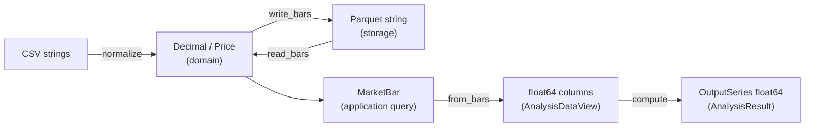

| Boundary | Left | Right | Why |
|----------|------|-------|-----|
| Import | CSV text | `Decimal` / `MarketBar` | Parse and validate in domain |
| Storage | `MarketBar` | Parquet `string` prices | Lossless decimal persistence |
| Query | Parquet | `list[MarketBar]` | Canonical consumer contract |
| Analysis input | `MarketBar` | `AnalysisDataView` float64 | Numeric backend for components (D-027) |
| Analysis output | component logic | `OutputSeries` float64 | Backend-neutral result contract |

---

## 9. Not Yet Implemented (Sprint 003 Remainder)

These appear in architecture diagrams and sprint plans but **have no production code path yet**:

| Capability | Planned role in data flow |
|------------|---------------------------|
| Built-in components (TR, ATR, EMA, Volatility State) | Produce `AnalysisResult` from `AnalysisWorkspaceView` |
| `AnalysisFrameAssembler` | Wide tabular consumer view over workspace outputs |
| `run_analysis` facade | Single entry point orchestrating load → plan → execute → frame |
| Persistent analysis cache | Cross-run deduplication (MVP uses in-memory `ExecutionCache` only) |
| Multitimeframe alignment | Separate bars per timeframe; not in MVP flow |

---

## 10. Quick Reference — Entry Points

| Workflow step | Module | Function / type |
|---------------|--------|-----------------|
| CSV import | `application.market_data` | `import_external_dataset` |
| Finalize / publish | `application.market_data` | `finalize_dataset`, `publish_dataset` |
| Historical bars | `application.market_data` | `query_historical` → `list[MarketBar]` |
| Analysis input | `application.market_analysis` | `load_analysis_data_view` → `AnalysisDataView` |
| Register components | `market_analysis.registry` | `ComponentRegistry` |
| Build DAG | `market_analysis.planning` | `DependencyPlanner.build_plan` |
| Execute plan | `market_analysis.execution` | `SequentialBatchExecutor.execute` |
| Result lookup | `market_analysis.storage` | `AnalysisResultStore`, `AnalysisWorkspace` |

---

## Maintenance

Update this document when:

- a new application workflow changes how data moves between layers,
- storage schema or lifecycle rules change,
- analysis input/output contracts change.

After small wave merges: update §9 and diagrams if status changed.  
Navigation status symbols stay in [MODULE_MAP.md](MODULE_MAP.md).
