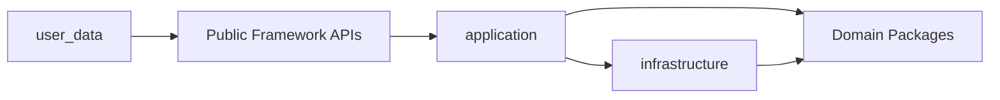

# Module Map

This document maps the architectural modules and workflows described in `ARCHITECTURE_AND_WORKFLOWS.md` to their implementation in the repository.

Its purpose is to show:

- which package owns a responsibility,
- where workflow orchestration lives,
- which domain contracts are involved,
- which infrastructure adapters implement those contracts,
- where tests and deeper documentation are located.

It is a navigation layer between architecture and source code.

---

## 1. Repository Boundaries

```text
src/trading_framework/
    reusable framework implementation

user_data/
    user-owned datasets
    component libraries
    model definitions
    strategies
    research specifications
    generated artifacts
    runtime state
```

Core dependency rules:

- `src/trading_framework/` never imports `user_data/`,
- user-owned paths and configuration are passed at runtime,
- users extend the framework through public contracts and the DSL,
- infrastructure adapters implement framework ports,
- domain packages do not depend on concrete infrastructure.

---

## 2. Top-Level Package Map

```text
application/          workflow orchestration
market/               market-data domain contracts
market_analysis/      analytical components, planning and execution
model_expression/     internal declarative expression representation
model_authoring/      user-facing DSL
market_model/         Market Model definitions and evaluation
signal_model/         Signal Model definitions and evaluation
strategy/             strategy composition contracts
research/             research facts, simulation, analytics and artifacts
execution/            execution domain and runtime contracts
infrastructure/       provider, storage and delivery adapters
core/                 shared identifiers, types and errors
time/                 timeframes, sessions and clock contracts
config/               runtime configuration loading
```

---

## 3. Workflow-to-Module Map

| Workflow | Application orchestration | Domain packages | Infrastructure | Main outputs |
|---|---|---|---|---|
| Market Data | `application/market_data/` | `market/` | `infrastructure/importers/`, `infrastructure/providers/`, `infrastructure/storage/`, `infrastructure/validation/` | Published datasets |
| Market Analysis | `application/market_analysis/` | `market_analysis/` | Numerical adapters and storage bridges | Features and states |
| Model Evaluation | `application/model_evaluation/` | `model_expression/`, `model_authoring/`, `market_model/`, `signal_model/` | — | Evaluated models |
| Signal / Model Research | `application/signal_research/` | `research/`, `strategy/` | Research repositories and report adapters | Research artifacts |
| Strategy Research | `application/strategy_research/` | `strategy/`, `research/simulation/`, `research/datasets/` | Result storage and reporting adapters | Trades, equity, manifests |
| Robustness Research | `application/robustness_research/` | `research/robustness/` | Experiment storage and reporting adapters | Experiment artifacts |
| Live Execution | `application/execution/` | `execution/` | `infrastructure/providers/`, `infrastructure/storage/` | Runtime state |
| Visualization | Application view-model builders | `research/analytics/`, reporting packages | HTML, API and dashboard adapters | Dashboards and reports |

---

## 4. Shared Foundations

### `core/`

**Responsibility**

- shared identifiers,
- base value types,
- framework exceptions,
- profiling primitives.

**Used by**

All domain and application modules.

**Typical paths**

```text
core/
├── identifiers/
├── types/
├── exceptions.py
└── profiling.py
```

---

### `time/`

**Responsibility**

- UTC time representation,
- timeframes,
- trading sessions,
- clock contracts,
- temporal alignment primitives.

**Used by**

- `market/`,
- `market_analysis/`,
- `research/`,
- `execution/`.

---

### `config/`

**Responsibility**

- framework configuration loading,
- runtime path configuration,
- environment-driven settings.

**Used by**

Application entry points and runtime assembly.

---

## 5. Market Data Implementation Map

### Responsibilities

| Responsibility | Package |
|---|---|
| Market-data domain types | `market/models/` |
| Instrument and dataset identity | `market/datasets/` |
| Dataset lifecycle | `market/datasets/` |
| Repository protocols | `market/repositories/` |
| Import and publication workflows | `application/market_data/` |
| Provider adapters | `infrastructure/providers/` |
| File and archive importers | `infrastructure/importers/` |
| Normalization | `infrastructure/normalization/` |
| Validation | `infrastructure/validation/` |
| Dataset persistence | `infrastructure/storage/` |

### Public workflow surface

The Market Data application layer owns workflows for:

- importing external data,
- validating and normalizing records,
- publishing datasets,
- querying historical data,
- deriving new datasets,
- resolving stable dataset references.

### Dependency direction

```text
application/market_data
    → market
    → infrastructure adapters

infrastructure
    → market repository and domain contracts
```

### Tests

```text
tests/unit/market/
tests/unit/infrastructure/
tests/unit/application/market_data/
tests/integration/market_data/
```

### Deep references

- `ARCHITECTURE_AND_WORKFLOWS.md`
- market-data module reference
- storage ADRs

---

## 6. Market Analysis Implementation Map

### Responsibilities

| Responsibility | Package |
|---|---|
| Component contracts | `market_analysis/protocols/` |
| Component identity | `market_analysis/identity/` |
| Component requests and outputs | `market_analysis/models/` |
| Component registry | `market_analysis/registry/` |
| Dependency planning | `market_analysis/planning/` |
| Batch execution | `market_analysis/execution/` |
| Analysis input data | `market_analysis/data/` |
| Results and workspace | `market_analysis/storage/` |
| Built-in components | `market_analysis/components/` |
| Frame assembly and alignment | `market_analysis/assembly/` |
| Workflow orchestration | `application/market_analysis/` |

### Workflow mapping

```text
Published Dataset
  → application/market_analysis
  → market_analysis/data
  → market_analysis/planning
  → market_analysis/execution
  → market_analysis/storage
  → features and states
```

### Public workflow surface

The Market Analysis application layer is responsible for:

- loading published market data,
- resolving component requests,
- building an execution plan,
- executing shared computations,
- assembling model-facing analytical outputs.

### Tests

```text
tests/unit/market_analysis/
tests/unit/application/market_analysis/
tests/integration/market_analysis/
```

### Deep references

- `ARCHITECTURE_AND_WORKFLOWS.md`
- Market Analysis module reference
- Market Analysis ADRs

---

## 7. Declarative Model Implementation Map

### Responsibilities

| Responsibility | Package |
|---|---|
| Expression tree and references | `model_expression/` |
| Expression validation | `model_expression/` |
| Expression evaluation | `model_expression/evaluation/` |
| User-facing typed DSL | `model_authoring/` |
| Market Model contracts | `market_model/` |
| Signal Model contracts | `signal_model/` |
| Shared model evaluation workflow | `application/model_evaluation/` |

### Layer distinction

```text
model_authoring/
    user-facing DSL

model_expression/
    internal representation

market_model/ and signal_model/
    model definitions and evaluation contracts
```

`model_authoring/` is the layer users interact with.

`model_expression/` is the internal representation executed by the framework.

### Workflow mapping

```text
User DSL
  → model_authoring
  → model_expression
  → application/model_evaluation
  → Market Model and Signal Model results
```

### Tests

```text
tests/unit/model_authoring/
tests/unit/model_expression/
tests/unit/market_model/
tests/unit/signal_model/
tests/unit/application/model_evaluation/
```

### Deep references

- `ARCHITECTURE_AND_WORKFLOWS.md`
- model DSL reference
- model evaluation ADRs

---

## 8. Research Implementation Map

Research workflows share analytical and model-evaluation foundations, but remain independent application workflows.

### Signal and Model Research

| Responsibility | Package |
|---|---|
| Workflow orchestration | `application/signal_research/` |
| Research definitions | `research/signal_research/` |
| Observations | `research/observations/` |
| Context facts | `research/context/` |
| Forward outcomes | `research/outcomes/` |
| Run artifacts | `research/datasets/` |
| Analytics | `research/analytics/` |
| Reporting | `research/reporting/signal_research/` |

Workflow:

```text
Published Dataset
  → model evaluation
  → research facts
  → persisted run
  → read-only analytics
  → report
```

---

### Strategy Research

| Responsibility | Package |
|---|---|
| Workflow orchestration | `application/strategy_research/` |
| Shared OHLCV + model-eval cache | `application/strategy_research/shared_evaluation.py` |
| Strategy contracts | `strategy/` |
| Simulation engine | `research/simulation/` |
| Run artifacts | `research/datasets/` |
| Analytics | `research/analytics/` |
| Reporting | strategy reporting packages |

Workflow:

```text
Market Model + Signal Model + Strategy Definition
  → strategy research workflow
  → (optional SharedStrategyEvaluationContext)
  → simulation
  → persisted trades and equity
  → read-only analytics
  → dashboard
```

Robustness parameter / walk-forward / stress cells that share market and signal definitions reuse
`SharedStrategyEvaluationCache` so OHLCV load and `evaluate_models` run once per unique pair.

---

### Robustness Research

| Responsibility | Package |
|---|---|
| Workflow orchestration | `application/robustness_research/` |
| Experiment contracts | `research/robustness/` |
| Experiment analytics | `research/robustness/analytics/` |
| Experiment reports | robustness reporting packages |

Workflow:

```text
Research Definition
  → experiment variants
  → repeated strategy research runs
  → persisted experiment artifacts
  → aggregate analysis
  → verdict and report
```

### Tests

```text
tests/unit/research/
tests/unit/strategy/
tests/unit/application/signal_research/
tests/unit/application/strategy_research/
tests/unit/application/robustness_research/
tests/integration/research/
```

### Deep references

- `RESEARCH_METHODOLOGIES.md`
- `ARCHITECTURE_AND_WORKFLOWS.md`
- research ADRs

---

## 9. Execution Implementation Map

### Responsibilities

| Responsibility | Package |
|---|---|
| Execution modes and safety contracts | `execution/` |
| Orders, fills, positions and account models | `execution/models/` |
| Broker simulation | `execution/broker_sim/` |
| Runtime state ports | `execution/repositories/` |
| Runtime logic | `execution/runtime/` |
| Workflow orchestration | `application/execution/` |
| Live provider adapters | `infrastructure/providers/` |
| Runtime-state persistence | `infrastructure/storage/` |
| Status and monitoring delivery | application and infrastructure adapters |

### Workflow mapping

```text
Live Provider Adapter
  → normalized market facts
  → application/execution
  → execution/runtime
  → broker abstraction
  → runtime-state repository
  → monitoring or dashboard
```

### Dependency direction

```text
execution
    does not depend on research

application/execution
    orchestrates execution domain and adapters

infrastructure
    implements provider and persistence boundaries
```

### Tests

```text
tests/unit/execution/
tests/unit/application/execution/
tests/unit/infrastructure/
tests/integration/live_data/
```

### Deep references

- `ARCHITECTURE_AND_WORKFLOWS.md`
- execution runbooks
- execution ADRs

---

## 10. Visualization and Reporting Map

### Responsibilities

| Responsibility | Package |
|---|---|
| Read-only analytics | `research/analytics/` |
| Signal research reports | `research/reporting/signal_research/` |
| Strategy dashboards | strategy analytics and reporting packages |
| Robustness reports | `research/robustness/` reporting packages |
| Live dashboard state | execution read-model adapters |
| Demo generation | `scripts/demo/` |
| Live dashboard delivery | `scripts/portfolio_live/` |

### Boundary

Visualization reads:

- persisted research artifacts,
- persisted analytics,
- runtime state.

Visualization does not execute research or control execution.

---

## 11. User Workspace Map

The framework core is reusable, while each user maintains an independent workspace.

Canonical layout (``--storage-root`` = workspace root, usually ``user_data/``):

```text
user_data/
├── market_data/
│   ├── raw/                 # immutable vendor archives
│   ├── metadata/            # dataset registry JSON
│   ├── normalized/          # published Parquet market facts
│   └── continuous/          # roll schedules
├── research/
│   ├── market_research/     # Signal Research runs + family experiments
│   ├── strategy_research/   # Strategy Research runs
│   └── strategy_robustness/ # robustness experiments
├── runtime/                 # execution dry-run state
├── reports/                 # optional loose reports
├── config/
├── components/
└── models/
```

| User-owned area | Purpose |
|---|---|
| `market_data/raw/` | vendor archives (DBN, CSV, …); never overwritten |
| `market_data/metadata/` | dataset registry and lifecycle metadata |
| `market_data/normalized/` | published Parquet market facts |
| `market_data/continuous/` | roll schedules and related artifacts |
| `research/market_research/` | Signal Research runs and model-family experiments |
| `research/strategy_research/` | Strategy Research runs |
| `research/strategy_robustness/` | robustness experiments |
| `components/` | custom analytical components |
| `models/` | Market Model and Signal Model definitions |
| `runtime/` | local execution state and operational data |

Path helpers: `src/trading_framework/infrastructure/storage/paths.py`.  
Migration: `scripts/ops/migrate_user_data_workspace.py`.

Users extend the system through:

- public component contracts,
- the model-authoring DSL,
- research definition contracts,
- strategy composition contracts,
- runtime configuration.

Users should not need to modify framework internals to:

- add components,
- compose models,
- define strategies,
- run research,
- inspect results.

---

## 12. Dependency Rules

```text
domain packages
    do not depend on infrastructure

application
    orchestrates domain packages and infrastructure

infrastructure
    implements domain ports and external boundaries

user_data
    depends on public framework APIs

src/trading_framework
    never imports user_data
```

Simplified dependency map:



---

## 13. Test Map

| Implementation area | Main test location |
|---|---|
| `market/` | `tests/unit/market/` |
| `market_analysis/` | `tests/unit/market_analysis/` |
| `model_*` | corresponding unit-test packages |
| `application/` | `tests/unit/application/`, `tests/integration/` |
| `research/` | `tests/unit/research/`, workflow integration tests |
| `strategy/` | `tests/unit/strategy/` |
| `execution/` | `tests/unit/execution/` |
| `infrastructure/` | `tests/unit/infrastructure/`, opt-in integration tests |
| Architecture boundaries | dedicated architecture-boundary tests |

Tests should mirror module ownership and validate both:

- local contracts,
- cross-module workflow integration.

---

## 14. Detailed References

Use this document to locate implementation.

Use the following documents for deeper context:

- `README.md` — project overview,
- `ARCHITECTURE_AND_WORKFLOWS.md` — architectural problems and workflow design,
- `RESEARCH_METHODOLOGIES.md` — research methodology,
- module-specific reference documents,
- Architecture Decision Records,
- execution and deployment runbooks.

---

## Maintenance

Update this document when:

- package ownership changes,
- a workflow moves between modules,
- a public entry point changes,
- a new top-level package is introduced,
- dependency rules change.

Do not add:

- sprint history,
- roadmap status,
- benchmark narratives,
- full workflow explanations,
- low-level implementation details already covered in module references.
