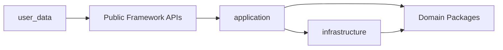

# Module Map

This document maps the architectural modules and workflows described in `ARCHITECTURE_AND_WORKFLOWS.md` to their implementation in the repository.

Its purpose is to show:

- which package owns a responsibility,
- where workflow orchestration lives,
- which domain contracts are involved,
- which infrastructure adapters implement those contracts,
- where tests and deeper documentation are located.

It is a navigation layer between architecture and source code.

---

## 1. Repository Boundaries

```text
src/trading_framework/
    reusable modular-monolith implementation (ADR-0001)

apps/
    deployable consumers outside the monolith (ADR-0022)
    apps/dashboard/ — read-only Streamlit + DuckDB research dashboard (Sprint 028)
    apps/cli/ — operator CLI, trading-cli, over application-layer workflows (Sprint 046 / ADR-0026)

scripts/
    thin CLIs over application use cases

deploy/
    containers / infra-as-code / local AWS runbook home
    (app-specific Compose may stay under apps/<app>/deploy/)

artifacts/artifacts/demo/
    generated demo HTML (not docs/reference)

scratch/
    local-only logs and one-off probes (gitignored except README)

tests/
    framework test suite (apps may keep their own tests)

docs/
    vision, reference, planning, adr, agents, onboarding

user_data/
    user-owned datasets
    component libraries
    model definitions
    strategies
    research specifications
    generated artifacts
    runtime state
```

Core dependency rules:

- `src/trading_framework/` never imports `user_data/` or `apps/`,
- `apps/*` must not import research/execution engines or provider/importer adapters,
- user-owned paths and configuration are passed at runtime,
- users extend the framework through public contracts and the DSL,
- infrastructure adapters implement framework ports,
- domain packages do not depend on concrete infrastructure.

See **ADR-0022** for the binding top-level layout.

---

## 2. Top-Level Package Map

Framework packages under `src/trading_framework/`:

```text
application/          workflow orchestration
market/               market-data domain contracts
market_analysis/      analytical components, planning and execution
model_expression/     internal declarative expression representation
model_authoring/      user-facing DSL
market_model/         Market Model definitions and evaluation
signal_model/         Signal Model definitions and evaluation
strategy/             strategy composition contracts
research/             research facts, simulation, analytics and artifacts
execution/            execution domain and runtime contracts
infrastructure/       provider, storage and delivery adapters
core/                 shared identifiers, types and errors
time/                 timeframes, sessions and clock contracts
config/               runtime configuration loading
```

Separate app package (not under `trading_framework`):

```text
apps/dashboard/src/dashboard_app/
    catalog/ query/ views/ charts/ caching/ datasources/
    catalog/predictive_quality.py   # Predictive Research quality flags (Sprint 044)
    views/predictive.py             # Predictive Research picker/leaderboard/detail view models
    pages/6_Predictive_Research.py  # Predictive Research page

apps/cli/src/trading_cli/
    cli.py              # argparse subparser tree + dispatch
    config.py            # YAML config loader + strict validation (D-S046-07/08)
    plan.py               # ResolvedPlan model, --dry-run / --json rendering
    errors.py              # exit-code taxonomy (0 / 1 / 2, D-S046-09)
    commands/               # one module per command group: data.py, research.py,
                             # dry_run.py, report.py
    strategy_loader.py       # Sprint 047 / ADR-0027: research.strategy.strategy_file
                              # -- import-by-path + build_strategy() convention, full
                              # error taxonomy, no sys.path mutation
```

---

## 3. Workflow-to-Module Map

| Workflow | Application orchestration | Domain packages | Infrastructure | Main outputs |
|---|---|---|---|---|
| Market Data | `application/market_data/` | `market/` | `infrastructure/importers/`, `infrastructure/providers/`, `infrastructure/storage/`, `infrastructure/validation/` | Published datasets |
| Market Analysis | `application/market_analysis/` | `market_analysis/` | Numerical adapters and storage bridges | Features and states |
| Model Evaluation | `application/model_evaluation/` | `model_expression/`, `model_authoring/`, `market_model/`, `signal_model/` | — | Evaluated models |
| Signal / Model Research | `application/signal_research/` | `research/`, `strategy/` | Research repositories and report adapters | Research artifacts |
| Strategy Research | `application/strategy_research/` | `strategy/`, `research/simulation/`, `research/datasets/` | Result storage and reporting adapters | Trades, equity, manifests |
| Robustness Research | `application/robustness_research/` | `research/robustness/` | Experiment storage and reporting adapters | Experiment artifacts |
| Predictive Research | `application/predictive_research/` | `research/predictive/`, `research/datasets/predictive.py`, `research/datasets/predictive_run.py`, `research/reporting/predictive/` | `infrastructure/ml/`, `infrastructure/storage/paths.py` | Dataset envelope; run envelope; offline HTML report |
| Live Execution | `application/execution/` | `execution/` | `infrastructure/providers/`, `infrastructure/storage/` | Runtime state |
| Visualization | Application view-model builders | `research/analytics/`, reporting packages | HTML, API and dashboard adapters; `apps/dashboard` | Dashboards and reports |
| Predictive Research dashboard | — (read-only catalog scan, no application orchestration import) | `apps/dashboard/src/dashboard_app/catalog/`, `views/`, `caching/`, `contracts.py` | DuckDB/Parquet reads of `research/predictive_research/` | Study picker, leaderboard, run detail, provenance (`pages/6_Predictive_Research.py`) |
| Operator CLI | `apps/cli/src/trading_cli/commands/` (`data.py`, `research.py`, `dry_run.py`, `report.py`) call `application/market_data/`, `application/predictive_research/`, `application/strategy_research/`, `application/execution/` directly | `apps/cli/src/trading_cli/config.py`, `plan.py`, `errors.py` (CLI-local config/plan/error models, not domain packages) | none of its own — delegates entirely to the application layer it wraps | `DatasetRef` (data fetch), dataset/run identifiers + offline HTML (research run, report render), dry-run runtime state |

---

## 4. Shared Foundations

### `core/`

**Responsibility**

- shared identifiers,
- base value types,
- framework exceptions,
- profiling primitives.

**Used by**

All domain and application modules.

**Typical paths**

```text
core/
├── identifiers/
├── types/
├── exceptions.py
└── profiling.py
```

---

### `time/`

**Responsibility**

- UTC time representation,
- timeframes,
- trading sessions,
- clock contracts,
- temporal alignment primitives.

**Used by**

- `market/`,
- `market_analysis/`,
- `research/`,
- `execution/`.

---

### `config/`

**Responsibility**

- framework configuration loading,
- runtime path configuration,
- environment-driven settings.

**Used by**

Application entry points and runtime assembly.

---

## 5. Market Data Implementation Map

### Responsibilities

| Responsibility | Package |
|---|---|
| Market-data domain types | `market/models/` |
| Instrument and dataset identity | `market/datasets/` |
| Dataset lifecycle | `market/datasets/` |
| Repository protocols | `market/repositories/` |
| Import and publication workflows | `application/market_data/` |
| Continuous trades materialize | `application/market_data/materialize_continuous_trades.py` (`session_workers`) |
| Provider adapters | `infrastructure/providers/` |
| Binance historical klines reader (paginated REST, rate-limit governor) | `infrastructure/providers/binance/futures_klines_history.py` |
| Binance historical OHLCV import workflow (validate, write, publish) | `application/market_data/import_binance_futures_ohlcv.py` |
| Binance historical OHLCV CLI (thin, ADR-0022) | `scripts/market_data/import_binance_ohlcv.py` |
| File and archive importers | `infrastructure/importers/` (Databento: NumPy `ContractChunkColumns`) |
| Normalization | `infrastructure/normalization/` |
| Validation | `infrastructure/validation/` |
| Dataset persistence | `infrastructure/storage/` |

### Public workflow surface

The Market Data application layer owns workflows for:

- importing external data,
- validating and normalizing records,
- publishing datasets,
- querying historical data,
- deriving new datasets,
- resolving stable dataset references.

### Dependency direction

```text
application/market_data
    → market
    → infrastructure adapters

infrastructure
    → market repository and domain contracts
```

### Tests

```text
tests/unit/market/
tests/unit/infrastructure/
tests/unit/application/market_data/
tests/integration/market_data/
```

### Deep references

- `ARCHITECTURE_AND_WORKFLOWS.md`
- market-data module reference
- storage ADRs

---

## 6. Market Analysis Implementation Map

### Responsibilities

| Responsibility | Package |
|---|---|
| Component contracts | `market_analysis/protocols/` |
| Component identity | `market_analysis/identity/` |
| Component requests and outputs | `market_analysis/models/` |
| Component registry | `market_analysis/registry/` |
| Dependency planning | `market_analysis/planning/` |
| Batch execution | `market_analysis/execution/` |
| Analysis input data | `market_analysis/data/` |
| Results and workspace | `market_analysis/storage/` |
| Built-in components | `market_analysis/components/` (incl. `components/candle/wick.py` -- `candle.wick`, and `components/structure/level_distance.py` -- `structure.level_distance`, both Sprint 047 / ADR-0027; and `components/trend/ema_distance.py` -- `trend.ema_distance` (signed `distance_atr`, depends on `trend.ema` + `volatility.atr`), and `components/volatility/range_expansion.py` -- `volatility.range_expansion` (dimensionless `ratio`, depends on `volatility.true_range` + `volatility.atr`), both Sprint 048 / ADR-0028) |
| Frame assembly and alignment | `market_analysis/assembly/` |
| Workflow orchestration | `application/market_analysis/` |

### Workflow mapping

```text
Published Dataset
  → application/market_analysis
  → market_analysis/data
  → market_analysis/planning
  → market_analysis/execution
  → market_analysis/storage
  → features and states
```

### Public workflow surface

The Market Analysis application layer is responsible for:

- loading published market data,
- resolving component requests,
- building an execution plan,
- executing shared computations,
- assembling model-facing analytical outputs.

### Tests

```text
tests/unit/market_analysis/
tests/unit/application/market_analysis/
tests/integration/market_analysis/
```

### Deep references

- `ARCHITECTURE_AND_WORKFLOWS.md`
- Market Analysis module reference
- Market Analysis ADRs

---

## 7. Declarative Model Implementation Map

### Responsibilities

| Responsibility | Package |
|---|---|
| Expression tree and references | `model_expression/` |
| Expression validation | `model_expression/` |
| Expression evaluation | `model_expression/evaluation/` |
| User-facing typed DSL | `model_authoring/` (incl. `references/candle.py` -- `candle.upper_wick_ratio`/`lower_wick_ratio`/`body_ratio`, and `references/structure.py`'s `distance_to_session_high`/`distance_to_session_low` -- both Sprint 047 / ADR-0027) |
| Market Model contracts | `market_model/` |
| Signal Model contracts | `signal_model/` |
| Shared model evaluation workflow | `application/model_evaluation/` |

### Layer distinction

```text
model_authoring/
    user-facing DSL

model_expression/
    internal representation

market_model/ and signal_model/
    model definitions and evaluation contracts
```

`model_authoring/` is the layer users interact with.

`model_expression/` is the internal representation executed by the framework.

### Workflow mapping

```text
User DSL
  → model_authoring
  → model_expression
  → application/model_evaluation
  → Market Model and Signal Model results
```

### Tests

```text
tests/unit/model_authoring/
tests/unit/model_expression/
tests/unit/market_model/
tests/unit/signal_model/
tests/unit/application/model_evaluation/
```

### Deep references

- `ARCHITECTURE_AND_WORKFLOWS.md`
- [Model authoring DSL](modules/MODEL_AUTHORING.md)
- model evaluation ADRs

---

## 8. Research Implementation Map

Research workflows share analytical and model-evaluation foundations, but remain independent application workflows.

### Signal and Model Research

| Responsibility | Package |
|---|---|
| Workflow orchestration | `application/signal_research/` |
| Research definitions | `research/signal_research/` |
| Observations | `research/observations/` |
| Context facts | `research/context/` |
| Forward outcomes | `research/outcomes/` |
| Run artifacts | `research/datasets/` |
| Analytics | `research/analytics/` |
| Reporting | `research/reporting/signal_research/` |

Workflow:

```text
Published Dataset
  → model evaluation
  → research facts
  → persisted run
  → read-only analytics
  → report
```

---

### Strategy Research

| Responsibility | Package |
|---|---|
| Workflow orchestration | `application/strategy_research/` |
| Shared OHLCV + model-eval cache | `application/strategy_research/shared_evaluation.py` |
| Strategy contracts | `strategy/` |
| Simulation engine | `research/simulation/` (incl. `simulation/kernels/fixed_bars.py` -- the original `@njit` fixed-bars kernel, unchanged since Sprint 013, and `simulation/kernels/bracket.py` -- the Sprint 048 / ADR-0028 `@njit` bracket kernel dispatched for `PriceBracketExit` models, with its own result dataclass and per-trade-reason materializers; no reference/non-njit counterpart, see TD-028) |
| Run artifacts | `research/datasets/` |
| Analytics | `research/analytics/` |
| Reporting | strategy reporting packages |

Workflow:

```text
Market Model + Signal Model + Strategy Definition
  → strategy research workflow
  → (optional SharedStrategyEvaluationContext)
  → simulation
  → persisted trades and equity
  → read-only analytics
  → dashboard
```

Robustness parameter / walk-forward / stress cells that share market and signal definitions reuse
`SharedStrategyEvaluationCache` so OHLCV load and `evaluate_models` run once per unique pair.

---

### Robustness Research

| Responsibility | Package |
|---|---|
| Workflow orchestration | `application/robustness_research/` |
| Experiment contracts | `research/robustness/` |
| Experiment analytics | `research/robustness/analytics/` |
| Experiment reports | robustness reporting packages |

Workflow:

```text
Research Definition
  → experiment variants
  → repeated strategy research runs
  → persisted experiment artifacts
  → aggregate analysis
  → verdict and report
```

---

### Predictive Research

Phase 10A: dataset foundation (Sprint 039), baseline estimators (Sprint 040),
and offline HTML report (Sprint 041). Phase 10B (Sprint 042) adds tree families
(XGBoost, LightGBM, CatBoost), bounded inner-fold selection, permutation
importance, a single-study leaderboard, and three report panels. Phase 10C
(Sprint 043) adds extra `dl` (CPU PyTorch): feedforward MLP, LSTM/GRU sequence
families, fold-contained windows, and learning-curve / window-accounting
panels. This workflow states a learning problem, persists a fingerprinted
labelled matrix, trains declared estimators per fold, and reviews one run as
standalone HTML. It does **not** emit signals or import `strategy/` /
`signal_model/`. `research/predictive/` stays library-free (polars, numpy,
framework contracts). Report figures live in `research/reporting/predictive/`
(plotly; no sklearn). ML libraries live behind optional extras `ml` /
`ml-trees` / `dl` and `infrastructure/ml/` adapters.

| Responsibility | Package |
|---|---|
| Study spec, features, labels, matrix, splits | `research/predictive/` |
| Estimator protocol, `EstimatorSpec`, `TaskType` | `research/predictive/estimators.py` |
| Fold-local preprocessing spec | `research/predictive/preprocessing.py` |
| Statistical + finance-aware metrics | `research/predictive/metrics.py` |
| Bounded candidate selection (`CandidateSetSpec`) | `research/predictive/selection.py` |
| Native + permutation importance, train/test gap | `research/predictive/importance.py` |
| Single-study leaderboard | `research/predictive/leaderboard.py` |
| Inner-training learning curves | `research/predictive/learning_curves.py` |
| Sequence windows + dropped-window accounting | `research/predictive/windows.py` |
| Dataset envelope, fingerprint, repository | `research/datasets/predictive.py` |
| Run envelope, fingerprint, repository | `research/datasets/predictive_run.py` |
| Workflow orchestration (build, run, analyze, render) | `application/predictive_research/` |
| Read-only HTML report | `research/reporting/predictive/` |
| Family registry + sklearn / tree / torch adapters | `infrastructure/ml/` (`registry.py`, `sklearn/`, `trees/xgboost/`, `trees/lightgbm/`, `trees/catboost/`, `torch/`) |
| Thin CLIs | `scripts/predictive_research/` |
| Storage paths | `infrastructure/storage/paths.py` |
| Promoted-artifact manifest, fingerprint, content-addressed repository (Phase 14A, Sprint 049) | `research/datasets/promoted_artifact.py` |
| Pure-NumPy promoted-artifact evaluator, parameter payload schema, load-time guard (Phase 14A) | `research/predictive/promotion/` |
| Promoted-artifact blob read, extraction, promotion-time version guard (Phase 14A) | `infrastructure/ml/promotion.py` |
| `promote_predictive_run` workflow (Phase 14A) | `application/predictive_research/promote_predictive_run.py` |
| Operator surface (Phase 14A) | `trading-cli research promote` (`apps/cli/`), `scripts/predictive_research/promote_predictive_run.py` |

Workflow:

```text
Published DatasetRef + PredictiveStudySpec (YAML/JSON)
  → run_analysis (declared FeatureSpec columns only)
  → labelled matrix (one row per complete evaluation bar)
  → purged + embargoed walk-forward fold roles
  → PredictiveDatasetEnvelope (manifest + fingerprint)
  → EstimatorSpec (family + hyperparameters + seed)
      or CandidateSetSpec (declared, capped; inner TRAIN split, TEST once)
  → run_predictive_research (fit on TRAIN per fold, predict on TEST;
      sequence families: application builds windows before fit / predict)
  → PredictiveRunEnvelope (predictions, metrics, opaque blobs)
  → analyze_predictive_run (writes metrics.json from predictions; never deserializes model blobs)
  → render_predictive_research_report (offline HTML; optional importance/selection/leaderboard/learning_curves/window_accounting sidecars; never fits or loads model blobs)
```

Samples are **evaluation bars**, not `SignalOccurrence` rows. Labels reuse
`compute_forward_outcomes_for_horizons` on a synthetic long-only occurrence
table (one row per bar). `FeatureTransform.RANK` is rejected at matrix build
(cross-sectional vs expanding rank is ambiguous; a global rank would leak).
Supported transforms this slice: `NONE`, `LOG`, `DIFF`, `PCT_CHANGE`.

The dataset fingerprint hashes study spec (`definition_hash`) + `OutputRef`
lineage + `DatasetRef` + time range. It never hashes materialized frame bytes.
`dataset_id` is the first 16 hex characters of that fingerprint.

Persisted fold roles: `TRAIN` / `TEST` / `PURGED` / `EMBARGOED`. Purged and
embargoed rows are retained with a role label, not deleted. Preprocessing
(`IMPUTE_MEDIAN`, `STANDARDIZE`) is fitted inside each fold on `TRAIN` rows
only; `PURGED` and `EMBARGOED` never reach `fit()`.

Estimator families this slice (registry ids): extra `ml` — `sklearn.ridge`,
`sklearn.elastic_net`, `sklearn.logistic` (binary). Extra `ml-trees` —
`xgboost.regressor`, `xgboost.classifier` (binary), `lightgbm.regressor`,
`lightgbm.classifier` (binary), `catboost.regressor`, `catboost.classifier`
(binary). Extra `dl` — `torch.feedforward.regressor`,
`torch.feedforward.classifier` (binary), `torch.lstm.regressor`,
`torch.lstm.classifier` (binary), `torch.gru.regressor`,
`torch.gru.classifier` (binary). Unknown family ids raise
`PredictiveSpecError`. Missing extra raises `PredictiveExtraError` naming the
extra. Tree families also need extra `ml` for fold-local preprocessing.
Neural families do **not** require extra `ml`; sequence families consume
rank-3 windows built by application. Reference baselines (`CONSTANT_MEAN`,
`MAJORITY_CLASS`, `RANDOM_PERMUTATION`)
are metric-layer comparisons, not registry families. Metrics are reported per
fold and pooled.

Optional extras:
`ml = ["scikit-learn>=1.6,<2.0"]`,
`ml-trees = ["xgboost-cpu>=2.1,<4.0", "lightgbm>=4.5,<5.0", "catboost>=1.2,<2.0"]`,
and `dl = ["torch>=2.6,<2.10"]` (CPU index).
Not in the default `dev` group. Dedicated CI jobs `ml`, `ml_trees`, and `dl`.
Standard unit CI stays extra-free (`uv sync --locked --dev`,
`-m "not ml and not ml_trees and not torch"`).

Storage:

```text
<workspace>/research/predictive_research/datasets/{dataset_id}/
  manifest.json
  features.parquet
  folds.json
<workspace>/research/predictive_research/runs/{run_id}/
  manifest.json
  predictions.parquet
  metrics.json
  report.html            # offline Plotly; first figure embeds JS inline
  selection.json         # candidate scores per fold; absent on single-estimator runs
  importance.json        # native + permutation importance and train/test gap
  leaderboard.json       # optional; single-study comparison of run dirs
  learning_curves.json   # optional; inner-train / inner-val loss per fold
  window_accounting.json # optional; dropped windows and effective sample
  models/fold_{n}.bin    # opaque; reproduce by re-fitting, not deserializing
```

**Promoted artifacts** (Phase 14A, Sprint 049) live in a separate,
content-addressed store under
`<workspace>/research/predictive_research/promoted/{artifact_fingerprint}/` —
see `docs/reference/PREDICTIVE_PROMOTION.md` §3 for the exact two-file
layout, which is documented there only (not repeated here).

CLIs:

```text
uv run python scripts/predictive_research/build_predictive_dataset.py --storage-root <workspace> --definition <spec.yaml>
uv run python scripts/predictive_research/run_predictive_research.py --storage-root <workspace> --dataset-id <id> --estimator <spec.yaml>
uv run python scripts/predictive_research/analyze_predictive_run.py --storage-root <workspace> --run-id <id>
uv run python scripts/predictive_research/render_predictive_report.py --storage-root <workspace> --run-id <id>
uv run python scripts/predictive_research/compare_predictive_runs.py --run-dir <run> [--run-dir <run> ...]
```

### Tests

```text
tests/unit/research/
tests/unit/research/predictive/
tests/unit/strategy/
tests/unit/application/signal_research/
tests/unit/application/strategy_research/
tests/unit/application/robustness_research/
tests/unit/research/reporting/predictive/
tests/unit/application/predictive_research/
tests/unit/infrastructure/ml/
tests/integration/research/
```

### Deep references

- `RESEARCH_METHODOLOGIES.md`
- `ARCHITECTURE_AND_WORKFLOWS.md`
- `PREDICTIVE_PROMOTION.md` — promoted-artifact schema, store layout, both
  guards, the family restriction, and the two parity comparisons (Phase 14A)
- research ADRs (Predictive Research: ADR-0023; promotion: ADR-0029)

---

## 9. Execution Implementation Map

### Responsibilities

| Responsibility | Package |
|---|---|
| Execution modes and safety contracts | `execution/` |
| Orders, fills, positions and account models | `execution/models/` |
| Broker simulation | `execution/broker_sim/` |
| Runtime state ports | `execution/repositories/` |
| Runtime logic | `execution/runtime/` |
| Workflow orchestration | `application/execution/` |
| Live provider adapters | `infrastructure/providers/` |
| Runtime-state persistence | `infrastructure/storage/` |
| Status and monitoring delivery | application and infrastructure adapters |

### Workflow mapping

```text
Live Provider Adapter
  → normalized market facts
  → application/execution
  → execution/runtime
  → broker abstraction
  → runtime-state repository
  → monitoring or dashboard
```

### Dependency direction

```text
execution
    does not depend on research

application/execution
    orchestrates execution domain and adapters

infrastructure
    implements provider and persistence boundaries
```

### Tests

```text
tests/unit/execution/
tests/unit/application/execution/
tests/unit/infrastructure/
tests/integration/live_data/
```

### Deep references

- `ARCHITECTURE_AND_WORKFLOWS.md`
- execution runbooks
- execution ADRs

---

## 10. Visualization and Reporting Map

### Responsibilities

| Responsibility | Package |
|---|---|
| Read-only analytics | `research/analytics/` |
| Signal research reports | `research/reporting/signal_research/` |
| Strategy dashboards | strategy analytics and reporting packages |
| Robustness reports | `research/robustness/` reporting packages |
| Live dashboard state | execution read-model adapters |
| Demo generation | `scripts/demo/` |
| Live dashboard delivery | `scripts/portfolio_live/` (aiohttp); `apps/dashboard` Live Paper page (status GET) |
| Predictive Research dashboard delivery | `apps/dashboard/src/dashboard_app/catalog/predictive_quality.py` (quality flags), `apps/dashboard/src/dashboard_app/views/predictive.py` (picker/leaderboard/detail/provenance view models); `pages/6_Predictive_Research.py` (Sprint 044) |

### Boundary

Visualization reads:

- persisted research artifacts,
- persisted analytics,
- runtime state.

Visualization does not execute research or control execution.

---

## 11. User Workspace Map

The framework core is reusable, while each user maintains an independent workspace.

Canonical layout (``--storage-root`` = workspace root, usually ``user_data/``):

```text
user_data/
├── market_data/
│   ├── raw/                 # immutable vendor archives
│   ├── metadata/            # dataset registry JSON
│   ├── normalized/          # published Parquet market facts
│   └── continuous/          # roll schedules
├── research/
│   ├── market_research/     # Signal Research runs + family experiments
│   ├── strategy_research/   # Strategy Research runs
│   ├── strategy_robustness/ # robustness experiments
│   └── predictive_research/ # Predictive Research datasets + runs (Phase 10)
├── runtime/                 # execution dry-run state
├── reports/                 # optional loose reports
├── config/
├── components/
└── models/
```

| User-owned area | Purpose |
|---|---|
| `market_data/raw/` | vendor archives (DBN, CSV, …); never overwritten |
| `market_data/metadata/` | dataset registry and lifecycle metadata |
| `market_data/normalized/` | published Parquet market facts |
| `market_data/continuous/` | roll schedules and related artifacts |
| `research/market_research/` | Signal Research runs and model-family experiments |
| `research/strategy_research/` | Strategy Research runs |
| `research/strategy_robustness/` | robustness experiments |
| `research/predictive_research/` | Predictive Research datasets (`datasets/{dataset_id}/`) and runs (`runs/{run_id}/`) |
| `components/` | custom analytical components |
| `models/` | Market Model and Signal Model definitions |
| `runtime/` | local execution state and operational data |

Path helpers: `src/trading_framework/infrastructure/storage/paths.py`.  
Migration: `scripts/ops/migrate_user_data_workspace.py`.

Users extend the system through:

- public component contracts,
- the model-authoring DSL,
- research definition contracts,
- strategy composition contracts,
- runtime configuration.

Users should not need to modify framework internals to:

- add components,
- compose models,
- define strategies,
- run research,
- inspect results.

---

## 12. Dependency Rules

```text
domain packages
    do not depend on infrastructure

application
    orchestrates domain packages and infrastructure

infrastructure
    implements domain ports and external boundaries

user_data
    depends on public framework APIs

src/trading_framework
    never imports user_data
```

Simplified dependency map:


```mermaid
flowchart LR
    USER[user_data]
    PUBLIC[Public Framework APIs]
    APP[application]
    DOMAIN[Domain Packages]
    INFRA[infrastructure]

    USER --> PUBLIC
    PUBLIC --> APP
    APP --> DOMAIN
    APP --> INFRA
    INFRA --> DOMAIN
```

---

## 13. Test Map

| Implementation area | Main test location |
|---|---|
| `market/` | `tests/unit/market/` |
| `market_analysis/` | `tests/unit/market_analysis/` |
| `model_*` | corresponding unit-test packages |
| `application/` | `tests/unit/application/`, `tests/integration/` |
| `research/` | `tests/unit/research/`, workflow integration tests |
| `strategy/` | `tests/unit/strategy/` |
| `execution/` | `tests/unit/execution/` |
| `infrastructure/` | `tests/unit/infrastructure/`, opt-in integration tests |
| `apps/cli/src/trading_cli/` | `apps/cli/tests/` (own CI job, own `--package trading-cli` pytest run) |
| Architecture boundaries | dedicated architecture-boundary tests (`tests/unit/test_apps_boundaries.py`) |

Tests should mirror module ownership and validate both:

- local contracts,
- cross-module workflow integration.

---

## 14. Detailed References

Use this document to locate implementation.

Use the following documents for deeper context:

- `README.md` — project overview,
- `ARCHITECTURE_AND_WORKFLOWS.md` — architectural problems and workflow design,
- `RESEARCH_METHODOLOGIES.md` — research methodology,
- module-specific reference documents,
- Architecture Decision Records,
- execution and deployment runbooks.

---

## Maintenance

Update this document when:

- package ownership changes,
- a workflow moves between modules,
- a public entry point changes,
- a new top-level package is introduced,
- dependency rules change.

Do not add:

- sprint history,
- roadmap status,
- benchmark narratives,
- full workflow explanations,
- low-level implementation details already covered in module references.
