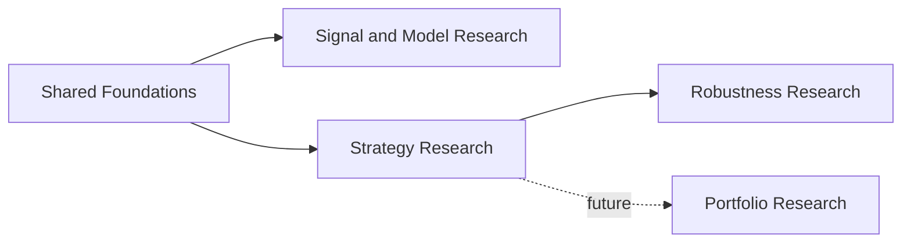

# Research Methodologies

This document describes the research methodologies supported by the framework, the questions they answer, and how to choose between them.

Research workflows are independent capabilities. They share datasets, analytical components and declarative models, but they do not form one mandatory pipeline.

---

## 1. Methodology Overview




| Methodology                | Main question                                                          | Primary output                                 |
| -------------------------- | ---------------------------------------------------------------------- | ---------------------------------------------- |
| Signal Research            | Does a feature, state or signal describe repeatable forward behaviour? | Occurrences, observations and forward outcomes |
| Model Research Methodology | Is a model study reproducible, bounded and diagnostically sound?       | Study artifacts, diagnostics and comparisons   |
| Strategy Research          | Does a complete strategy produce acceptable simulated results?         | Trades, equity and performance metrics         |
| Robustness Research        | Does the result survive variation and stress?                          | Stability diagnostics and robustness verdict   |
| Portfolio Research         | How should multiple strategies be combined?                            | Portfolio behaviour and allocation analysis    |


---

## 2. Shared Research Foundations

All research methodologies depend on the same foundations:

- published market datasets,
- reusable analytical components,
- Market Features and Market States,
- Signal Features and Signal States,
- declarative Market Models,
- declarative Signal Models,
- persisted research artifacts.

These foundations are shared, but research workflows remain independent.

```text
Published Data
  → Market Analysis
  → Declarative Models
  → Selected Research Workflow
```

---

## 3. Shared Research Principles

### Reproducibility

Every research run should record enough information to explain and reproduce the result.

This includes:

- dataset reference,
- time range,
- model definitions,
- strategy assumptions,
- parameters,
- evaluation horizons,
- execution assumptions where applicable,
- configuration or code fingerprint,
- persisted outputs.

### Separation of Computation and Analysis

The framework follows a compute-first, persist-first model:

```text
Compute
  → Persist Facts
  → Analyze
  → Visualize
```

Analytics and reports should not rerun model evaluation or simulation unless the underlying inputs change.

### Independent Workflows

- Signal Research is not required before Strategy Research.
- Strategy Research is not part of Strategy Execution.
- Robustness Research consumes persisted strategy results but does not modify them.
- Portfolio Research is a separate methodology built on persisted strategy outputs.
- Execution is operational and is not a research methodology.

### Explicit Assumptions

Research results should expose assumptions such as:

- temporal alignment,
- occurrence policy,
- fill timing,
- slippage,
- fees,
- position sizing,
- incomplete trade handling,
- missing outcomes,
- warm-up periods.

### Data and Sample Quality

A research methodology should account for:

- sample size,
- missing or incomplete outcomes,
- period concentration,
- regime concentration,
- temporal leakage,
- class imbalance,
- multiple testing,
- outliers,
- unrealistic execution assumptions.

---

## 4. Signal Research

### Research Question

> Does a market feature, state, signal or context describe repeatable forward market behaviour?

### Suitable For

- feature validation,
- market-state research,
- signal research,
- conditional behaviour analysis,
- forward returns,
- MFE and MAE,
- occurrence distributions,
- context-aware comparisons.

### Not Suitable For

- trade sequencing,
- exits,
- position sizing,
- transaction costs,
- drawdown,
- equity curves,
- simulated PnL.

These belong to Strategy Research.

### Workflow

```text
Published Dataset
  → Analytical Components
  → Market or Signal Model
  → Occurrences or Observations
  → Forward Outcomes
  → Persisted Research Facts
  → Read-Only Analytics
```

### Main Outputs

- signal occurrences,
- market-model observations,
- contextual facts,
- forward outcomes,
- grouped metrics,
- sample-size diagnostics,
- quality warnings.

### Typical Questions

- Does a signal predict positive forward returns?
- Does a market state change the distribution of outcomes?
- Does the result hold across sessions, periods or regimes?
- Is the observed effect supported by a sufficient sample?
- Is the effect concentrated in a small subset of the data?

---

## 5. Model Research Methodology

Model Research Methodology is a methodological layer built on Signal Research.

Its purpose is not to create another independent compute engine. It defines how a model study should be specified, bounded, diagnosed and reported.

### Research Question

> Is the model study well-defined, reproducible, bounded and diagnostically credible?

### Adds to Signal Research

- declarative study definitions,
- explicit research scope,
- baselines,
- grouping rules,
- occurrence policies,
- quality rules,
- bounded model-family comparison,
- persisted analytics,
- standardized reporting.

### Workflow

```text
Study Definition
  → Validation
  → Signal Research Run
  → Quality Diagnostics
  → Baseline Comparison
  → Persisted Analytics
  → Report
```

### Methodological Focus

- reproducibility,
- bounded search space,
- controlled comparison,
- explicit baselines,
- quality diagnostics,
- interpretability,
- avoidance of uncontrolled model mining.

### Recommended Boundaries

A model study should define in advance:

- the hypothesis,
- the studied model or model family,
- the dataset and time range,
- the evaluation horizons,
- the occurrence policy,
- the comparison baseline,
- the quality thresholds,
- the allowed variant count.

---

## 6. Strategy Research

### Research Question

> Does a complete strategy produce acceptable simulated performance under explicit execution assumptions?

### Strategy Composition

```text
Market Model
  × Signal Model
  × Entry
  × Risk
  × Exit
```

A strategy is treated as a composition of independent lower-level elements rather than one monolithic implementation.

### Workflow

```text
Published Dataset
  → Shared Analysis
  → Model Evaluation
  → Entry Decisions
  → Sequential Simulation
  → Trades and Equity
  → Persisted Run
  → Read-Only Analytics
```

### Main Outputs

- trade ledger,
- equity curve,
- returns,
- drawdown,
- hit rate,
- holding periods,
- exposure,
- execution diagnostics,
- performance summaries.

### Methodological Requirements

Strategy Research should make the following assumptions explicit:

- signal timing,
- entry timing,
- fill price,
- slippage,
- commissions and fees,
- exit behaviour,
- position sizing,
- incomplete positions,
- session boundaries,
- warm-up requirements.

### Typical Questions

- Does the full strategy generate acceptable risk-adjusted performance?
- How sensitive is the result to fill assumptions?
- Are results driven by a small number of trades?
- Does the strategy remain stable across periods and regimes?
- Is the strategy behaviour consistent with the original research hypothesis?

---

## 7. Robustness Research

### Research Question

> Does the apparent strategy edge survive variation in parameters, time, regimes and execution assumptions?

### Workflow

```text
Strategy Definition
  → Experiment Variants
  → Repeated Strategy Runs
  → Persisted Child Results
  → Aggregate Analysis
  → Robustness Verdict
```

### Main Methods

- parameter sweeps,
- walk-forward analysis,
- stress testing,
- Monte Carlo analysis,
- regime analysis,
- sensitivity analysis,
- statistical diagnostics,
- execution-assumption testing.

### What It Should Detect

- narrow parameter peaks,
- unstable performance,
- regime dependency,
- sensitivity to costs,
- sensitivity to slippage,
- dependence on a small number of trades,
- degradation out of sample,
- concentration in one time period,
- unrealistic execution assumptions.

### Main Outputs

- experiment manifest,
- child-run references,
- parameter surfaces,
- walk-forward results,
- stress scenarios,
- Monte Carlo distributions,
- quality diagnostics,
- PASS / CONDITIONAL / FAIL verdict.

### Interpretation Rule

Robustness Research does not prove that an edge will persist.

Its purpose is to expose fragility, concentration and unsupported assumptions before a strategy is considered for execution.

---

## 8. Portfolio Research

Portfolio Research is a planned methodology.

### Research Question

> How should multiple strategies be combined, allocated and evaluated as a portfolio?

### Planned Scope

- correlation between strategies,
- capital allocation,
- portfolio drawdown,
- risk contribution,
- diversification,
- turnover,
- capacity,
- portfolio robustness,
- execution constraints,
- strategy replacement and deactivation rules.

### Planned Workflow

```text
Persisted Strategy Results
  → Temporal Alignment
  → Portfolio Composition
  → Allocation Rules
  → Portfolio Simulation
  → Portfolio Analytics
```

### Expected Outputs

- portfolio equity curve,
- strategy contribution,
- risk contribution,
- allocation history,
- portfolio drawdown,
- diversification metrics,
- portfolio-level robustness diagnostics.

---

## 9. Choosing a Methodology


| Research need                            | Recommended methodology                |
| ---------------------------------------- | -------------------------------------- |
| Validate a component or market state     | Signal Research                        |
| Measure forward market behaviour         | Signal Research                        |
| Run a documented model study             | Model Research Methodology             |
| Compare a bounded set of model variants  | Model Research Methodology             |
| Measure trades, equity and PnL behaviour | Strategy Research                      |
| Validate parameter stability             | Robustness Research                    |
| Test sensitivity to costs and slippage   | Robustness Research                    |
| Evaluate regime dependence               | Signal Research or Robustness Research |
| Combine multiple strategies              | Portfolio Research                     |
| Apply selected logic to live data        | Execution workflow, not research       |


---

## 10. Optional Research Progression

A common research progression is:

```text
Component or Model Research
  → Strategy Research
  → Robustness Research
  → Portfolio Research
```

This progression is optional.

Each workflow may be used independently when the research question requires it.

Examples:

- a component may be studied without ever becoming part of a strategy,
- a strategy may be simulated directly from an existing model definition,
- a robustness experiment may be rerun against an already persisted strategy family,
- portfolio research may compare strategies created through different research paths.

---

## 11. Research Artifacts

Research outputs are persisted as structured artifacts.


| Artifact            | Purpose                                         |
| ------------------- | ----------------------------------------------- |
| Run manifest        | Records inputs, definitions and assumptions     |
| Research facts      | Stores observations, outcomes or trades         |
| Analytics           | Stores derived summaries and diagnostics        |
| Report              | Presents persisted results                      |
| Experiment manifest | Groups related runs                             |
| Child-run registry  | Links experiment variants to their outputs      |
| Quality diagnostics | Records warnings and methodological limitations |


Core rule:

> Reports are disposable views. Persisted facts and manifests are the research record.

---

## 12. Quality and Anti-Overfitting Principles

### Predefined Hypotheses

The research question and primary metrics should be defined before inspecting results whenever possible.

### Bounded Search Space

Model variants and parameter ranges should be explicitly limited.

Unbounded search increases the probability of finding accidental patterns.

### Baseline Comparison

Results should be compared against an appropriate baseline, such as:

- unconditional market behaviour,
- signal-only behaviour,
- model-inactive periods,
- a simpler model,
- a previous stable strategy.

### Temporal Validation

Prefer:

- chronological splits,
- walk-forward evaluation,
- rolling windows,
- out-of-sample periods.

Avoid random shuffling when temporal dependence matters.

### Multiple Testing

When many variants are evaluated, reported conclusions should account for the increased probability of false discoveries.

### Sample Size and Concentration

Metrics should be interpreted together with:

- observation count,
- trade count,
- period concentration,
- regime concentration,
- distribution of outcomes.

### Sensitivity Analysis

A credible result should not depend on:

- one exact parameter,
- one narrow time range,
- one unrealistic execution assumption,
- one small group of trades.

### Negative Results

Negative and inconclusive studies should remain part of the research record.

This reduces repeated testing of failed ideas and limits hindsight bias.

---

## 13. Relationship to Execution

Research and execution are separate capabilities.

```text
Research
    evaluates hypotheses and persists evidence

Execution
    applies selected definitions to live data
```

They may share:

- Market Models,
- Signal Models,
- strategy definitions,
- domain contracts.

They do not share workflow state.

Core rules:

- Execution does not depend on research run artifacts.
- Research results are not automatically promoted to execution.
- Promotion to execution should be an explicit decision.
- Live execution should use the same domain definitions where appropriate.
- Execution-specific safety and risk controls remain independent from research.

---

## 14. Methodology Boundaries


| Capability                 | Research methodology? | Reason                                |
| -------------------------- | --------------------- | ------------------------------------- |
| Market Data ingestion      | No                    | Produces research inputs              |
| Market Analysis            | No                    | Provides reusable compute foundations |
| Signal Research            | Yes                   | Studies forward behaviour             |
| Model Research Methodology | Yes                   | Defines a controlled study protocol   |
| Strategy Research          | Yes                   | Studies complete simulated strategies |
| Robustness Research        | Yes                   | Evaluates credibility and stability   |
| Portfolio Research         | Planned               | Studies strategy combinations         |
| Live Execution             | No                    | Applies selected logic operationally  |
| Visualization              | No                    | Presents persisted results            |


---

## 15. References

Use the following documents for deeper context:

- `README.md` — project overview,
- `ARCHITECTURE_AND_WORKFLOWS.md` — architectural modules and workflows,
- `MODULE_MAP.md` — mapping from workflows to source-code packages,
- Architecture Decision Records,
- module-specific reference documents,
- execution and deployment runbooks.

### Reference Research Reports

The following standalone HTML reports are generated from persisted research artifacts.

They are read-only views and do not rerun model evaluation, simulation or robustness experiments.


| Methodology             | Report                                                                    | Purpose                                                                              |
| ----------------------- | ------------------------------------------------------------------------- | ------------------------------------------------------------------------------------ |
| Combined Model Research | [Market × Signal report](combined_model_research.html )                 | Forward-outcome analysis for a signal conditioned by market context                  |
| Strategy Research       | [Strategy Research dashboard](strategy_dashboard_nq_half_year.html )    | Trade ledger, equity, drawdown and strategy performance analysis                     |
| Robustness Research     | [Robustness dashboard](robustness_dashboard.html )                      | Parameter sensitivity, walk-forward, stress, Monte Carlo and statistical diagnostics |


These reports illustrate the output of the corresponding methodologies. They should be interpreted together with the recorded dataset, model definitions, assumptions, sample size and quality diagnostics.