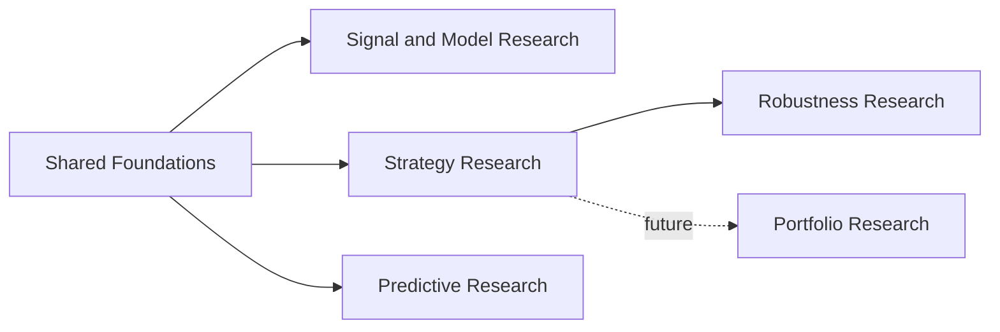

# Research Methodologies

> Moved from `docs/reference/RESEARCH_METHODOLOGIES.md` to
> `docs/reference/workflows/RESEARCH_METHODOLOGIES.md` by Sprint 054 T008
> (`docs/reference` system/workflows/runbooks/modules split). Content
> unchanged — kept as one document, not split per methodology (see
> `docs/planning/sprints/SPRINT_054_T007_REFERENCE_FOLDER_AUDIT.md` §4.1).
>
> **This document answers "which methodology should I choose, and what
> question does it answer".** For "what are a workflow's scopes, contracts
> and persisted outputs", see
> [`SIGNAL_RESEARCH.md`](SIGNAL_RESEARCH.md) / [`STRATEGY_RESEARCH.md`](STRATEGY_RESEARCH.md) /
> [`STRATEGY_EXECUTION.md`](STRATEGY_EXECUTION.md) / [`MARKET_DATA.md`](MARKET_DATA.md) —
> added by Sprint 055 T007, per
> `docs/planning/sprints/SPRINT_055_T004_DECISIONS.md` §1 (RESEARCH_METHODOLOGIES /
> SIGNAL_RESEARCH adjacency, option (a)). The two kinds of document are
> deliberately not merged.

> **Workflow Architecture preamble (carried here from the retired
> `docs/reference/system/WORKFLOWS_ARCHITECTURE.md`'s opening section by
> Sprint 055 T007, pending a proper `workflows/README.md` folder index from
> Sprint 055 T005):**
>
> The framework's three primary workflows — Signal Research, Strategy
> Research, Strategy Execution — must not be represented as a mandatory
> pipeline:
>
> ```text
> Signal Research
>         ↓
> Strategy Research
>         ↓
> Strategy Execution
> ```
>
> This would incorrectly imply that every workflow requires the output of
> the previous workflow. The correct architecture is:
>
> ```text
>                          Shared Domains
>                                │
>               ┌────────────────┼────────────────┐
>               │                │                │
>               ▼                ▼                ▼
>        Signal Research   Strategy Research   Strategy Execution
> ```
>
> Shared domains include: Market, Market Analysis, Strategy, Research,
> Execution, Time, Configuration, Infrastructure contracts. Each workflow
> has its own purpose, inputs, orchestration, outputs, persistence model,
> and analytics or runtime state.
>
> A **workflow definition** is a validated configuration describing one use
> case (datasets, assets, model definitions, logical expressions, parameter
> spaces, execution assumptions, output policies, research scope, alignment
> and timeframe rules) — it belongs to the application and configuration
> layers, not the domain model.
>
> Every research workflow separates **Research Computation** (creates
> reusable factual datasets) from **Research Analytics** (interprets stored
> results). A new report, filter, ranking or family analysis must not
> automatically recalculate unchanged source results.

This document describes the research methodologies supported by the framework, the questions they answer, and how to choose between them.

Research workflows are independent capabilities. They share datasets, analytical components and declarative models, but they do not form one mandatory pipeline.

---

## 1. Methodology Overview




| Methodology                | Main question                                                          | Primary output                                 |
| -------------------------- | ---------------------------------------------------------------------- | ---------------------------------------------- |
| Signal Research            | Does a feature, state or signal describe repeatable forward behaviour? | Occurrences, observations and forward outcomes |
| Model Research Methodology | Is a model study reproducible, bounded and diagnostically sound?       | Study artifacts, diagnostics and comparisons   |
| Strategy Research          | Does a complete strategy produce acceptable simulated results?         | Trades, equity and performance metrics         |
| Robustness Research        | Does the result survive variation and stress?                          | Stability diagnostics and robustness verdict   |
| Predictive Research        | Is there predictable structure in these features out of sample?        | Labelled matrix, fold roles, out-of-sample predictions and metrics |
| Portfolio Research         | How should multiple strategies be combined?                            | Portfolio behaviour and allocation analysis    |


---

## 2. Shared Research Foundations

All research methodologies depend on the same foundations:

- published market datasets,
- reusable analytical components,
- Market Features and Market States,
- Signal Features and Signal States,
- declarative Market Models,
- declarative Signal Models,
- persisted research artifacts.

These foundations are shared, but research workflows remain independent.

```text
Published Data
  → Market Analysis
  → Declarative Models
  → Selected Research Workflow
```

---

## 3. Shared Research Principles

### Reproducibility

Every research run should record enough information to explain and reproduce the result.

This includes:

- dataset reference,
- time range,
- model definitions,
- strategy assumptions,
- parameters,
- evaluation horizons,
- execution assumptions where applicable,
- configuration or code fingerprint,
- persisted outputs.

### Separation of Computation and Analysis

The framework follows a compute-first, persist-first model:

```text
Compute
  → Persist Facts
  → Analyze
  → Visualize
```

Analytics and reports should not rerun model evaluation or simulation unless the underlying inputs change.

### Independent Workflows

- Signal Research is not required before Strategy Research.
- Strategy Research is not part of Strategy Execution.
- Robustness Research consumes persisted strategy results but does not modify them.
- Predictive Research is independent of Signal and Strategy Research. It does not produce signals.
- Portfolio Research is a separate methodology built on persisted strategy outputs.
- Execution is operational and is not a research methodology.

### Explicit Assumptions

Research results should expose assumptions such as:

- temporal alignment,
- occurrence policy,
- fill timing,
- slippage,
- fees,
- position sizing,
- incomplete trade handling,
- missing outcomes,
- warm-up periods.

### Data and Sample Quality

A research methodology should account for:

- sample size,
- missing or incomplete outcomes,
- period concentration,
- regime concentration,
- temporal leakage,
- class imbalance,
- multiple testing,
- outliers,
- unrealistic execution assumptions.

---

## 4. Signal Research

### Research Question

> Does a market feature, state, signal or context describe repeatable forward market behaviour?

### Suitable For

- feature validation,
- market-state research,
- signal research,
- conditional behaviour analysis,
- forward returns,
- MFE and MAE,
- occurrence distributions,
- context-aware comparisons.

### Not Suitable For

- trade sequencing,
- exits,
- position sizing,
- transaction costs,
- drawdown,
- equity curves,
- simulated PnL.

These belong to Strategy Research.

### Workflow

```text
Published Dataset
  → Analytical Components
  → Market or Signal Model
  → Occurrences or Observations
  → Forward Outcomes
  → Persisted Research Facts
  → Read-Only Analytics
```

### Main Outputs

- signal occurrences,
- market-model observations,
- contextual facts,
- forward outcomes,
- grouped metrics,
- sample-size diagnostics,
- quality warnings.

### Typical Questions

- Does a signal predict positive forward returns?
- Does a market state change the distribution of outcomes?
- Does the result hold across sessions, periods or regimes?
- Is the observed effect supported by a sufficient sample?
- Is the effect concentrated in a small subset of the data?

---

## 5. Model Research Methodology

Model Research Methodology is a methodological layer built on Signal Research.

Its purpose is not to create another independent compute engine. It defines how a model study should be specified, bounded, diagnosed and reported.

### Research Question

> Is the model study well-defined, reproducible, bounded and diagnostically credible?

### Adds to Signal Research

- declarative study definitions,
- explicit research scope,
- baselines,
- grouping rules,
- occurrence policies,
- quality rules,
- bounded model-family comparison,
- persisted analytics,
- standardized reporting.

### Workflow

```text
Study Definition
  → Validation
  → Signal Research Run
  → Quality Diagnostics
  → Baseline Comparison
  → Persisted Analytics
  → Report
```

### Methodological Focus

- reproducibility,
- bounded search space,
- controlled comparison,
- explicit baselines,
- quality diagnostics,
- interpretability,
- avoidance of uncontrolled model mining.

### Recommended Boundaries

A model study should define in advance:

- the hypothesis,
- the studied model or model family,
- the dataset and time range,
- the evaluation horizons,
- the occurrence policy,
- the comparison baseline,
- the quality thresholds,
- the allowed variant count.

---

## 6. Strategy Research

### Research Question

> Does a complete strategy produce acceptable simulated performance under explicit execution assumptions?

### Strategy Composition

```text
Market Model
  × Signal Model
  × Entry
  × Risk
  × Exit
```

A strategy is treated as a composition of independent lower-level elements rather than one monolithic implementation.

### Workflow

```text
Published Dataset
  → Shared Analysis
  → Model Evaluation
  → Entry Decisions
  → Sequential Simulation
  → Trades and Equity
  → Persisted Run
  → Read-Only Analytics
```

### Main Outputs

- trade ledger,
- equity curve,
- returns,
- drawdown,
- hit rate,
- holding periods,
- exposure,
- execution diagnostics,
- performance summaries.

### Methodological Requirements

Strategy Research should make the following assumptions explicit:

- signal timing,
- entry timing,
- fill price,
- slippage,
- commissions and fees,
- exit behaviour,
- position sizing,
- incomplete positions,
- session boundaries,
- warm-up requirements.

### Typical Questions

- Does the full strategy generate acceptable risk-adjusted performance?
- How sensitive is the result to fill assumptions?
- Are results driven by a small number of trades?
- Does the strategy remain stable across periods and regimes?
- Is the strategy behaviour consistent with the original research hypothesis?

---

## 7. Robustness Research

### Research Question

> Does the apparent strategy edge survive variation in parameters, time, regimes and execution assumptions?

### Workflow

```text
Strategy Definition
  → Experiment Variants
  → Repeated Strategy Runs
  → Persisted Child Results
  → Aggregate Analysis
  → Robustness Verdict
```

### Main Methods

- parameter sweeps,
- walk-forward analysis,
- stress testing,
- Monte Carlo analysis,
- regime analysis,
- sensitivity analysis,
- statistical diagnostics,
- execution-assumption testing.

### What It Should Detect

- narrow parameter peaks,
- unstable performance,
- regime dependency,
- sensitivity to costs,
- sensitivity to slippage,
- dependence on a small number of trades,
- degradation out of sample,
- concentration in one time period,
- unrealistic execution assumptions.

### Main Outputs

- experiment manifest,
- child-run references,
- parameter surfaces,
- walk-forward results,
- stress scenarios,
- Monte Carlo distributions,
- quality diagnostics,
- PASS / CONDITIONAL / FAIL verdict.

### Interpretation Rule

Robustness Research does not prove that an edge will persist.

Its purpose is to expose fragility, concentration and unsupported assumptions before a strategy is considered for execution.

---

## 8. Predictive Research

Predictive Research is a methodology **alongside** Signal, Strategy and Robustness research.
It answers a learning question. It does **not** produce signals, extend Strategy Research,
or promote a trained model to a tradable component.

Phase 10A now covers the dataset foundation (Sprint 039), baseline estimators
(Sprint 040), and the offline HTML report (Sprint 041). Linear and logistic
baselines are the control group. Phase 10B (Sprint 042) adds tree families
through the same estimator protocol, plus bounded candidate selection,
permutation importance, a single-study leaderboard, and three report panels.
Phase 10C (Sprint 043) adds optional extra `dl` (CPU PyTorch): feedforward
MLP on tabular rows and LSTM/GRU on fold-contained sequence windows, plus
learning-curve and window-accounting report panels. Sprint 044 closes Phase
10 with a read-only Predictive Research page in `apps/dashboard` (study
picker, leaderboard sorted by baseline delta, run detail, provenance, and a
link out to the offline HTML report) and ADR-0024, the IDEA-014 promotion
gate. Models do not trade.

### Research Question

> Is there predictable structure in these declared features, under a split that makes an out-of-sample claim honest?

### Suitable For

- declaring a supervised learning problem over Market Analysis outputs,
- labelling evaluation bars from reused forward outcomes,
- proving absence of temporal leakage before any model is fit,
- training declared baselines (ridge, elastic net, logistic) per fold,
- training declared tree families (XGBoost, LightGBM, CatBoost) per fold,
- training declared neural families (feedforward MLP; LSTM/GRU on sequence windows) per fold,
- bounded inner-fold candidate selection and a single-study leaderboard,
- measuring statistical and finance-aware metrics against naive reference baselines,
- reviewing one run as standalone offline HTML (fold timeline, baselines, calibration,
  native vs permutation importance, selection trace, study leaderboard,
  learning curves, window accounting),
- browsing studies and runs side by side in the dashboard's Predictive
  Research page (Sprint 044): study picker, baseline-delta leaderboard,
  per-fold run detail, and provenance, all read from persisted facts.

### Not Suitable For

- emitting tradable signals,
- Strategy Research (trades, equity, PnL),
- Robustness Research (parameter / stress verdicts),
- computing metrics inside the dashboard (it reads persisted facts only; ADR-0022),
- promoting a trained model to Market Analysis (IDEA-014 → ADR-0024, gated, not implemented).

### Samples

Rows are **evaluation bars**, not `SignalOccurrence` objects. The matrix builder
constructs a synthetic long-only occurrence table (one row per bar) so
`compute_forward_outcomes_for_horizons` can be reused. Incomplete and non-finite
rows are excluded and counted in the manifest; they never receive a label.

### Features and transforms

A feature is a declared analysis output (`FeatureSpec` → `AnalysisFrame` column with
`OutputRef` lineage). The builder never recomputes analysis.

Bounded transforms this slice: `NONE`, `LOG`, `DIFF`, `PCT_CHANGE`.
`RANK` is **rejected** at matrix build — cross-sectional versus expanding rank is
ambiguous, and a global rank would leak.

Preprocessing that must be fitted (scaling, imputation) is **not** part of the
dataset builder. Sprint 040 fits `IMPUTE_MEDIAN` then `STANDARDIZE` inside each
fold on `TRAIN` rows only. `PURGED` and `EMBARGOED` rows never reach `fit()`.

### Workflow

```text
Published DatasetRef
  → PredictiveStudySpec (YAML/JSON)
  → declared FeatureSpec columns via run_analysis
  → labelled matrix (entity_id, horizon_bars, availability, label)
  → purged + embargoed walk-forward fold roles
  → PredictiveDatasetEnvelope (manifest + fingerprint)
  → EstimatorSpec (family + hyperparameters + seed)
      or CandidateSetSpec (declared, capped; inner TRAIN split, TEST once)
  → run_predictive_research (per-fold fit on TRAIN, predict on TEST;
      sequence families: application builds windows, then fit / predict)
  → PredictiveRunEnvelope (predictions.parquet, metrics.json, opaque blobs)
  → analyze_predictive_run (writes metrics.json from predictions; never deserializes model blobs)
  → compare_predictive_runs (optional leaderboard.json on one dataset fingerprint)
  → render_predictive_research_report (read-only HTML; optional importance/selection/leaderboard/learning_curves/window_accounting sidecars)
  → apps/dashboard Predictive Research page (DuckDB catalog scan of the same
      persisted datasets/runs directory tree; study picker → leaderboard →
      run detail → link to the offline HTML report)
```

CLIs: `scripts/predictive_research/build_predictive_dataset.py`,
`run_predictive_research.py`, `analyze_predictive_run.py`,
`compare_predictive_runs.py`, `render_predictive_report.py`.

Dashboard: `apps/dashboard` (`pages/6_Predictive_Research.py`, Sprint 044) reads
the same `manifest.json` / `metrics.json` / `predictions.parquet` facts through
a read-only catalog scan and its own DTOs — it never imports
`trading_framework.research` or an ML library (ADR-0022; enforced by
`tests/unit/test_apps_boundaries.py`).

### Fold roles

Fold assignment is persisted data, not a training-time courtesy.

```text
TRAIN | TEST | PURGED | EMBARGOED
```

Purged and embargoed rows are **retained with a role label**, not deleted.

### Fingerprint and storage

The dataset fingerprint hashes:

```text
study spec (definition_hash)
feature lineage (OutputRef per column)
DatasetRef
time range
```

It never hashes materialized frame bytes. `dataset_id` is the first 16 hex
characters of that fingerprint.

```text
<workspace>/research/predictive_research/datasets/{dataset_id}/
  manifest.json
  features.parquet
  folds.json
<workspace>/research/predictive_research/runs/{run_id}/
  manifest.json
  predictions.parquet
  metrics.json
  report.html            # offline Plotly; first figure embeds JS inline
  selection.json         # optional; bounded candidate selection
  importance.json        # native + permutation importance and train/test gap
  leaderboard.json       # optional; single-study comparison of run dirs
  learning_curves.json   # optional; inner-train / inner-val loss per fold
  window_accounting.json # optional; dropped windows and effective sample
  models/fold_{n}.bin    # opaque; reproduce by re-fitting from the manifest
```

Durable facts of a run are predictions and metrics. Fitted blobs are convenience
only, tagged with library name and version. No workflow depends on reloading them.

### Typical Questions

- Can these analysis columns be assembled into a leakage-safe labelled matrix?
- How many rows does purge / embargo remove from each fold?
- Does rebuilding an unchanged spec yield the same fingerprint?
- Do ridge / elastic net / logistic beat constant, majority, and permutation baselines out of sample?
- Do XGBoost / LightGBM / CatBoost beat those S040 baselines on the same dataset fingerprint?
- Do feedforward and LSTM families recover a known synthetic signal, and which ranks higher?
- Is native gain aligned with out-of-sample permutation importance, or only with the training fold?
- How large is the |train - test| gap on the primary metric per fold?
- Is the result stable across folds, or does one fold carry the pooled metric?
- Did inner early stopping restore an epoch before the last recorded loss?
- How many sequence windows were dropped by incomplete lookback, gaps, or fold boundaries?

---

## 9. Portfolio Research

Portfolio Research is a planned methodology.

### Research Question

> How should multiple strategies be combined, allocated and evaluated as a portfolio?

### Planned Scope

- correlation between strategies,
- capital allocation,
- portfolio drawdown,
- risk contribution,
- diversification,
- turnover,
- capacity,
- portfolio robustness,
- execution constraints,
- strategy replacement and deactivation rules.

### Planned Workflow

```text
Persisted Strategy Results
  → Temporal Alignment
  → Portfolio Composition
  → Allocation Rules
  → Portfolio Simulation
  → Portfolio Analytics
```

### Expected Outputs

- portfolio equity curve,
- strategy contribution,
- risk contribution,
- allocation history,
- portfolio drawdown,
- diversification metrics,
- portfolio-level robustness diagnostics.

---

## 10. Choosing a Methodology


| Research need                            | Recommended methodology                |
| ---------------------------------------- | -------------------------------------- |
| Validate a component or market state     | Signal Research                        |
| Measure forward market behaviour         | Signal Research                        |
| Run a documented model study             | Model Research Methodology             |
| Compare a bounded set of model variants  | Model Research Methodology             |
| Measure trades, equity and PnL behaviour | Strategy Research                      |
| Validate parameter stability             | Robustness Research                    |
| Test sensitivity to costs and slippage   | Robustness Research                    |
| Evaluate regime dependence               | Signal Research or Robustness Research |
| Learn a mapping from analysis columns to forward outcomes | Predictive Research                    |
| Combine multiple strategies              | Portfolio Research                     |
| Apply selected logic to live data        | Execution workflow, not research       |


---

## 11. Optional Research Progression

A common research progression is:

```text
Component or Model Research
  → Strategy Research
  → Robustness Research
  → Portfolio Research
```

This progression is optional.

Each workflow may be used independently when the research question requires it.

Examples:

- a component may be studied without ever becoming part of a strategy,
- a strategy may be simulated directly from an existing model definition,
- a robustness experiment may be rerun against an already persisted strategy family,
- a predictive dataset may be built and baselines trained without ever becoming a signal or a strategy,
- portfolio research may compare strategies created through different research paths.

---

## 12. Research Artifacts

Research outputs are persisted as structured artifacts.


| Artifact            | Purpose                                         |
| ------------------- | ----------------------------------------------- |
| Run manifest        | Records inputs, definitions and assumptions     |
| Research facts      | Stores observations, outcomes or trades         |
| Dataset envelope    | Stores labelled matrix, fold roles and fingerprint (Predictive Research) |
| Run envelope        | Stores predictions, metrics and opaque fitted blobs (Predictive Research) |
| Analytics           | Stores derived summaries and diagnostics        |
| Report              | Presents persisted results                      |
| Experiment manifest | Groups related runs                             |
| Child-run registry  | Links experiment variants to their outputs      |
| Quality diagnostics | Records warnings and methodological limitations |


Core rule:

> Reports are disposable views. Persisted facts and manifests are the research record.

---

## 13. Quality and Anti-Overfitting Principles

### Predefined Hypotheses

The research question and primary metrics should be defined before inspecting results whenever possible.

### Bounded Search Space

Model variants and parameter ranges should be explicitly limited.

Unbounded search increases the probability of finding accidental patterns.

### Baseline Comparison

Results should be compared against an appropriate baseline, such as:

- unconditional market behaviour,
- signal-only behaviour,
- model-inactive periods,
- a simpler model,
- a previous stable strategy.

### Temporal Validation

Prefer:

- chronological splits,
- walk-forward evaluation,
- rolling windows,
- out-of-sample periods.

Avoid random shuffling when temporal dependence matters.

### Multiple Testing

When many variants are evaluated, reported conclusions should account for the increased probability of false discoveries.

### Sample Size and Concentration

Metrics should be interpreted together with:

- observation count,
- trade count,
- period concentration,
- regime concentration,
- distribution of outcomes.

### Sensitivity Analysis

A credible result should not depend on:

- one exact parameter,
- one narrow time range,
- one unrealistic execution assumption,
- one small group of trades.

### Negative Results

Negative and inconclusive studies should remain part of the research record.

This reduces repeated testing of failed ideas and limits hindsight bias.

---

## 14. Relationship to Execution

Research and execution are separate capabilities.

```text
Research
    evaluates hypotheses and persists evidence

Execution
    applies selected definitions to live data
```

They may share:

- Market Models,
- Signal Models,
- strategy definitions,
- domain contracts.

They do not share workflow state.

Core rules:

- Execution does not depend on research run artifacts.
- Research results are not automatically promoted to execution.
- Promotion to execution should be an explicit decision.
- Live execution should use the same domain definitions where appropriate.
- Execution-specific safety and risk controls remain independent from research.

---

## 15. Methodology Boundaries


| Capability                 | Research methodology? | Reason                                |
| -------------------------- | --------------------- | ------------------------------------- |
| Market Data ingestion      | No                    | Produces research inputs              |
| Market Analysis            | No                    | Provides reusable compute foundations |
| Signal Research            | Yes                   | Studies forward behaviour             |
| Model Research Methodology | Yes                   | Defines a controlled study protocol   |
| Strategy Research          | Yes                   | Studies complete simulated strategies |
| Robustness Research        | Yes                   | Evaluates credibility and stability   |
| Predictive Research        | Yes                   | Studies predictable structure in features (Phase 10, Sprints 039–044: dataset, baselines, trees, neural families, report, and dashboard page; not trading) |
| Portfolio Research         | Planned               | Studies strategy combinations         |
| Live Execution             | No                    | Applies selected logic operationally  |
| Visualization              | No                    | Presents persisted results            |


---

## 16. References

Use the following documents for deeper context:

- `README.md` — project overview,
- `../system/SYSTEM_OVERVIEW.md` — architectural modules and workflows,
- `../system/MODULE_MAP.md` — mapping from workflows to source-code packages,
- Architecture Decision Records (Predictive Research: ADR-0023; ML State
  promotion gate: ADR-0024),
- module-specific reference documents,
- execution and deployment runbooks.

### Reference Research Reports

Standalone HTML reports are **generated demos**, not committed documentation
artifacts (ADR-0022). Produce them under `artifacts/demo/output/` via
[`scripts/demo/`](../../../scripts/demo/README.md) (for example
`uv run python scripts/demo/run_portfolio_demo.py --full`).

| Methodology             | Typical demo output (after generation)                         | Purpose |
| ----------------------- | -------------------------------------------------------------- | ------- |
| Combined Model Research | `artifacts/demo/output/model_research/` / portfolio index entries          | Forward-outcome analysis for a signal conditioned by market context |
| Strategy Research       | `artifacts/demo/output/00_strategy_dashboard_nq_half_year.html` (hero)     | Trade ledger, equity, drawdown and strategy performance analysis |
| Robustness Research     | `artifacts/demo/output/07_robustness_dashboard.html`                       | Parameter sensitivity, walk-forward, stress, Monte Carlo and diagnostics |
| Predictive Research     | `<run-dir>/report.html` via `render_predictive_report.py`           | Fold timeline, baselines, calibration, quality flags; offline Plotly |

For day-to-day inspection of research runs, prefer **`apps/dashboard`**
(Sprint 028) over regenerating HTML.

These reports illustrate methodology outputs. Interpret them together with the
recorded dataset, model definitions, assumptions, sample size and quality
diagnostics.